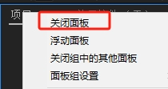
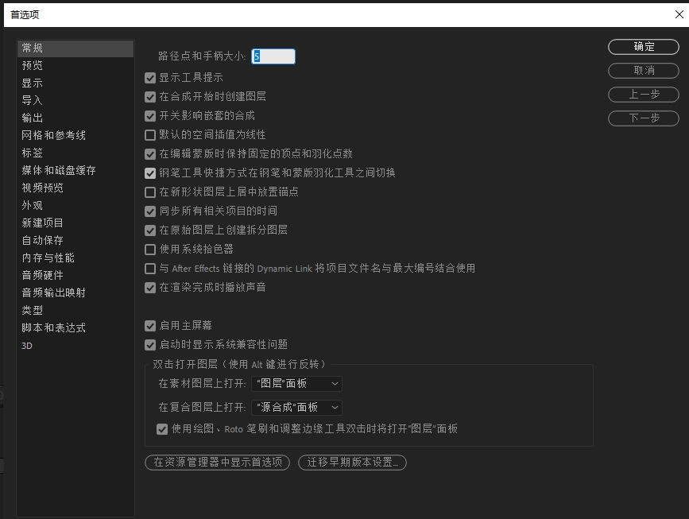
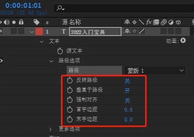

<h1>AE基础</h1>

<h5>作者：汐小旅Shiorys</h5>

# 简介

> 是一款Adobe公司的视频特效合成软件，在广告、动画、电影以及当下短视频都有着广泛的应用。
>
> AE可以理解为动态的PS，只不过PS是合成图片，AE是合成视频。

# 工作流程

> **导入素材---新建合成---编辑素材---渲染**，得到最终视频效果。整个流程中，主要做的就是编辑素材。

# 工作面板

> 打开AE，会出现一个欢迎界面，会让**新建项目**或者**打开项目**(打开项目一般打开原有项目eap文件)，此处选择**新建项目**
>
> 
>
> 点击新建项目，就会进入AE默认面板，如下
>
> 

## 窗口简介

### 项目窗口

> **作用**：是存放项目素材的位置，包括音频、视频、图片，还有各种互导的文件
>
> 

### 合成窗口

> **作用**：做好视频效果之后，在该面板实时预览最终画面效果。或者在此窗口进行简单的编辑
>
> 

### 素材窗口

> **作用**：预览素材，以及对素材时长进行编辑简单编辑的
>
> 此窗口需要自己在**菜单栏**中，选择《**窗口**》，找到《**素材**》，单击勾选上
>
> 

### 时间轴窗口

> 此处分为**图层面板**和**时间线面板**两部分，AE里面的效果制作都在这一栏里面去控制，是AE的重中之重。
>
> **作用**：编辑素材
>
> 

### 效果和预设窗口

> **作用**：AE默认的一些特效，需要特效时，只需将特效添加到相应的素材图层上即可
>
> AE内置插件及安装的外置插件都在这里
>
> AE的宝藏栏，这是AE提供的预制库，会有很多已经做好的动画，只需拖拽到想要的素材上，就会产生相应的动画效果，也被称为宝藏栏
>
> 使用：按住鼠标左键拖拽，到视图上、图层上，按下空格键播放就可以看到效果
>
> 提供了便利、但也不可过于依赖，因为更多的是需要人去操作去演变的，产生无限的可能
>
> 

### 效果控件窗口

> 工作中还会常用到**窗口**中的**效果控件**窗口，后期加的效果都要在效果控件窗口进行参数的调整，所以可以将**效果控件**窗口也打开。**菜单栏**中，选择《**窗口**》，找到《**效果控件**》，单击勾选上即可
>
> **作用**：进行效果参数的调整
>
> 
>
> 它会与项目窗口并列
>
> 

### 信息窗口

> **作用**：调节色彩信息（RGB）、XY坐标(正常情况下不会用此来定义位置)

### 音频窗口

> **作用**：调节音频的高音、低音、消音等等

## 自定义工作面板

> 根据自己的习惯，拖动窗口摆放位置。然后在菜单栏中：《**窗口**》---《**工作区**》---《**另存为新工作区**》，命名好即可，以后想使用自定义的界面时，只需在工具栏找到点击即可。工具栏的其他界面可以自行点击，只是窗口布局不同，效果还是一样的。
>
> 
>
> 
>
> 

## 面板还原

> 如果不小心将窗口弄乱了，将如何恢复默认界面呢？
>
> **方式1**：在工具栏右边找到相应的工作区旁边的三条杠图标，选择《**重置为已保存的布局**》
>
> **方式2**：在菜单栏中：《**窗口**》---《**工作区**》---《**将XX重置为已保存的布局**》
>
> 

## 打开窗口

> 如果工作中不小心将某个窗口关闭了。只需要在菜单栏中：《**窗口**》中重新勾选上即可

## 关闭窗口

> 在窗口的位置，右击，选择《**关闭面板**》即可，也可以在菜单栏《**窗口**》中取消要关闭的窗口
>
> 

## 窗口控制

> 可以任意拖动窗口来放大和缩小窗口的区域

# AE软件设置

> 在使用AE之前，需要对软件进行设置，可以提高效率。

## 首选项设置

> 打开设置界面：菜单栏《**编辑**》---《**首选项**》，无论点击哪个菜单都会进入相同的设置界面。
>
> 
>
> 

### 常规

> **在新形状图层上居中放置锚点**：勾选上，因为在做动画的过程中，如果锚点不居中，后续做动画效果时会受到锚点影响，所以作为新手，一定要勾选上。当所有的设置完成后要记得点《**确定**》保存
>
> 

### 预览

> **快速预览-自适应分辨率限制**：一般默认即可，但是如果电脑配置低，可以设置小一点，分母越大越小。
>
> 

### 显示

> **运动路径**：新手建议设置为多有关键帧，老手根据需要任意
>
> 

### 导入

> **序列素材**：默认是30帧每秒，这个需要看项目的具体要求。国内一般是25帧每秒
>
> 

### 媒体和磁盘缓存

> AE在运行的过程中会产生大量的缓存，而且AE默认的缓存内容都在C盘，久而久之就会撑爆C盘，导致电脑卡顿，所以需要清空磁盘缓存，将缓存文件目录更换到其他盘符。比如换到F盘，新建一个AE缓存文件夹，这样AE的缓存就会存到其他盘符。
>
> **最大磁盘缓存大小**：空间自然是越大越好，但是需要根据盘符剩余空间进行调整，默认是23G如果被填满，AE就会出现卡顿，所以建议定期清理一下缓存。同时在菜单栏的《**编辑**》下也有一个**清理**。下面的缓存目录都替换一下，弹框选择**删除**即可
>
> 

### 外观

> 可以设置软件界面的外观，可根据自己的需要设置。一般默认即可

### 自动保存

> 这是一种保存方式，但是不要过于依赖，这是最后的保障。所以应该建议习惯性按下**Ctrl+S**对项目编辑内容进行保存
>
> 如果项目编辑过程中忘记保存，当AE崩溃时，工作内容就会丢失，**自动保存**相当于最后一道防线
>
> **保存间隔**：默认是20分钟，因为自动保存间隔**不宜过长，也不宜过短**。每一次自动保存都是行走在AE崩溃边缘的一次试探，因为每次保存都会产生一个非常大的缓存量，一旦塞满设置的最大缓存大小，AE就有可能就会崩溃，所以建议是20分支到半个小时。当然，保存间隔过短也有一点好处，那就是在AE崩溃时，可以找回设置时长之前的内容，比如设置5分钟，AE崩溃时，就可以找回AE崩溃前5分钟的内容。内容在设置的**自动保存位置**里面
>
> **最大项目版本**：默认5。比如每20分钟保存一次，最大限制是5，当保存第6次时，会自动覆盖第一个，所以需要找文件时，就找最近时间的，这是最新工作的版本。
>
> 

### 音频硬件

> 有时候会使用到耳机，或者突然在AE里面听不到声音了，很有可能是因为这里的**默认输出**没有选到相应的设备

### 脚本和表达式

> AE中虽然有很多默认插件脚本预设，有时候需要去安装外置动画效果的插件脚本，不勾选此两项是没法用的。所以我们就需要勾选**允许脚本写入文件和访问网络**、**启动JavaScript调试器**。设置完，点击**确定**即可
>
> 

## 项目设置

> 在**项目**窗口，点击**三条横杠**，选择**项目设置**，或者在菜单栏：《**文件**》---《**项目设置**》。
>
> 
>
> **视频渲染和效果**：**使用范围**选择：**Mercury GPU加速(CUDA)**，此项也是默认项，可以增加视频预渲染的速度。

# 导入素材与素材管理

> 需要养成良好的素材管理习惯。对于素材的管理，可以在某个盘符中创建一个**项目文件夹**，在项目文件夹下创建一个名为**素材**的文件夹，然后在该文件夹下创建如**视频**、**音频**、**图片等**子文件夹，将相应的素材放入对应的文件夹，这样后期方便管理。当AE保存项目时，可以将**项目文件**保存到**项目文件夹(如此处的项目文件夹为：练习项目)**下
>
> 

## 导入素材

> 素材一般有图片、音频、视频、模型等。
>
> 导入素材可以导入文件或者文件夹(一次貌似只能导入一个文件夹)，导入方式有以下几种方式，**常用**的是第一种，**双击打开**导入：
>
> **1、双击打开**：在项目窗口空白处双击，然后选择文件或文件夹导入即可
>
> **2、拖拽导入**：将文件或者文件夹拖入AE
>
> **3、Ctrl+i**
>
> **4、项目窗口，右键---导入---文件**
>
> **5、菜单栏：文件--导入--文件**
>
> 
>
> 导入之后素材就会在项目窗口显示，可以看到很多关于素材的信息，同样点击素材时上面也会显示素材的信息
>
> 

## 预览素材

> 双击素材，就会在中间出现一个名为素材窗口显示素材。
>
> 可以用键盘上的**空格键**或者右边**预览**窗口中的播放预览（**常用空格键播放预览**），就可以实时的预览素材，预览后关掉**素材**窗口即可
>
> 

## 删除素材

> 注意：此处删除素材，不会将真正的素材源文件删掉，此处的素材只是相当于一个虚拟的素材，链接指向真正的素材，所以此处删除素材，并不会将源文件删掉。
>
> **方式1**：选中素材，使用删除键
>
> **方式2**：选中素材，在下方工具栏中有一个删除图标，点击删除即可
>
> 

## 管理素材

> 当素材并不是已归类的素材导入，而是从各个盘符下导入进来的素材，那么可以给素材在项目里分类。
>
> 项目窗口下方有个文件夹图标，点击可以创建文件夹，可以给零散的素材在项目里分类
>
> 为了避免素材太过于凌乱，工作中需要养成良好管理素材的习惯，在项目外就将素材分类好，项目用到直接导入分类好的文件夹
>
> 

# 合成与预合成

> 在AE中，**合成**是指将多个不同的元素（如视频、图片、动画、效果等）组合在一起形成一个整体的过程。**合成是AE中最基本且核心的操作之一，用于创作复杂的视觉效果和动画。**
>
> 合成也可以理解为一个虚拟的画布或者舞台，你可以将不同的素材图层放置在这个合成中，通过调整它们的位置、尺寸、动画、透明度、效果等属性来构建最终的视觉效果。
>
> 合成也可以是一段视频、一段音频、一张图片等。
>
> **合成包含以下几个关键概念**
>
> 1、**图层(Layers)**：在合成中可以添加多个图层，每个图层可包含不同的元素，如视频、图片、文字等。图层可以被特定属性和效果所调整和控制，以实现期望的视觉效果。
>
> 2、**时间轴(Timeline)**：AE中时间轴用于控制合成中各图层的时间和动画，你可以在时间轴上设置关键帧，在不同的时间点调整图层的属性，以实现动画和过渡的效果。
>
> 3、**合成模式(Blending Modes)**：AE中提供了各种合成模式，用于控制合成中图层之间的混合和叠加效果。通过选择不同的合成模式，可以创建出各种颜色、透明度和效果的混合效果。
>
> 4、**遮罩(Masks)**：遮罩可以用来限制图层的可见区域，以实现精确的控制和计算，你可以使用矩形、椭圆、多边形等形状创建遮罩，并调整其属性和路径来定义图层的可见范围。
>
> 5、**效果(Effects)**：AE提供了丰富的特效和滤镜，可以用于图层和合成，以改变其外观和行为。特效可以调整颜色、光照、模糊、变形等，以创建各种视觉效果。

## 新建合成

> 新建合成有以下几种方式：常用快捷键：Ctrl+N 来新建合成或直接拖拽素材到时间轴窗口
>
> 1、**快捷键：Ctrl+N** 来新建合成
>
> 2、**拖拽**：直接**拖拽素材**到**时间轴窗口**(相当于从素材新建合成，合成尺寸的大小也就是素材的大小)
>
> 3、**菜单栏**：《**合成**》---《**新建合成**》
>
> 4、**项目窗口**：**空白处右键---新建合成**
>
> 5、**项目窗口：下方图标---新建合成**
>
> 
>
> 6、**合成窗口：新建合成**
>
> 
>
> 
>
> 新建后，在**合成窗口**就会出现一个黑色的框，也就是合成的尺寸
>
> 
>
> 合成的图标
>
> 

## 删除合成

> 选中合成，使用删除键

## 合成面板设置

> **合成的名称**：可根据内容进行命名
>
> **基本**：
>
> ​		**预设**：有很多根据现在媒体的预设，可自定义宽度和高度，也可选择。默认横屏HDTV 1080 25（高清1080P 25帧每秒），锁定长宽比为16：9。
>
> ​		**像素长宽比**：通常默认方形像素。方形像素可以理解为每个画面放大后都是由一个一个小格子组成，通常这个小格子就是它的方形像素。
>
> ​		**帧速率**：默认25帧，根据需求更改
>
> ​		**分辨率**：不影响视频输出的分辨率，只是影响预览观看的分辨率，电脑配置低可以改小，可以让预览更加流畅，同时这个在**合成页面**也可以随时调整
>
> 
>
> ​		**开始时间码、持续时间**：默认30秒，也就是这个合成有30s的时长，可以根据需要更改
>
> ​		**背景颜色**：也可以去更改，默认是黑色
>
> **高级**： 调节的是一些效果，使用最多的是**运动模糊--快门角度**，做动画的时候模糊的大小，默认即可
>
> **3D渲染器** AE不仅可以做二维的动画，还可以做一些三维的动画，所以具备3D的属性
>
> ​		渲染器：默认经典3D，一般默认即可。还有一个C4D，AE和C4D关联性还是很大的，比如文件互导
>
> 

## 更改合成设置

> 1、项目窗口：选中素材合成，右击选择《**合成设置**》
>
> 
>
> 2、菜单栏：合成---合成设置
>
> 3、快捷键：Ctrl+K，推荐使用
>
> 分辨率可以在中间窗口随时更换
>
> 

## 预合成

> 预合成使用场景：比如图层比较多，想给部分图层打包成一个组，只需要选中要打包的图层，右键《**预合成**》，确定后就将选中的图层打包成了一个组，这个组就是预合成，双击进入，就可以看到被打包的所有图层。同时项目窗口的素材库也出现了一个预合成
>
> **预合成快捷键：Ctrl+Shift+C**
>
> 
>
> 在预合成中更改内容，项目窗口的素材库的预合成也同步更改了。

## 预合成中面板属性

> 给任一图层添加效果，然后对该图层进行预合成时选择以下两种属性之一说明：
>
> **保留预合成中的所有属性** ：所有效果都停留在了预合成上面，就是给整个合成加属性。
>
> **将所有的属性移动到新合成**：效果停留在预合成里面的图层上面，给合成里的图层单独加属性。
>
> 

# 项目保存方式

> 防止AE崩溃，导致做的工作内容丢失

## 方式一

> **快捷键**：**Ctrl+S**，最常用方式，推荐使用

## 方式二

> **菜单栏**：《**文件**》---《**整理工程**》---《**收集文件**》
>
> 当在于其他人合作项目时，比如当你需要把你的工程给到别人的时候，这个功能会将在整个工程中所有使用到的素材全部打包。如果只是单纯的给到别人一个AEP文件(AE的工程文件)被人打开时就会出现素材丢失，因为AE认定的素材必须要到达指定的文件路径位置才会被读取到，比如素材文件移动了盘符，此时再用AE打开AEP文件时，就会找不到素材了。
>
> 所以这个时候就需要使用整理工程收集全部源文件，点击收集，保存，就会生成一个文件夹。文件夹里面就有一个AEP文件及工程中用到的所有素材源文件，这样就不会出现素材文件丢失的问题。

## 方式三

> **自动保存**：**菜单栏**：《**文件**》---《**编辑**》---《**首选项**》中

# 工具栏

## 选取工具

> **快捷键**：V（英文输入法下）
>
> **作用**：用来移动素材，更多的时候是辅助位移工具；可以选择想要的内容
>
> 

## 手形工具

> **快捷键**：H
>
> **作用**：移动整个合成视图窗口，观察看不到的部分。
>
> 很多时候用不到这个工具，比如在选取工具下，按住空格，就会自动调到抓手工具上；松开空格，就会回到选择工具。可以使用空格键来代替H键。可以配合滚轮使用放大缩小。
>
> 

## 缩放工具

> **快捷键**：Z
>
> **作用**：放大镜，用来放大视图(整个合成视图窗口)。缩小需要配合Alt键点击
>
> 基本也不会去用，可以使用鼠标滚轮来代替放大缩小
>
> 

## 摄像机工具(3个)

> 旋转、移动、推拉镜头(缩放)。配合相机使用，在图层上开启3D图层或右键新建摄像机就可以使用这三个工具。
>
> 

## 旋转工具

> **快捷键**：W
>
> **作用**：围绕锚点(中心点)旋转素材。
>
> 用的不多，因为这个旋转没办法控制一个准确的度数，所以只用用来调整造型或者定格。如果需要记住旋转动画角度，需要用到的是合成旋转属性。
>
> 

## 锚点工具

> **快捷键**：Y，中心点移动工具
>
> **作用**：锚点也就是素材中心点，移动中心点的位置。配合工具栏中的**对齐（或关闭对齐使用Ctrl键）**，可以出现吸附功能；向后平移功能需配合视频使用（比如截取**几秒的视频**，当在**时间线上拖动视频**时，这**几秒时间的时长是不会变的**，但是**这个时长内的视频**就**变成之前几秒视频前后的视频内容**）
>
> 

## 矩形工具

> 也叫遮罩工具或蒙版工具
>
> **快捷键**：Q
>
> **作用**：就是区域显示，画成什么图形，就在什么图形区域内显示
>
> 
>
> 小技巧：如果想画圆形，只需选择椭圆，安住Shift键绘制即可。

## 钢笔工具

> **快捷键**：G
>
> **作用**：和遮罩工具有点像，可以画出不规则图形
>
> 

### 钢笔工具的使用

> **默认钢笔工具**
>
> ​		选中钢笔工具，可以换出不规则的图形。如果在图层上操作，就形成遮罩(蒙版)；如果在合成空白处操作，就形成形状图层。
>
> 如何画出有弧度的曲线？
>
> ​		点击之后不要放手（鼠标左键），往不同方向拉，这样就会出现一个弧度，这就是贝塞尔曲线
>
> **添加“顶点”工具**
>
> ​		钢笔会出现一个“+”号，快捷键：Shift键
>
> **删除“顶点”工具**
>
> ​		快捷键：Ctrl键，按住Ctrl键，点一下就可以删除顶点
>
> **转换“顶点”工具**
>
> ​		某个顶点没有弧度，使用这个工具点一下，贝塞尔曲线就出来了。
>
> **蒙版羽化工具”**
>
> ​		选用这个工具点一下，边缘就过渡就比较好，没那么生硬

## 文字工具

> **快捷键**：Ctrl+T
>
> **作用**：输入文字。横排文件工具、竖排文字工具
>
> 

### 文字工具的使用

> 1、工具栏点击文字工具，在合成页面输入文本即可
>
> 2、时间轴图层面板右键新建文本，在合成页面输入文本即可
>
> 3、**快捷键：Ctrl+T**，在合成页面输入文本即可
>
> 如果想要限制文字范围，选择选择文字工具，然后在合成页面拉一个边框，这个边框就可以限制文本的画幅大小，多出的文字就不会在整个边框内显示。同时这个边框的大小也可以自由调整。
>
> 文字的样式可以在【**字符**】窗口与【**段落**】窗口进行更改
>
> 
>
> 说到文字工具，肯定离不开【**标题安全框**】，在合成页面下方的工具中。这个工具一般在做标题与字幕的时候使用，可以辅助让文字不要超出安全框，避免超出后给人一种压迫感，这是排版上的一些技巧。
>
> 

## 画笔工具、仿制图章工具、橡皮擦工具

> **作用**：涂、画、擦除。只能针对图层使用，双击合成中的图层，就在合成窗口出现一个与合成窗口并列的图层窗口，在这个图层窗口就能使用了，使用之后关闭这个图层窗口，回到合成窗口后就能看到刚才的编辑的内容了。**仿制图章**要**按住Alt键取样**再来仿制擦拭【复制】。
>
> 可以打开合成窗口的透明网格辅助查看橡皮擦擦掉的内容，橡皮擦擦掉的内容有什么好处呢，就是可以看到下面的图层。因为AE也是一个图层式的软件，都是一个个图层叠加
>
> 

## Roto笔刷工具

> **作用**：有一个类似于跟踪的效果。抠图的工具，可以捕捉物体的运动轨迹，比如在视频中的人涂抹出来，就可以单独的把人物抠出来
>
> 

## 图钉工具

> **快捷键**：Ctrl+P
>
> **作用**：也叫人偶位置控制点工具，做MG动画的时候才会使用，比如需要做人物的一些动画，走路、跳舞等
>
> 

# 图层面板常见操作功能

## 眼睛图标

> 显示与隐藏。图层隐藏或显示的开关。如果需要当前图层参与最终渲染，那就开启

## 小喇叭图标

> 音频开关。比如操作带声音的视频，有时候不需要听到声音，就可以关掉，需要的时候再开启

## 小圆点图标

> 独显开关。也就是单独显示某个或某几个图层，可以给某个或某几个图层开启独显。开启独显的就会显示，没开启的就会被隐藏。比如图层较多时，我们想单独查看某个图层或某几个图层的效果时，就可以使用独显，避免其他图层干扰

## 锁图标

> 锁定开关。一旦锁定某个图层，就没法选中这个图层，更别说进行操作了。作用就是当调整完当前图层效果后，后期这个效果不需要修改，那么就可以进行锁定，防止后续误操作修改了

## 标签图标

> 图层的标签。也就是图层的颜色，可以更改颜色。这样在图层很多的时候，方便去辨别，容易找到相应的图层。比如视频素材和图片素材用不同的标签颜色。

## 源名称/图层名称

> 相互切换。比如有很多素材，需要将素材重命名时使用。这样切换的时候可以知道素材源名称是什么，方便去找到源文件

## 消隐

> 隐藏图层操作栏中的图层，但是在合成窗口的场景中还是看得见它，要配合上方的总开关消隐使用

## 三个小圆球图标

> 运动模糊。需要动画效果才能看出效果。开启之后，比如运动时，就可以看出边缘模糊，有虚影，不开启就是比较硬。如矩形移动时，不开启就是很直观的矩形，开启之后就会看到边缘模糊，给人一种物体快速运动的感觉，体现速度快，可以通过运动模糊的方式来体现

## 小太极图标

> 调整图层。本身就是一个透明图层，对下方的图层全部起作用

## 三维开关

> AE是一款二维软件，但是也存在三维功能。 会有很多三维插件，包括图层也可以模拟一个空间的纵伸感
>

## 裁剪操作

> 直接拖拽裁剪。快捷键：**Alt+{** ：剪切掉当前时间指示器前面的内容；**Alt+}** ：剪切掉当前时间指示器后面的内容；**Ctrl+Shift+D**：将以当前时间指示器为分割线，将内容裁剪成两部分；英文输入法下，**B键**设置入点，**N键**设置出点，这个区间就是渲染的时候的范围。修剪完成后，右击选择【**将合成修改至工作区**】，这样就完美的规避了黑屏部分，整个工作区就变成裁剪的片段。

# 图层的五大属性

> 在图层**变换**中：**锚点、位置、缩放、旋转、不透明度**
>
> 
>
> **如何在不打开图层的情况下调出五大属性？**
>
> **答：使用快捷键。如果同时调出多个，再加一个键：Shift**

## 锚点

> 图层的中点
>
> **快捷键**：A
>
> **作用**：中心点不动，移动图层。如果要移动锚点的位置，则需要工具栏中的锚点工具。后续的旋转、缩放等，都会以锚点为轴心点进行变换。
>
> 

## 位置

> **快捷键**：P
>
> **作用**：横向、纵向移动。锚点会跟着图层移动
>
> 

## 缩放

> **快捷键**：S
>
> **作用**：默认等比缩放（放大缩小）。如果关闭链条，就可以单轴向拉伸
>
> 

## 旋转

> **快捷键**：R
>
> **作用**：0x代表圈数，后面是度数，一旦旋转超过360度，就会进1，后面度数归零，可以做旋转动画
>
> 

## 不透明度

> **快捷键**：T
>
> **作用**：0%为不显示，100%为显示，0到100之间都属于半透明状态，可以调整图层透明度
>
> 

# 关键帧动画

## 关键帧

> **关键帧：是专门用来记录属性的值。相当于二维动画中的原画。指角色或者物体运动或变化中的关键动作所处的那一帧**
>
> 如果需要记录某一帧的动画，就点击属性前面的小闹钟变成蓝色，就相当于已经记录了一帧，时间线上相应的也有了一个锚点，这个锚点就是关键帧。
>
> 两个关键帧产生动画的条件：**有时间差且效果不同的两个关键帧**，就可以实现动画效果（**空格是播放动画**），如平行移动。
>
> 
>
> 第二个关键帧可以在**前进后退图标那里的中间位置菱形方块**上打上，此处也可以用来移动时间轴至上一个或下一个关键帧。
>
> 
>
> 假如在拖动时间轴的时候想要时间轴快速的吸附到关键帧上，按住Shift拖动即可。
>
> **删除关键帧**：框选住，按删除键即可
>
> **复制关键帧**：框选住，Ctrl+C、Ctrl+V
>
> **关键帧时间缩放**：选择时间范围内的所有关键帧，按住Alt键拖拽即可。
>
> **关键帧让动画从小到大小技巧**：全选两个关键帧，右键【**关键帧辅助**】---【**时间反向关键帧**】
>
> **关键帧很多，一次性删除的技巧**：一种是全选，然后按删除键；一种是直接点小闹钟图标关掉

## 关键帧类型

### 匀速关键帧与变速关键帧

> 默认是**匀速关键帧**，速度不变。匀速变化，给一个一种单一或单调的感觉。所以AE提供了另外一种关键帧，叫做**变速关键帧**，会以不同速度变化。

### 复制带关键帧的动画

> **U键**：快速显示已记录关键帧的动画。
>
> **Ctrl+D是复制快捷键**：复制一个带关键帧的动画
>
> 两个动画重合了，那么怎么移动？把时间线滑到其中一个关键帧上，选中图层属性，按住Shift键，复制的关键帧动画就可以对点移动，如平行。

### 运动曲线的调节

> 以上可以用两段动画来表示，**选中**某一图层的**要查看动画的两个关键帧**，右键找到【**关键帧辅助**】，找到【**缓动**】，快捷键**F9**，关键帧样子就会变成沙漏形，关键帧就变成了**变速关键帧**。
>
> 播放动画可以看出区别，可以放大视图看运动轨迹，两个点直接的距离是匀速还是变速。
>
> 找到**图层面板**的【**图标编辑器**】，就可以调出动画的运动曲线X轴和Y轴。
>
> 
>
> 在时间线 下面素图表找到【**编辑速度图表**】，可以看到与调节，拉手柄，就可以进行速度调节。
>
> 
>
> 
>
> **变速还原成匀速**：Ctrl+左键单击

# 图层的认识

> 图层由上往下，第一个图层在最上面，会遮挡后面的图层

## 纯色图层（固态层）

> **新建**：在图层面板空白处，**右键**---【**新建**】---【**纯色**】，快捷键：Ctrl+Y
>
> **纯色设置**：名称、宽高（会根据当前合成大小默认一个初始像素）、像素长宽比（一般方形像素）、颜色，就会得到一个纯色层
>
> **作用**：是一个单一颜色的图层，用来承接效果，一般用纯色层来做，很少用其他。

## 形状图层

> **新建**：1、可以在图层面板空白处，**右键**---【**新建**】---【**形状图层**】；2、也可以直接选择图形工具或钢笔工具来绘制
>
> **特点**：形状层前面会带一个五角星图标（形状层固有符号）
>
> **作用**：主要是通过形状层，可以得到它里面的一些其他效果。

## 调整图层

> **新建**：在图层面板空白处，**右键**---【**新建**】---【**调整图层**】
>
> **特点**：本身没有颜色，也没有形态的，同时一个透明的图层
>
> **作用**：对于下方的图层起作用。例如，给调整图层加一个模糊效果，形状层就变模糊了
>
> 

## 文字图层

> **新建**：1、可以在图层面板空白处，**右键**---【**新建**】---【**形状图层**】；2、也可以用文字工具添加文本
>
> **作用**：一般用作标识，比如书本名称，文字动画

## 三维图层

> 开启三维开关后，它就会存在空间的概念，开启三维效果

# 蒙版(遮罩)

> **匹配画面大小**（使素材大小与合成匹配）**快捷键**：**Ctrl+Shift+Alt+H**
>
> 蒙版的意思是：基于闭合的路径，路径源于原素材的图层上，作用于图层当中。
>
> 在**除了形状图层**以外的其他图层上**画的形状**就是**蒙版**。比如在纯色图层上画一个矩形，这个矩形就是蒙版。也就是区域保留，即所能保存的内容只能在所绘制的这个区域内显示。
>
> 蒙版之间可以进行相加减等操作，得到一个新的图形。
>
> 如果在工作过程中，路径找不到了，需要点击下面的开关，这样路径（形状的轮廓）就显示出来了
>
> 

## 绘制蒙版(遮罩)

> 绘制蒙版可通过图形工具或钢笔工具来绘制。
>
> **注意**：想要绘制蒙版，就必须要选中相应的图层，不然就会出现新的图层。

## 蒙版属性

### 蒙版路径

> 选中属性，用选择工具框选住就可以调整形状。用两个关键帧可以设置动画。也叫蒙版的**形变动画**或**路径动画**

### 蒙版羽化

> 边缘会变得模糊，也就是变的柔和，找不到硬边，也就是在过渡，快捷键：F

### 蒙版不透明度

> 隐藏与显示，调整透明度

### 蒙版扩展

> 有点像缩放的感觉。

# 轨道蒙版

> 蒙版的双胞胎兄弟，用法与蒙版有所区别

## 举例

### 蒙版的方式

> 

### 轨道蒙版的方式：

> 1、新建一个纯色图层，蒙版本身是在图层的上方
>
> 
>
> 
>
> 2、开启轨道蒙版：打开**展开或折叠转换控制窗格**，就会出现**TrkMat**，就是开启轨道蒙版
>
> 
>
> 
>
> 3、点击合成面下的**三色小球图标**，找到**Alpha**通道（用来查看黑白通道：黑透白不透[黑色透明、白色不透明]）。注意检查之后回到原来的**RGB**
>
> 
>
> 
>
> 
>
> 4、点击选取图层的**Alpha遮罩** （注意：轨道蒙版其实只有两种方式：一种是alpha遮罩，一种是亮度遮罩），就可以观察。
>
> 
>
> 
>
> 也就是图片是通过上面纯色图层的Alpha通道（只保留一个圆形）来保留的一些内容。反向Alpha通道正好相反
>
> 
>
> 使用轨道蒙版之后，图片和本身图层没有太大的影响，所控制它的是上面的图层。
>
> 

## 轨道蒙版作用

> 实现多功能控制；可以影响到颜色，如可以通过轨道蒙版的方式，影响文字层的颜色变化

# 抠像技巧

> 1、菜单栏中，【效果】---【Keying】---【Keylight】
>
> 2、找到【Screen Colour】也就是幕布颜色，点击一下旁边的**吸管**，吸取一下幕布颜色，就会发现幕布颜色已经变成黑色
>
> 
>
> 3、然后通过【透明网格】来检查一下背景是否透明。然后再退出【透明网格】
>
> 
>
> 4、在【效果控件】窗口找到【View】中【Screen Matte】这个通道模式下观察是否完全扣除。
>
> 
>
> 5、调整参数：在【效果控件】窗口找到【Screen Matte】中【Clip black和Clip White】,提高黑值，降低白值。调整黑白值的目的是，保证所要的人物是白色的，背景是黑色的，这样才算是完全去除干净
>
> 
>
> 6、再回到【Final Result】通道下，这个时候去看，人物就完全抠出来了。就是一定要到【Screen Matte】通道模式下去查看，调整黑白值，保证人物完全抠出来
>
> 

# 保留基础透明度

> 蒙版、轨道蒙版的三胞胎兄弟，用法与蒙版、轨道蒙版有所区别
>
> T：也就保留基础透明度
>
> 
>
> **使用方式**：
>
> 只需要把通道放在最下方，素材放在上方。素材开启T的小方格，不需要打预合成
>
> 

# 文字图层

> 如何安装字体：C:/Windows/Fonts，将下载的字体放进去即可，会有一个自动安装的过程

## 文本属性

### 源文本

> 定格帧。到达指定关键帧后变成新的东西。但是动画没有演变过程，而是到达指定关键帧后变成新的东西。

### 路径选择

> 刚开始路径没有选择项，所以先选中文字层，然后选中如钢笔工具，画一个路径。此时路径就会多出一个路径可以指认。指认后就会发现文字是跟随这个路径来的。同时路径下面就会出现很多选项。
>
> 
>
> 如首字边距、末字边距：控制文字沿着路径上首尾的位移动画。

## 动画属性

> 
>
> 

### 位置

> 这个和之前的位置会存在一个区别，它可以实现逐字偏移的动画，而图层属性中的位置是整个图层移动。但是我们不是要使用这个位置，而是这个位置内的属性（在范围选择器中）。
>
> 打开范围选择器，比如将结束置为0，当调节起始时，文字会逐字产生动画。
>
> 

# 形状图层

> 在合成的空白处用**矩形工具**或**钢笔工具**绘制图形时，会出现一个形状图层。
>
> 选中图层绘制出来是**蒙版**，没有选中图层绘制出来的就是**形状图层**。
>
> 当绘制好图形后，切回**选择工具**，会发现工具栏有**填充、描边、像素等**一些参数可以使用。

​	

## 填充

> 可以更改形状图层的颜色信息，吸管工具也可以吸取画面中任何一个颜色。

## 描边

> 围绕图层一圈即为描边。

## 形状图层的参数

### 路径

> 就是绘制的路径。包含属性：大小、位置、圆度

### 描边

> 和上面的描边一样，也可以使用上方的描边，上面的描边，是为我们提供方便的。
>
> 包含属性：颜色、不透明度、描边宽度、线段端点、线段连接、

### 填充

> 和上面的填充一样，也可以使用上方的填充，上面的填充，是为我们提供方便的。

# 父子级链接

> 比如画一个**正方形图层**，一个**圆形图层**。给**正方形图层做一个位移的动画**，当将**圆形图层的父级和链接选择为正方形图层**时（或直接使用圆形图层中父级和链接中蚊香图标指向正方形），此时也就是将**圆形图层作为正方形图层的子级**。当播放动画时，**圆形图层会跟随正方形图层做一个位移的动画**。
>
> 同时，当动圆形图层的位置时，不会影响正方形图层的位置；而动正方形图层的位置时，圆形图层的位置跟着变化。
>
> **总结**：**当两个图层有父子级链接时，父变子也变，而子变父不变。也就是父影响子，而子不影响父。**
>
> 
>
> **注意**：在**父子级链接**中，形状图层下的五大属性中除**不透明度**不受影响外，其他四大属性都会受到影响。

# 表达式的控制

## 输入表达式

> 如给五大属性中的**位置**属性添加表达式时，只需**按住Alt键**再点击**位置**属性，这个时候就可以输入表达式了。
>
> 
>
> **注意**：情况一：输入表达式时，输入法一定要在英文的输入法下。情况二：有时候需要打开国外的一些模板，其创作者是使用的英文版的AE，假如用中文的AE打开，可能会出现一系列的表达式错误，这种情况，要么将AE变成英文版的，或者使用低版本AE，就可以打开。

## 表达式控制

> 在**效果和预设**窗口中，有一个**表达式控制**，这个里面的预设都可以作为表达式的控制。
>
> 1、新建一个【**空对象**】来作为**表达式的控制点**
>
> 
>
> 2、在【**效果和预设**】窗口中选择【**表达式控制**】中的某个预设放到空对象上，就可在【**效果控件**】窗口看到所选择表达式控制了
>
> 
>
> 3、选择要控制的**表达式参数**，用**表达式关联器**拖动指向【**效果控件**】中所选择表达式控制，然后可以打上关键帧来改变参数了。
>
> 