
<h1>AE基础-干货篇</h1>

<h5>作者：汐小旅Shiorys</h5>

## 导入素材

> 1、项目窗口双击，选择素材导入
>
> 2、直接将素材拖拽到AE

## 查看素材

> 1、在项目窗口可查看素材的基本信息
>
> 2、双击素材，会打开一个与合成窗口并列的**素材窗口**（作用：用于观察素材，视频可设置入点和出点）
>
> 3、在查看素材的时候，可以用鼠标滚轮对素材进行一个缩放查看
>
> 4、也可在素材窗口下面选择显示比例。这个比例中的【适合】比例，在拖拽面板的时候会素材会跟着一块缩放
>
> 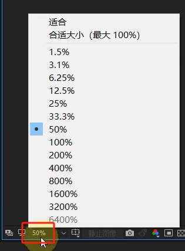

## 删除素材

> 选中素材，按delete删除键

## 新建合成

> 1、快捷键：Ctrl+N
>
> 2、直接将素材拖拽到图层窗口，在项目窗口会生成一个合成，同时这个素材会出现在图层窗口，形成一个图层
>
> 3、只有处在合成窗口中才能对素材进行一系列操作

## 合成设置

> 预设：基本都是【HDTV 1080 25】
>
> 宽度：1920
>
> 高度：1080
>
> 像素长宽比：方形像素
>
> 帧速率：25
>
> 持续时间：一般AE处理5到10秒的东西即可，可以预设为10秒，默认是30秒，有点长

## 查看合成

> 素材窗口会有一个合成

## 修改合成

> 1、快捷键：Ctrl+K

## 删除合成

> 在素材窗口选中合成，按delete删除键

## 图层顺序

> 在图层窗口，图层越靠前的，在合成窗口就显示在最上面，这就是图层 的顺序
>
> 可以拖拽图层调整顺序

## 合成窗口操作一

> 1、在【选择工具（快捷键V）】下，在合成窗口可以拖拽图层等。注意：在其他工具下做完操作后，一定要还原到【选择工具】下
>
> 2、按下鼠标中键等于启用【手形工具（快捷键H）】：可以移动合成窗口整个面板，不会影响图层；也可以将窗口下方比例改为【适合】比例，这样整个面板就回来居中了，居中一般建议使用50%的比例
>
> 3、【旋转工具（快捷键W）】：可以对合成窗口中的图层进行旋转操作

## 图层的五大属性

> 1、锚点：快捷键A；图层的中心点。比如做旋转的时候，会以锚点为中心转动；锚点不动，图层相对锚点运动；要想调节锚点的位置，使用【锚点工具（快捷键Y）】移动锚点位置
>
> 2、位置：快捷键P；移动图层的位置，X、Y坐标
>
> 3、缩放：快捷键S；放大缩小图层
>
> 4、旋转：快捷键R；旋转图层，0x代表圈数，1圈就是1x
>
> 5、不透明度：快捷键T；调整图层的透明度，0隐藏，100显示，0到100之间半透明
>
> 需同时调出多个属性时，需再加一个键：Shift+属性快捷键

## 动画

> 1、时间：有落差
>
> 2、属性：有变动
>
> 以上两点缺一不可
>
> 所谓动画，就是在一段时间上，属性发生了变化，所以就需要**关键帧**来记录这个变化

## 时间刻度缩放

> 1、可以拖动窗口下方的缩放条
>
> 2、使用：+、- 号

## 打关键帧

> 点击属性前面的小码表图标，变成蓝色即可；第二个以后的关键帧，需要给属性前面的前进后退中间那个关键帧图标点亮
>
> 任何属性都可以打关键帧
>
> 快捷键：U，显示已经打了的关键帧

## 修改关键帧

> 可以拖拽关键帧

## 取消关键帧

> 1、取消全部：属性前面的小码表图标关闭
>
> 2、取消某个：时间轴上选中要取消的关键帧，按delete删除键；属性前面的前进后退中间那个关键帧图标关闭
>
> 3、取消某几个：时间轴上选中，按delete删除键；

## AE流程

> 1、导入素材
>
> 2、制作关键帧动画
>
> 3、输出视频

## 设置动画(视频出入点)

> 1、可以在时间轴上拖拽
>
> 2、快捷键：B设置入点，N设置出点

## 添加到渲染队列

> 快捷键：Ctrl+M

## 渲染设置

> 品质：最佳
>
> 分辨率：完整，不然画质很很差

## 输出模块设置

> 格式：QuickTime 动画。因为很多时间AE只是PR的一个环节，有可能还有到PR里面合成，做合成的时候需要画质最高
>
> 选择输出位置，会得到一个mov文件。由于输出是高清模式，所以非常大，可以使用格式工厂，格式MP4，配置最优化
>
> 以上也可以直接使用ME导出MP4

## 查看AE制作动画的效果

> 空格键

## 合成窗口画质设置

> 1、窗口下方工具栏中，画质选【完整】
>
> 2、移动的时候模糊：下方工具栏中【快速预览】中选择【关（最终品质）】

## 蒙版（mask裁纸刀）

> 使用【钢笔工具】、【矩形工具】
>
> 注意：必须选中图层去操作，不然会出现一个形状图层，而不是蒙版
>
> 蒙版本身也可以记录动画的：也有属性

## 蒙版（mask裁纸刀）常用快捷操作

> 1、【矩形工具（快捷键Q）】、【钢笔工具（快捷键G）】：按住鼠标不放，出现更多形状
>
> 2、使用椭圆形状画正圆：画椭圆的时候鼠标不放，同时按Shift；如果以起点为中心点画圆，那就再按Ctrl键
>
> 3、移动蒙版：【选择工具】下，框选住整个蒙版，就可以整体移动；如果只是想移动某部分，框选住部分，然后拖拽即可；如果想等比缩放，双击某个点，然后拖拽即可；
>
> 4、画蒙版的时候，画好后先别松开鼠标，再按下空格键时，可以在画蒙版的时候移动蒙版
>
> 5、打开蒙版快捷键：M

## 蒙版（mask裁纸刀）补充

> 1、蒙版之间还可以进行相加、相减等操作。减谁就在谁的蒙版选相减
>
> 2、蒙版的颜色可以在图层窗口更改，避免轮廓看不清

## 蒙版（mask裁纸刀）的【钢笔工具】

> 1、可以用于抠图
>
> 2、画第点的时候不松鼠标，就会出现两个手柄，就是贝塞尔曲线，可以调节弧度；按住Alt键可以打断切线，Ctrl键可以调节
>
> 3、如果断了想要接着画，就点击最后一个端点

## 多重合成(合成嵌套)

> 多个素材打包成一个合成，当做一个整体放到里一个合成中使用，合成套娃
>
> 可以理解为一个盒子里面套了一个合成，方便素材的管理
>
> 影响上级合成，但不会影响下级合成
>
> 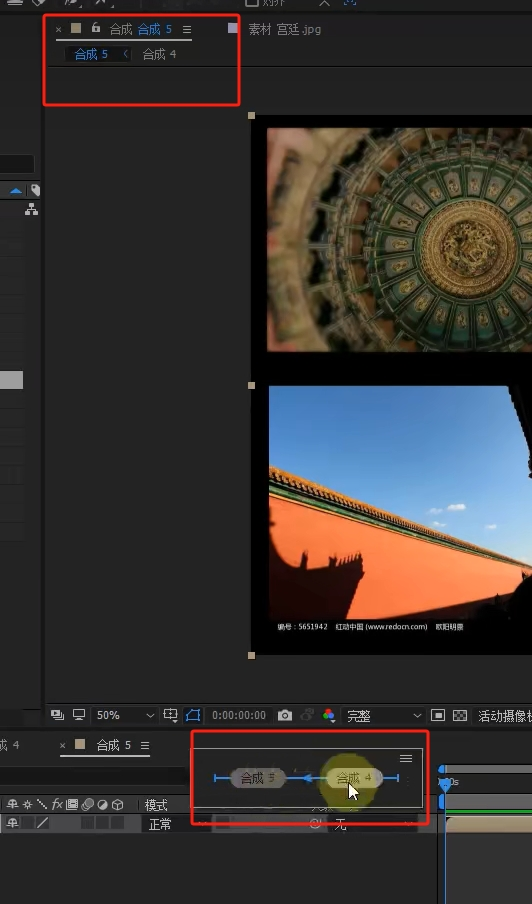

## 图层充满合成

> 1、【图层】---【变换】---【适合复合宽度】
>
> 2、快捷键：Ctrl+Alt+Shift+H

## AE叠加模式

> 图层面板---模式
>
> 水墨（黑）用变暗
>
> 光线（亮）用变量
>
> 纹理用叠加

## 蒙版（轨道遮罩）

> 之前的蒙版相当于裁剪工具，并不是真正的蒙版
>
> 打开轨道遮罩
>
> 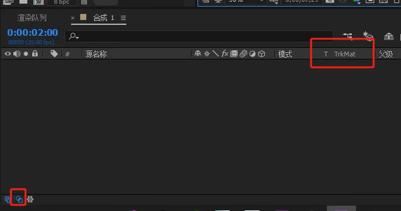
>
> **蒙版（轨道遮罩）是两个图层之间的关系**
>
> **mask**与**轨道遮罩**的区别：
>
> 1、mask相当于剪裁，而轨道遮罩相当于挖空某个上层图层看下面的图层；
>
> 2、一个是将特定的图层剪裁，一个是蒙在图层上的显示窗口
>
> 3、**轨道遮罩是两个图层之间的关系**；而**mask**是对单一图层的剪裁
>
> 
>
> 建立蒙版关系：在需要看的图层【TrkMat】中选择模式，就建立了关系
>
> ​		但凡要建立蒙版关系，需要看的图层一定要在下方，蒙版在上方
>
> ​		蒙版一旦建立关系，作为蒙版的图层将会被隐藏，注意：此时不能手动去打开作为蒙版的图层的小眼睛
>
> 通俗来说，照片相当于眼睛，而蒙版相当于挡在眼睛前面的东西。

## 蒙版（轨道遮罩）-alpha模式

> alpha，俗称可见外观，也是外观模式
>
> 1、新建纯色图层，作为蒙版，在图片图层的上方
>
> 2、改变蒙版的大小，挡住部分图片
>
> 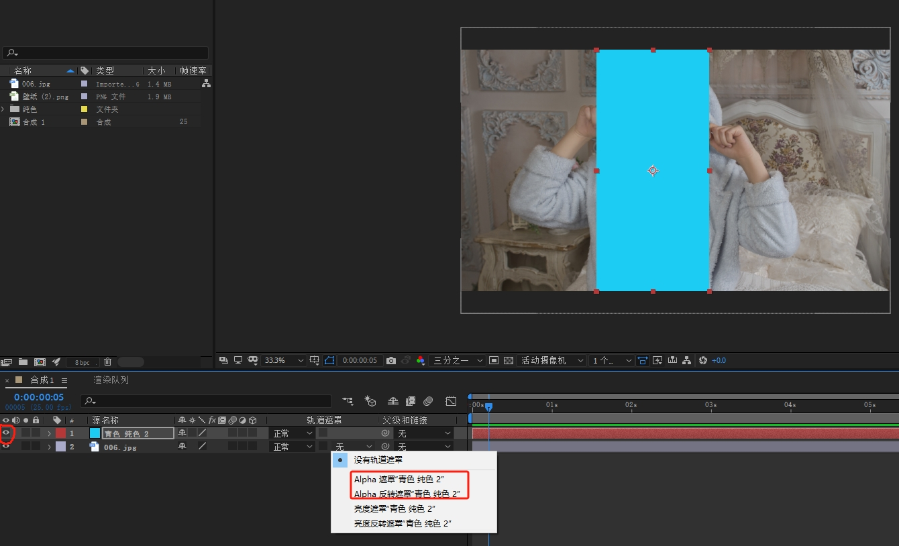
>
> 3、在照片上建立与蒙版（纯色图层）关系后：a、纯色图层小眼睛图标会消失，千万不能手动去打开，打开就没有意义了（**蒙版一旦建立关系，就会把作为蒙版的部分隐藏**）；b、源名称处也会多出一个图标，蒙版与图片互为相反；c、图片只剩蒙版内的区域部分
>
> 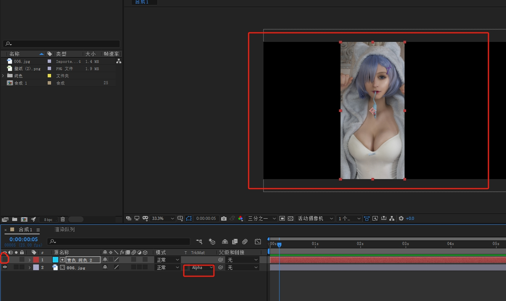
>
> 4、当去移动图片时，会发现图片内容只会出现在蒙版的形状内；当去移动蒙版时，蒙版形状在哪，就显示图片对应的内容；图片和蒙版之间互不影响，而mask是直接影响的
>
> 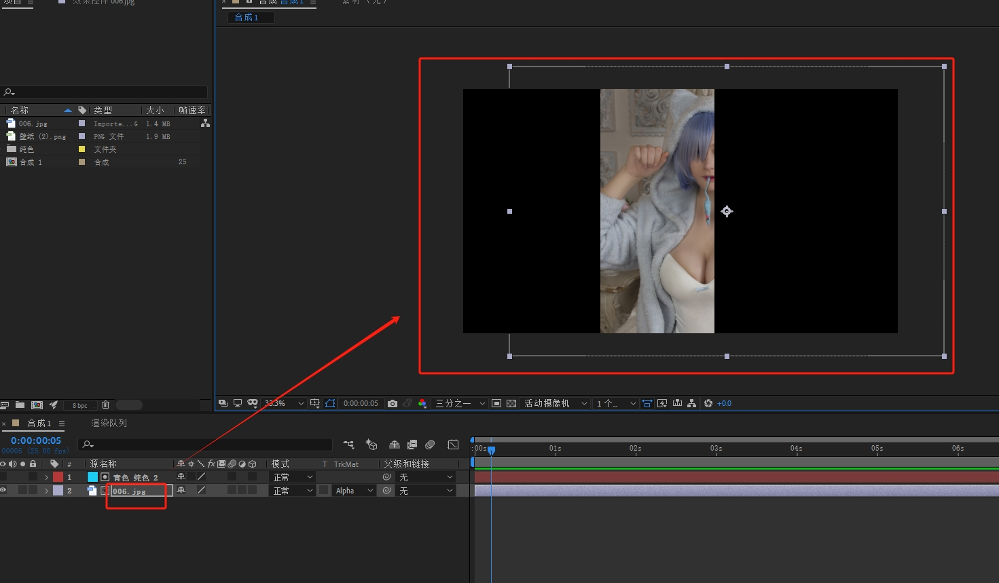
>
> Alpha遮罩与Alpha反遮罩效果相反。
>
> 多个蒙版、多张图片一一建立关系后，各蒙版之间相互独立，不会影响其他蒙版
>
> 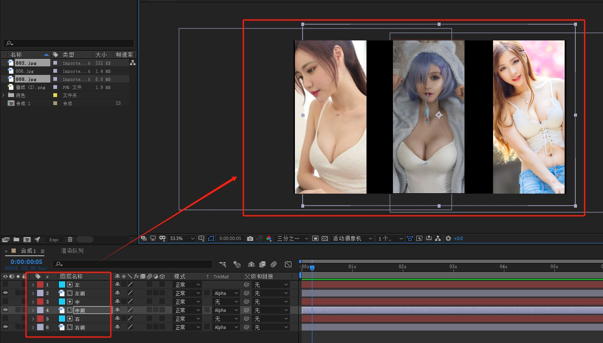

## 蒙版（轨道遮罩）-亮度模式

> 底层图片出现在作为蒙版图层比较亮的地方。注意，任何图层（除形状图层外）都可以作为蒙版
>
> 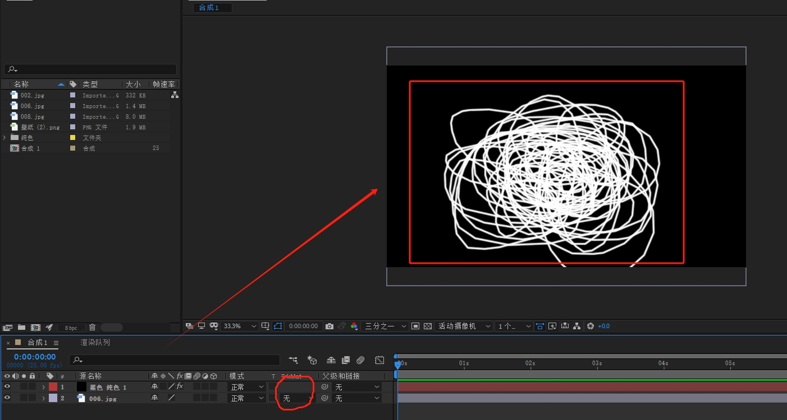
>
> 当选择【亮度遮罩】时，底层图片出现在蒙版亮的地方，打开【透明网格】，会发现黑的地方为透明（后面可以继续放图片）；
>
> 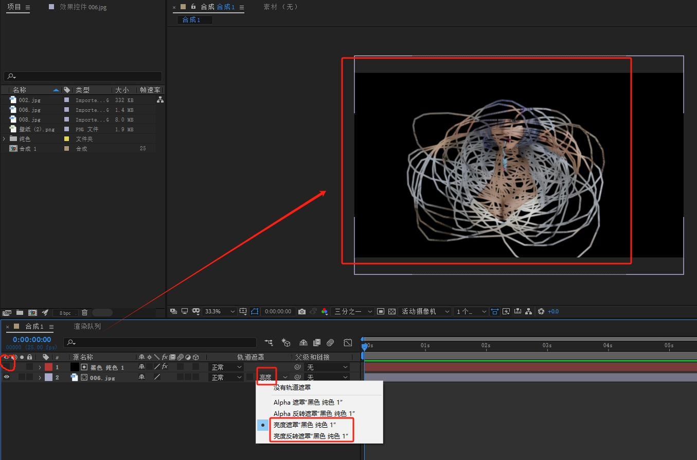
>
> 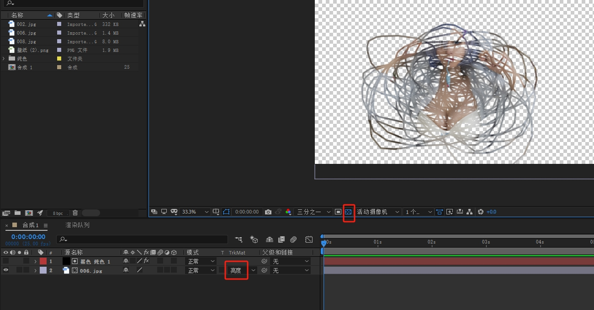
>
> 反之，使用【亮度反遮罩】，图片出现在黑的地方，白的地方为透明
>
> 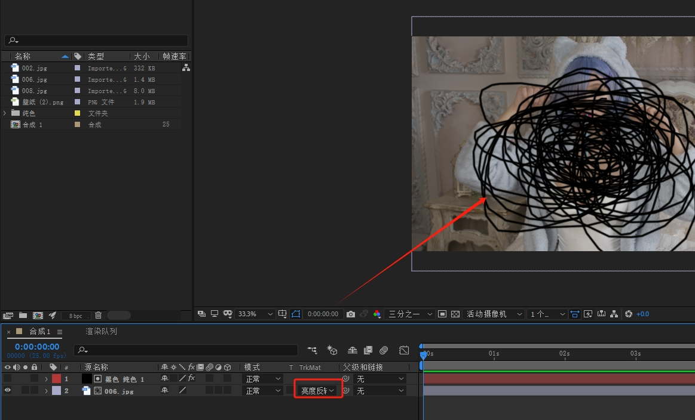
>
> 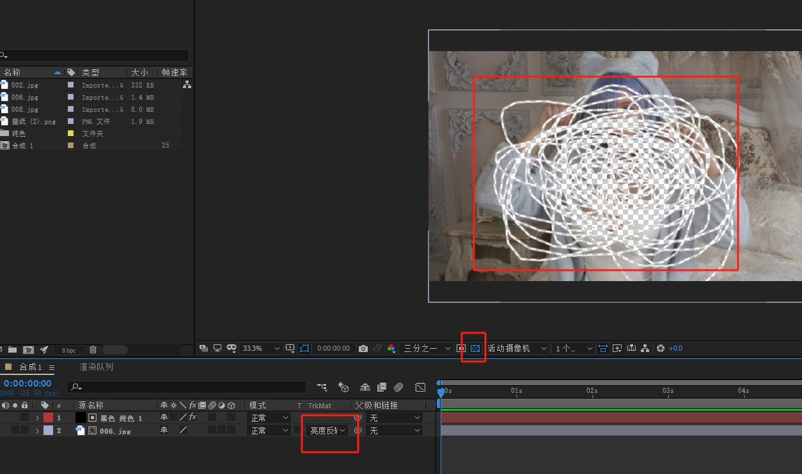

## 父子链接

> **父影响子，子不会影响父（例如旋转属性，父转则子转，子转父不转）**
>
> 画圆小方法：
>
> 1、新建一个纯色图层：宽高一样，图形工具选择椭圆，双击即可得到一个圆
>
> 2、旋转椭圆工具，按住Ctrl+Shift，鼠标按住左键画圆，画好后松鼠标左键，然后再送Ctrl+Shift
>
> 修改图层快捷键：选中图层，Ctrl+Shift+Y
>
> 地球的父级是太阳，将地球的【父级关联器】拖拽指向太阳，太阳转的时候，地球会跟着转；月亮的父级是地球，将月亮的【父级关联器】拖拽指向地球，地球转的时候，月亮也会跟着转；之间相互不影响。
>
> 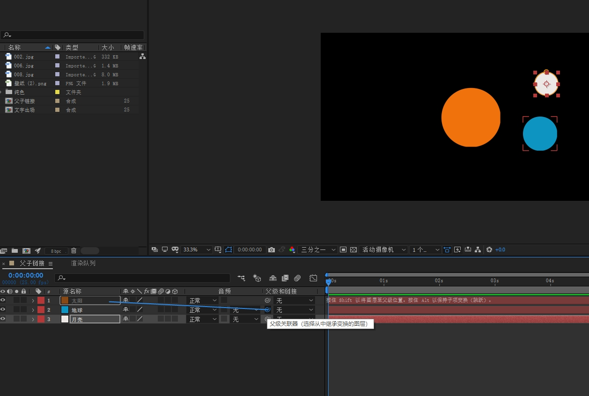
>
> 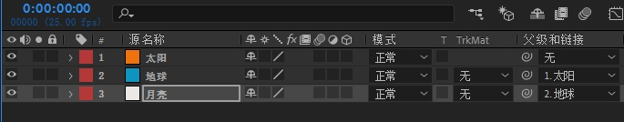
>
> 

## PSD文件导入

> 导入种类：合成-保持图层大小
>
> 图层选项：合并图层到素材
>
> 导入到AE后，就是一个合成，双击可查看所有图层了
>
> 超大PSD文件导入后电脑卡顿问题：【文件】---【脚本】---【Scale Composition.jsx】，然后按宽度【new Comp width】修改大小进行缩放
>
> PSD导入不分层问题：
>
> 有些图片是用于打印的，在PS查看图像模式：【图像】---【模式】中【CMYK颜色】格式是无法导入，只需将模式改为【RGB颜色】选择【不合并】，然后另存为即可。或Ctrl+Y改为RGB即可

## 合成窗口放大最大

> 快捷键：飘号键：**~**

