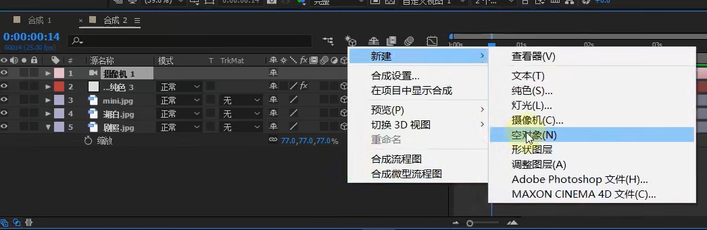

<h1>AE基础-三维篇</h1>

<h5>作者：汐小旅Shiorys</h5>

## 开启3D开关

> 
>
> 开启3D开关后，例如会发现位置属性多了一个维度，旋转属性多了一个轴向，合成面板多了一个空间坐标等
>
> 

## 摄像机

### 创建摄像机

> 在图层面板：【右键】---【新建】---【摄像机】
>
> 
>
> 摄像机面板设置：
>
> 类型：使用【双节点相机】，单节点很别扭
>
> 名称：根据需要自定义
>
> 预设：常规是24毫米到35毫米的焦段（焦段越小，透视越强。也就是视觉变化很大）
>
> 

### 操作摄像机

> 快捷键：老版本，C键；新版本：按Alt或C+Alt，此时合成上就会出现一个相机图标
>
> 单独操作：按下C键会在相机工具之间切换
>
> 
>
> 
>
> 旋转：在按住Alt的情况下，按住鼠标左键不放拖拽
>
> 缩放（推拉）：在按住Alt的情况下，按住鼠标右键不放拖拽
>
> 平移：在按住Alt的情况下，按住鼠标中键不放拖拽
>
> 注意：使用快捷键操作相机时，合成上的图标一定要处于相机图标，如果变成其他标志，一定要切换回来
>
> 

### 修改摄像机

> 双击图层中的摄像机即可

## 三维空间中的透视关系

> 近大远小，近快远慢(行驶火车窗外的景物)
>
> 图层关系将不是上层盖住下层，而是真实的三维空间了
>
> 摄像机焦段越小，透视越强，画面变形越严重。所以常规的拍摄角度是24毫米到35毫米之间。另外记住：大场景用小，特写用大。焦段小就是广角。透视与距离有直接的关系
>
> 焦段：也就是摄像机离物体的距离
>
> 

## 制作空间网格

> 新建纯色图层，选中图层，【效果与控件】面板，右键---【生成】---【网格】，开启3D，旋转角度
>
> 

## 相机视图(导演与摄像师)

> 修改相机视图
>
> 

### 自定义视图

> 在相机视图窗口选中【自定义视图X】，选中图层中的相机，缩放就可看到相机的位置，此时的角度我们看到的视角可比喻为**导演**视角
>
> 

### 双视图操作

> 
>
> 选中左边的视图，将【顶部】视图换成【活动摄摄像机】
>
> 
>
> 机会得到如下视图。其中：**左边是摄像机内部(摄像师)的视角，右边是导演的视角**
>
> 
>
> 摄像机由两个部分组成：一个是目标点，一个是摄像机的位置
>
> 
>
> 

### 打关键帧

> 可以从主观视角(摄像机视角)打关键帧（一个视图），也可从导演视角打关键帧（两个视图）；打关键帧需要打摄像机位置的关键帧，也要打目标点的关键帧

## 用空物体(空对象)控制相机

> 有时候觉得每次打关键帧需要打摄像机和目标点的关键帧，比较麻烦。所以可以通过空物体(空对象)来打关键帧。需要将空对象也要开启3D模式，把摄像机的父子链接链到空对象即可。可以制作螺旋动画
>
> 

### 空对象

> 可以使用空对象去带动几个对象；把几个对象的父链接指向空对象，相当于**变向的父子链接**。空对象运动，其他的对象也会跟着运动。空对象不是一个具体的对象，只是一个辅助我们打父子动画的对象。看不见、摸不着，也渲染不出来。同时使用空对象做动画后，摄像机还可以单独做动画，而且相互不影响。
>
> 空对象的缩放，会有摄像机推拉的效果

## 相机焦点的虚实变化

> 举例：例如用手机拍照的时候，会出现一个焦点，点击这个点的时候，这个点的位置就是清晰的，而之外的就是模糊的。
>
> AE中的摄像机也有这样的功能。
>
> 展开图层中的相机属性：【摄像机选项】----开启【景深】，在导演的视角就会看到相机前面出现了一个矩形方框，这个方框就是定焦的位置
>
> 
>
> 将【景深】移到要定焦的位置，然后慢慢加高【光圈】属性的值，就会发现定焦位置清晰，之外模糊
>
> 
>
> 变焦动画，通过给焦距打关键帧并且调整值，就可以实现变焦动画
>
> 
>
> 景深：相当于焦点
>
> 光圈：模糊程度
>
> 焦距：焦点到摄像机的距离

## 错误打摄像机方式

> 当想要将某张图片的视角由平面变成直线时，不能直接调整摄像机视角，不然当摄像机移动动直线的位置，摄像机就会旋转，导致图片翻转了。正确的操作是，不要移动相机，而是直接去操作图片旋转

## 常见相机动画及关键帧插值处理

### 浏览动画(巡游动画)

> 相机与空对象建立父子链接，通过操作空对象即可

### 关键帧插值处理

> 图形运动是曲线，如何调整为直线？
>
> 1、选中要走直线的关键帧
>
> 2、右键---【关键帧插值】
>
> 
>
> 3、将【空间插值】改为【线性】，默认是【贝塞尔曲线】
>
> 
>
> 

## 关键帧复制

> 选中要复制的关键帧，Ctrl+C复制，将时间线移动要复制到的位置，Ctrl+V 即可

## 显示mask的开关

> 

## 开启运动方向

> 让物体按照指定路线走
>
> 、、
>
> 自动方向选择：沿路径定向
>
> 

## 抠图技巧2

> 
>
> 可以提取白色和黑色，去掉白色
>
> 
>
> 

## 三维空间做倒影

> 加一个【调整图层】强行打破三维规则。调整图层放在底图层上方紧邻
>
> 
>
> 
>
> 

