
<h1>AE基础-灯光篇</h1>

<h5>作者：汐小旅Shiorys</h5>

## 灯光介绍

### 新建灯光（光影）

> 图层面板，右键---【新建】---【灯光】

### 灯光类型

> 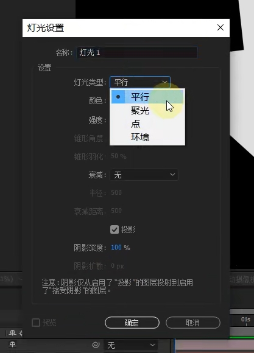
>
> **点**：相当于电灯。对环境产生一个照明。有了对环境的照明，环境就有了相应的体积感、立体感
>
> 灯光强度的快捷键：选择灯关图层，T
>
> 
>
> **聚光**：相当于手电筒打开的效果，舞台灯光效果
>
> 锥形角度可以调整灯光的开角
>
> 默认边缘(明暗交界处)有羽化的
>
> 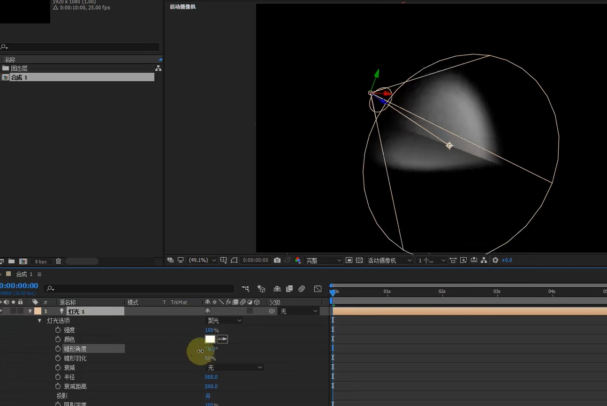
>
> **平行**：只有方向，可以理解为白天从窗户进来的太阳光
>
> 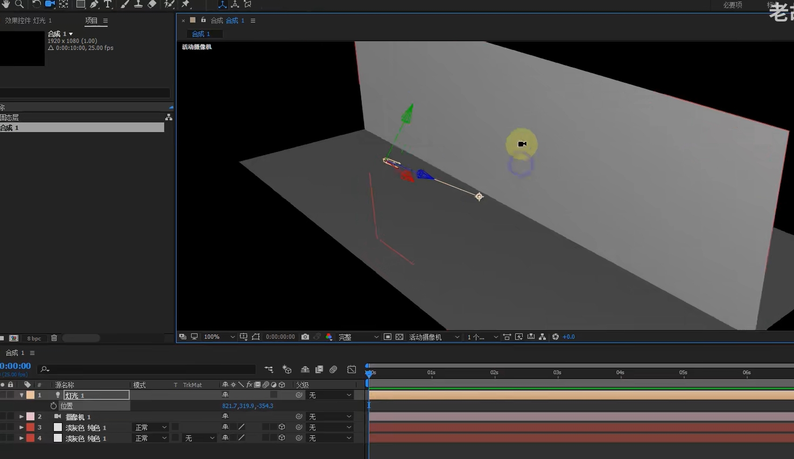
>
> **环境**：实际就是对整体做照明。主要是对环境进行一个光补充
>
> 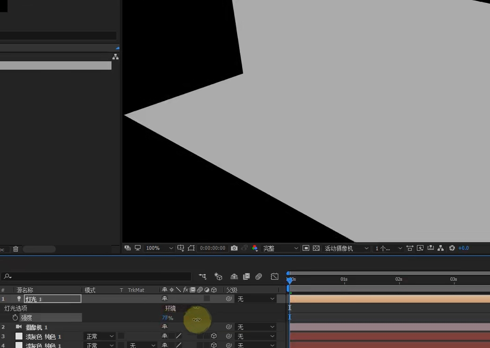
>
> 可以配合点光使用
>
> 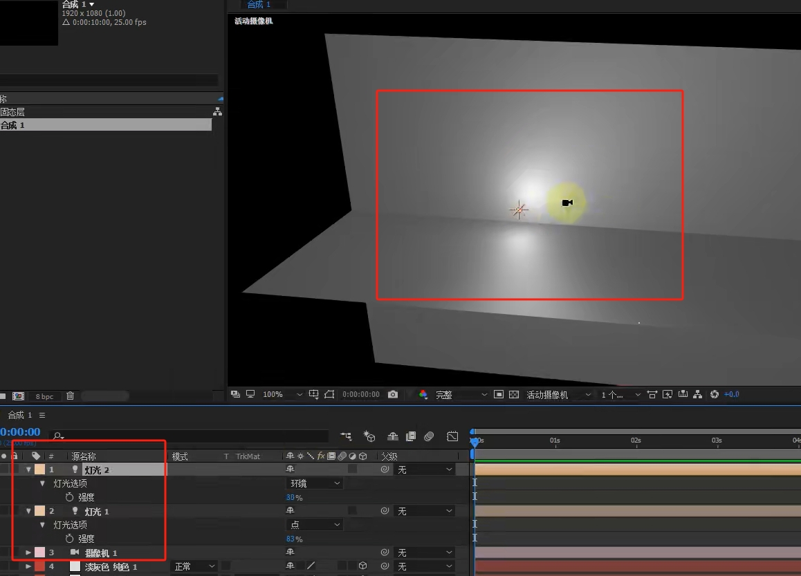

### 更改灯光设置

> 双击灯光图层即可

## 灯光阴影

> 1、将灯关的[【投影】勾选上
>
> 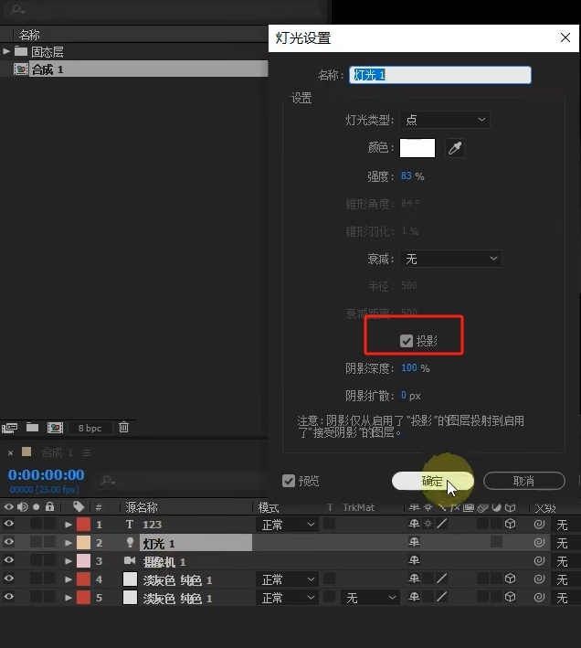
>
> 2、找到要投影的图层，将【材质选项】中的【投影】打开
>
> 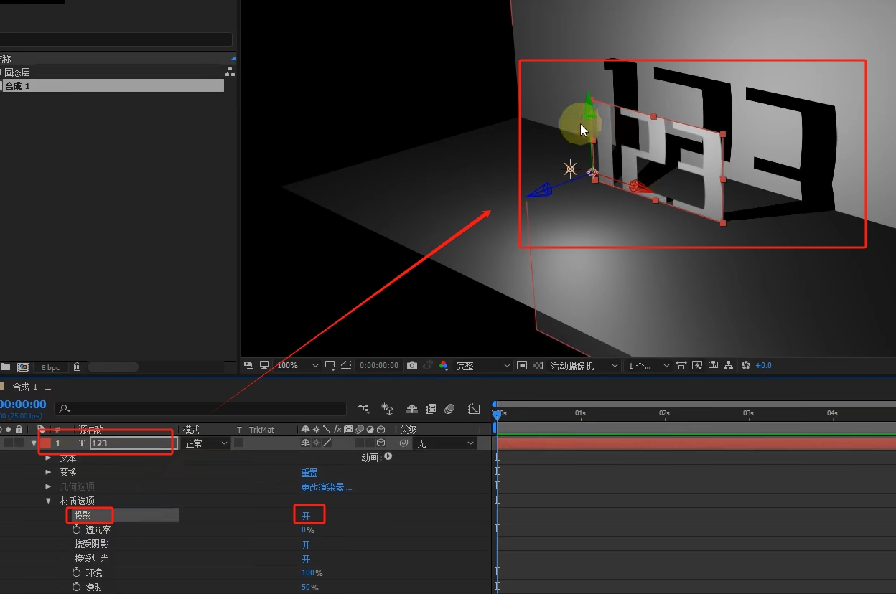
>
> 如果角色影子的颜色太重，可以在灯光图层的【灯关选项】中调节【阴影深度】，影子羽化的话，可以调节【阴影扩散】
>
> 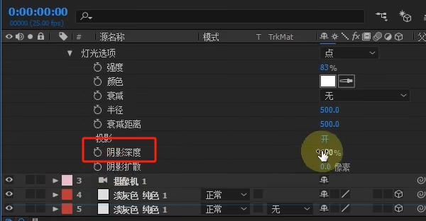
>
> 注意：环境光是不会产生阴影的
>
> 小技巧：如果同时有两个光源，颜色也不同，会有两个影子，那么可以选择将不保留影子的光源的【投影】关闭

## 灯光高级技巧-衰减控制

> 光谱颜色的加成。比如红光与蓝色，重叠部分就变成了紫光，在【灯光颜色】窗口可以看到，红色与蓝色之间的光是紫光
>
> 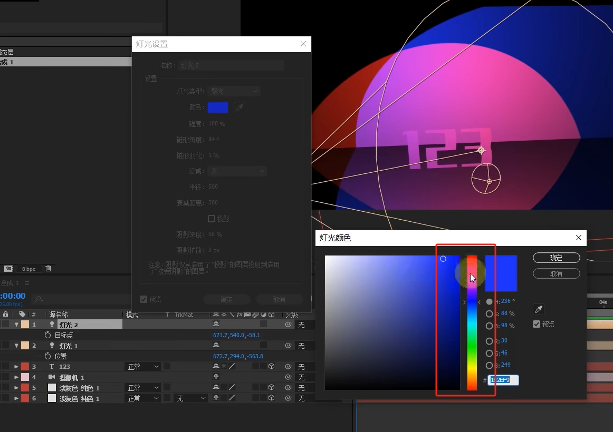
>
> 灯光在照射的过程中，光会越来越弱，所以需要设置灯光，需要开启【衰减】中的【反向平方限制】或【平滑】，然后收缩【半径】与【衰减距离】，光源会慢慢收缩
>
> 
>
> 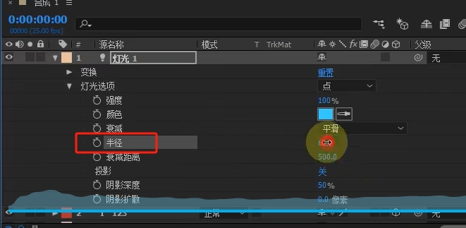
>
> 开启前
>
> 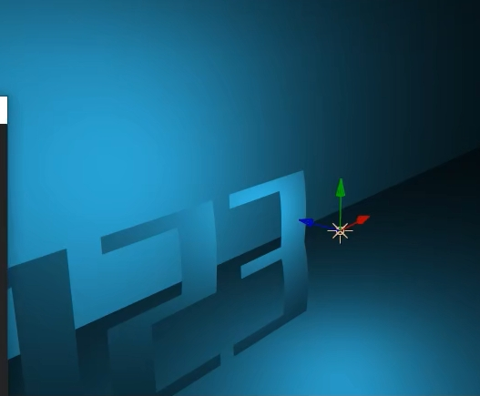
>
> 开启后，就会得到一个真实漂亮的照明效果
>
> 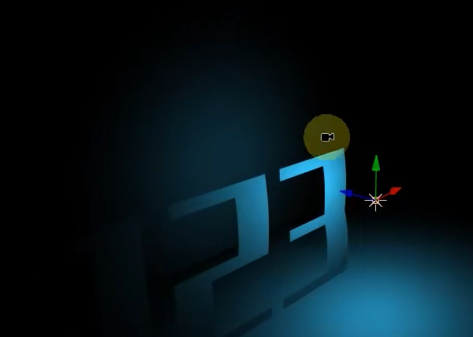

## 灯光高级技巧-透光率

> 投影仪的效果：找到图片【材质选项】中灯光的【透光率】
>
> 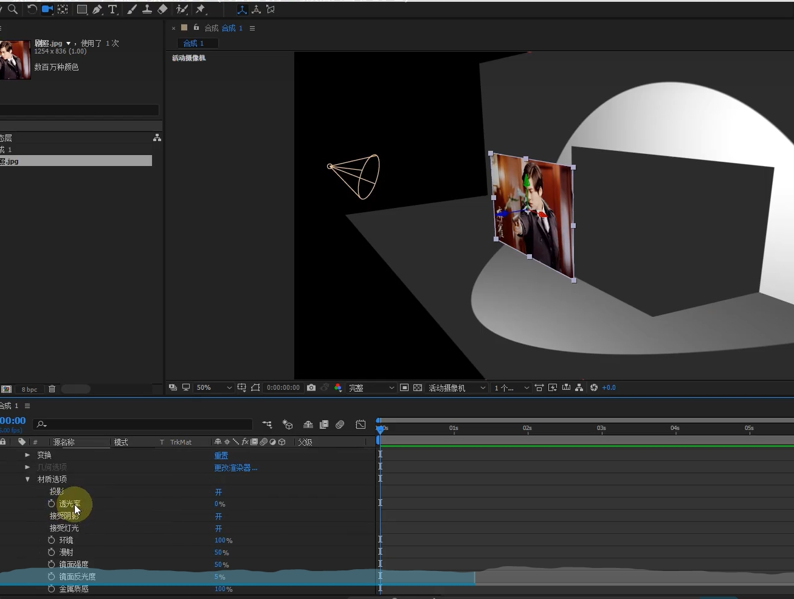
>
> 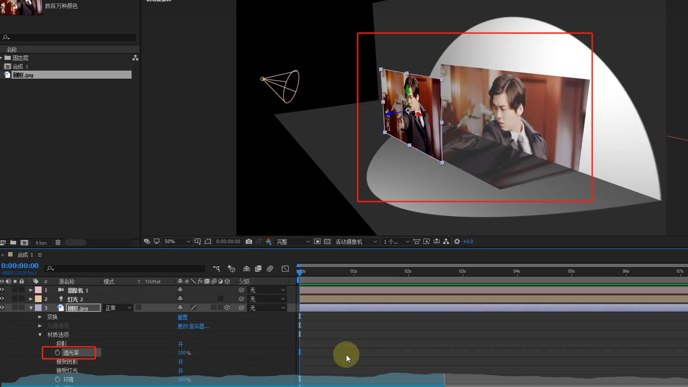
>
> 可以将图片父子链接指向灯光，这样无论灯光怎么动，图片也会跟着动

## 灯光高级技巧-高光应用

> 注意：纯色不能选择黑色，黑色会吸收所有光，导致灯光看不见。白色是受光照明最强的，所以推荐白色图层
>
> 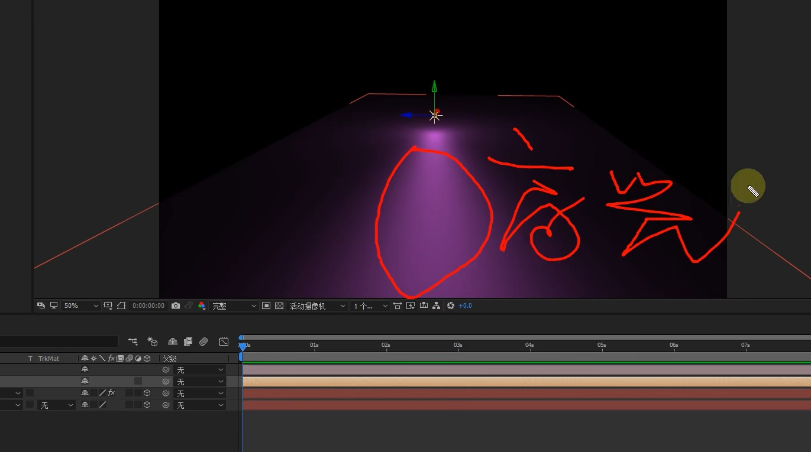
>
> 默认灯光会把纯色当做一个有金属光泽的板子
>
> 只需要将图层中的【材质选项】中的【镜面强度】调低即可，高光就会收拢
>
> 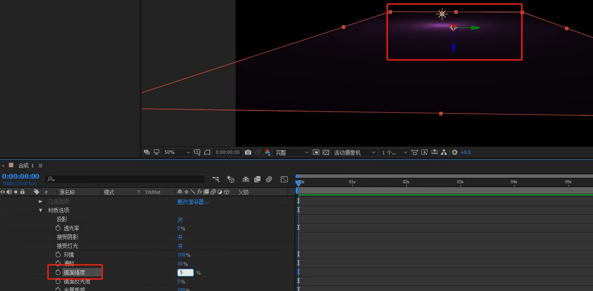
>
> 【镜面反光度】越高，高光条纹越细
>
> 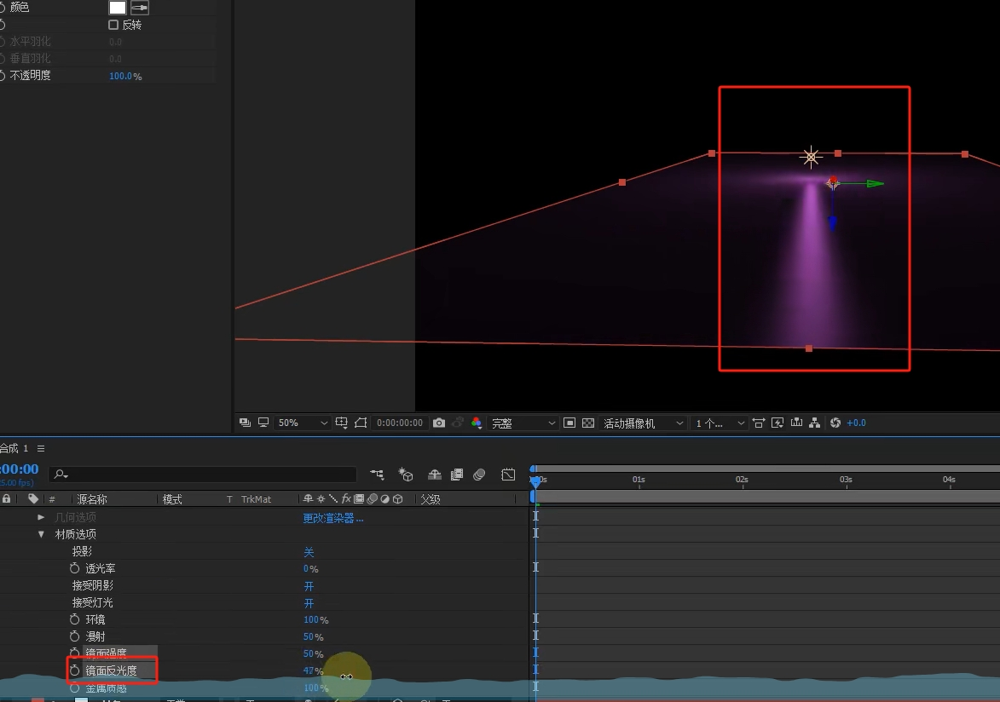
>
> 光源自身的照明为【漫反射】
>
> 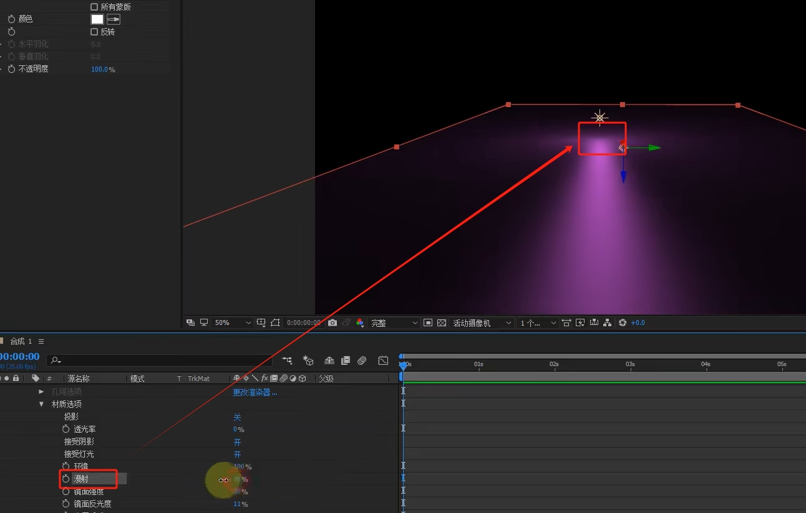
>
> 灯光由漫射和高光组成
>
> 可以模拟舞台灯光
>
> 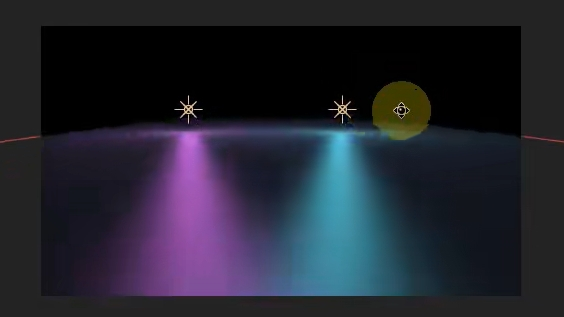

