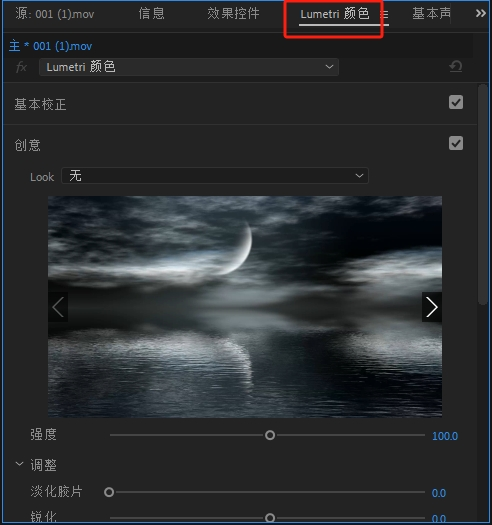
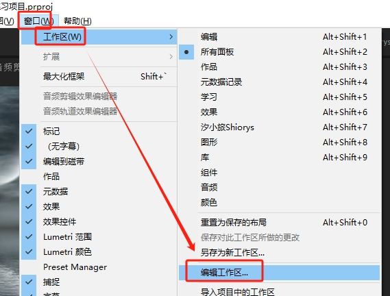

<center><h1>PR基础</h1></center>

<center><h5>作者：汐小旅Shiorys</h5></center>


## 常用窗口介绍

> 点击左上角的**小房子图标**可以进入【**主页面**】
>
> 
>
> 在【**主页面**】中，可以**新建项目**，也可**打开最近自己编辑的项目**
>
> 
>
> 
>
> 右侧是PR【**预设的工作区**】，每个工作区有相应的界面，一般不怎么使用这些工作区的界面，而是根据自己的喜好**自定义工作区**，后面会说到如何定制工作区。
>
> 


### 项目窗口

> **作用**：导入素材、管理素材、快速预览视频素材(鼠标移到视频素材上移动)。【双击】或【右键】可以导入素材
>
> 


### 效果窗口

> **作用**：PR预设或外设的视频、音频效果
>
> 


### 历史记录窗口

> **作用**：查看项目编辑的历史记录，方便做错以后回到之前版本
>
> 


### 源窗口

> **作用**：双击项目窗口中的素材，素材会显示在【**源**】窗口。可以浏览素材、设置素材的出点、入点
>
> 


### 信息窗口

> **作用**：显示当前所选择素材的信息
>
> 


### 效果控件窗口

> **作用**：可以编辑所有效果，如关键帧动画、音频、视频各种效果制作
>
> 


### Lumetri颜色窗口

> **作用**：PR的调色窗口。可以对视频进行调色
>
> 


### 基本声音窗口

> **作用**：PR的声音编辑窗口。可以对视频声音进行编辑
>
> 


### 节目窗口

> **作用**：预览在剪辑视频的窗口。预览项目、可以调节预览窗口的大小、调整预览分辨率
>
> 


### Lumetri范围窗口

> **作用**：调色时常用，常与【**Lumetri颜色**】配合各种图表查看效果，更加精确查看各种参数与调色效果
>
> 


### 基本图形窗口

> **作用**：功能很强大，有很多PR自带模板，也可以导入外部模板组成自己的模板库
>
> 


### 常用工具窗口

> **作用**：编辑项目的工具，视频编辑用到
>
> 


### 时间轴窗口

> **作用**：视频、音频、图片、字母等根据需要，按时间先后叠放在时间线上，然后组成了要剪辑的视频
>
> 


## 自定义工作区(面板)

> PR工作区支持自定义，可以基于某个工作区，然后根据自己的喜好拖拽窗口，组成自己想要的界面。
>
> 如果没有的窗口，可以在**菜单栏**中【**窗口**】中勾选上即可
>
> 
>
> 如图为本人基于【**组件**】工作区拖拽好的界面。
>
> 
>
> 最后只需在自己基于的工作区旁边的**三条杠**点开【**另存为新工作区**】，然后输入自定义名称【**确定**】即可
>
> 
>
> 
>
> 之后在工作区位置就可以多出一个刚才自定的工作区了
>
> 
>
> 还可以通过双箭头中的【**编辑工作区**】或菜单栏【**窗口--工作区--编辑工作区**】设置显示或隐藏工作区。要隐藏的拖拽到【**溢出菜单**】即可
>
> 
>
> 
>
> 
>
> 这样界面就显得比较简洁
>
> 


> **注意**：如果自己不小心把窗口弄乱了，则在工作区旁边的**三条杠**点开【**重置为已保存的布局**】，界面布局会恢复默认的样子
>
> 


## 软件设置

> 


## 项目、序列、素材理解

> 比如做一顿晚餐，需要做一些菜，而每种菜都需要食材和调料。此时
>
> **项目=晚餐**
>
> **序列=菜品**
>
> **素材=食材和调料**
>
> 则：**视频剪辑=做晚餐**
>
> **一个项目**可以**由一个或多个序列组成**，**每个序列又有多个素材按照目的组合而成**。序列也可简单理解为时间线


## 项目管理

> 在PR新建项目之前，建议先在电脑上建好项目文件夹。本人项目管理如下
>
> 主项目文件夹：名称为：日期+项目名称
>
> 主项目文件夹下：
>
> ```java
> 主线：存放主线视频素材
> 辅线：存放辅助主线的说明性素材
> 音乐音效：存放挑选好的背景音乐和音效
> 封面：存放封面用到的素材或已经做好的封面
> 字幕：存放语音生成字幕的MP3文件和语音生成的字幕文件
> PR：存放PR项目文件
> 成片：存放制作好的视频成片
> ```
>
> 


## 新建项目

> 打开PR之后会看到下面的界面。点击中间位置的【**新建**】或者左侧的【**新建项目**】均可新建项目。假设已经有项目了，可以选择【**打开项目**】打开
>
> 


### 常规设置

> 名称：根据项目自定义
>
> 位置：选择自定义目录位置（也就是上面**项目管理**中**PR**的位置）
>
> 视频渲染和回放：选择GPU加速(CUDA)
>
> 


### 暂存盘设置

> 全部选择【**与项目相同**】即可
>
> 


> 之后点击【**确认**】即可，然后进入项目界面
>
> 


## 导入素材

> 1、将存放素材的文件夹直接拖入【**项目**】窗口：这些文件夹会自动变成素材箱，文件夹里的素材也会被导入项目。
>
> **注意**：如果文件夹里没有文件，也就是空文件夹是无法导入项目中的；另外PR的项目结构和电脑里的文件夹结构是完全独立的，电脑上的文件夹是真正存放素材的地方，而PR的项目结构是虚拟的，只是一个虚拟的索引，比如删掉PR中的素材和素材箱，电脑里的文件是不受影响的。
>
> 2、在PR项目窗口直接导入：在项目窗口右键【**导入**】或双击，找到要导入的素材导入即可。


## 新建序列

> 1、在项目窗口右键【**新建项目**】---【**序列**】
>
> 2、项目窗口底部工具新建图标---【**序列**】，如果看不到这个图标，手动横向调节一下项目窗口的宽度。
>
> 


### 序列设置

> **序列预设**
>
> 可以根据官方的**预设**新建自己的**预设**，比如【AVCHD】中【1080p】中【AVCHD 1080p25】，右侧会有预设的说明描述。这个预设是**常用的横屏预设**。
>
> 
>
> **设置**
>
> 这个地方基本不用改
>
> 
>
> **轨道**
>
> 可以根据需要修改序列默认的轨道数量，比如序列比较复杂，可以增加序列的轨道数量。也可增减**音频轨道数量**及**轨道类型**。5.1轨道基本用不到，采用【**标准**】即可
>
> 
>
> 如果修改之后，点击【保存预设】，写上【名称】和【描述】,点击【确定】，这个序列就被保存了，下次新建序列时，在底部【自定义】中就可以看到保存的预设了
>
> 
>
> 
>
> 选择刚才自定义的序列，给序列命名，确定后序列就会被加载到时间线上
>
> 
>
> 其中：V1到V5就是视频的轨道，A1到A5就是音频的轨道
>
> 


### 设置1080P-竖屏

> 选择刚才自定义的序列预设
>
> 
>
> 修改设置：【编辑模式】选【自定义】，【帧大小】水平和垂直交换一下，即：水平1080，垂直1920，然后保存预设即可
>
> 
>
> 
>


## 剪辑步骤

> 先粗剪、后精剪
>
> **前提条件**：已经完成新建项目、素材导入、新建序列


### 粗剪

> 1、预览和挑选素材
>
> 2、调整素材顺序
>
> 3、精确修剪素材
>
> 4、添加背景音乐
>
> 粗剪的目的是为了确定剪辑思路，确定故事走向


#### 预览和挑选素材

> 挑选合适的素材：
>
> 方式1：鼠标在素材上慢慢划过，画面会跟着一起播放，这样就可以快速预览素材内容。【注意：不能点击选中素材，不然就没法通过移动鼠标预览素材了，素材是在未选中的情况下才能通过划鼠标预览。】
>
> 设置入点：划到素材要开始的位置，按下 **i** 键，就可以设置素材的起点
>
> 设置出点：划到素材要结束的位置，按下 **o** 键，就可以设置素材的终点
>
> 【注意：如果按 **i** 键和 **o** 键没反应，需要将输入法切换到英文状态下】
>
> 然后选中素材拖放到时间轴上即可，此时可能会弹出一个提示框【**剪辑不匹配警告**】，选择【**保持现有设置**】，因为有时候视频的帧率可能会与序列的不同，所以要让素材与序列保持一样，也就是按照序列的帧率来。
>
> 
>
> 方式2：可以双击素材，素材就会出现在【源】窗口中，同样可以使用 **i** 键和 **o** 键设置视频的入点和出点
>
> 
>
> 【快速浏览素材技巧】：使用键盘 **J、K、L、空格**键
>
> **L键**：按一次常速播放；连按多次快进，按得越多，速度越快，也就是多倍快进
>
> **J键**：按一次常速倒放；连按多次多倍倒放
>
> **K键**：暂停播放
>
> **空格键**：暂停/播放
>
> 
>
> 按住鼠标，拖拽【**源**】窗口中的画面到时间轴上，可以连画面带声音一起导入时间轴
>
> 只想要画面，可以拖拽画面图标
>
> 
>
> 只想要声音，可以拖拽声音图标
>
> 


#### 调整素材顺序

> 将素材大致摆放在时间轴上之后，可以进行调整素材的顺序，以确定故事的走向
>
> 【**移动素材片段工具**】：
>
> 【选择工具】：快捷键**V**。直接拖拽就可以任意移动素材片段的位置。
>
> 同时按住**Ctrl**键可以**前后上下插入**任意两个素材片段之间，可以插入的地方会出现一条竖线，**相邻的素材片段会顺延**。
>
> 同时按住**Shift**键可以**上下移动**素材片段，素材片段**不能左右移动**。适用于前后需要对齐的场景。
>
> 同时按住**Alt**键可以**复制并移动**素材片段。适用于需要重复使用的素材(如：视频、字母、音效等等)
>
> 
>
> 
>
> 【选择轨道工具】：向前选择轨道工具、向后选择轨道工具。可以在【选择工具】下使用鼠标框选住拖拽来替代。
>
> 这个工具主要是为了应对一次性选择多个素材移动的情况；**同时按住Shift键**，可以单独选择一条轨道上的素材移动，移动到指定位置，**先松开Shift键再松开鼠标**即可。
>
> 
>
> a、【向前选择轨道工具】：快捷键**A**。可以一次性选择右侧的所有素材拖拽到需要移动到的地方即可。
>
> 
>
> b、【向后选择轨道工具】：快捷键**Shift+A**。同理【向前选择轨道工具】


#### 精确修剪素材

> 【选择工具】：快捷键**V**。只需将鼠标放在**素材片段的头尾处**拖拽片段就可以控制素材的长度
>
> 
>
> 
>
> 【波纹剪辑工具】：波纹编辑工具、滚动编辑工具、比率拉伸工具
>
> 
>
> a、波纹编辑工具：快捷键**B**。和选择工具类似，也可以拖拽素材片段的头尾控制素材片段的长度。
>
> 区别在于**该工具会改变总体时间轴的长度**，可以任意拉长缩短素材，**两边相邻位置的素材片段也会随之改变**；而【**选择工具**】**不改变总体时间轴长度，只能在自己所在素材片段长度里变化，两边相邻的素材片段位置也不受影响**。
>
> b、滚动编辑工具：快捷键**N**。
>
> c、比率拉伸工具：快捷键**R**。
>
> 
>
> 【剃刀工具】：快捷键**C**。只需要移动到素材片段上，点击一下，素材就会被切开了。
>
> 
>
> 剃刀工具技巧（QW大法）：选中素材片段不需要的部分切两刀，按删除键删除，这种操作需要右手在鼠标和键盘之间来回操作比较麻烦。技巧是：先用剃刀工具切一刀，然后将播放指针向后拖到第二刀的位置，按下**Q**键，播放指针左边的部分就会被删除；可以使用**W**键删除播放指针右侧的部分。
>
> 技巧常使用场景：例如说话的音频，需要剪掉换气的部分，可以放大放高音频轨道，这样可以清楚的看到音频的波形，就可以使用剃刀工具技巧（QW大法）剪切了。
>
> 
>
> 【吸附功能】：蓝色为开启状态。移动素材片段时，会有自动吸附对齐接缝的功能。如果不需要，关闭即可。大部分情况需要打开，少部分情况可以关闭（比如需要对齐一些非接缝的地方，关闭吸附功能会比较容易）
>
> 
>
> 【链接功能】：蓝色为开启状态。移动素材时视频和音频是链接在一起的。关闭之后可以解锁视频和音频的链接，可以单独移动或删除视频或音频。建议打开，否则可能音画不同步了。
>
> 


#### 添加背景音乐

> 同视频一样，可以设置入点和出点等。
>
> 不同的是，音乐是音频，只能被拖放到音频轨道，视频轨道是拖不进去的。
>
> 音频剪切和视频一样


### 精剪

> 1、添加转场和效果
>
> 2、制作关键帧动画和变速
>
> 3、调整人声、音乐、添加音效
>
> 4、整体调色
>
> 5、制作字幕、标题
>
> 6、导出视频
>
> 精剪的目的是为了优化美化视频


#### 添加转场(过渡)和效果

> 在PR添加转场和效果主要用到三个面板
>
> 1、**效果面板**：所有的自带效果都在这个里面，也可以自己安装插件和预设。
>
> 2、**时间轴面板**：选择好的效果或者转场，只需要拖拽进时间抽合适的地方即可。效果拖到视频上，转场(过渡)拖到两个素材片段之间。
>
> 3、**效果控件面板**：所有的效果都可以在这个面板里调整参数。包括关键帧动画。
>
> 
>
> **效果面板**
>
> 
>
> 预设：里面是一些快速拖拽就能使用的效果
>
> Lumetri预设：里面是一些调色预设，拖到素材上就可以产生调色效果，和滤镜有点相似。可以使用Lumetri颜色面板来调替代
>
> 音频效果：里面是一些声音效果。可以使用声音面板来调替代	
>
> 音频过渡：里面是一些声音转场，也就是两段声音的转场效果。常用里面的【恒定功率】，它会让两段音频无缝连接
>
> 视频效果：里面是视频的各种应用效果。常用【变换、扭曲、模糊与锐化、键控（大部分高级转场必用）等】，可自行尝试
>
> 视频过渡：里面是视频转场的效果。可自行尝试。转场是为内容服务的，乱用转场会适得其反。常用【溶解（**交叉溶解**：一般用在两段有联系但是又有区别的视频中间，使两段视频流畅过渡、降低卡顿的感觉，例如文字，只需在文字两端添加，文字就可以实现渐入渐出的感觉；**黑场过渡**：也叫闪黑转场，一般用在一件事说完了，下一件事情就要开始的时候，可以放在片尾）】。
>
> 频繁拖拽效果很浪费时间，可以将常用的效果设置为默认效果。右键【将所选过渡设置为默认过渡】，回到时间轴面板上，在两段素材的接缝处点一下，会看到一个红色的标识，在标识上右键，选择【应用默认过渡】（快捷键：Ctrl+D）

