<center><h1>Git-分布式版本控制系统</h1></center>

<center><h5>作者：汐小旅Shiory</h5></center>


# 下载

> **官网**：https://git-scm.com/


# 安装

> 版本：2.40.1
>
> 1、双击**exe文件**，点击【**Next**】
>
> 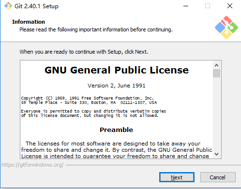
>
> 2、选择安装目录，点击【**Next**】
>
> 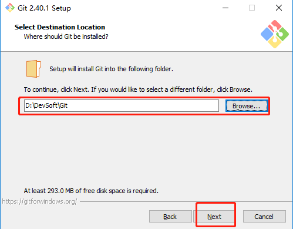
>
> 3、选择组件，可根据需要勾选，点击【**Next**】
>
> 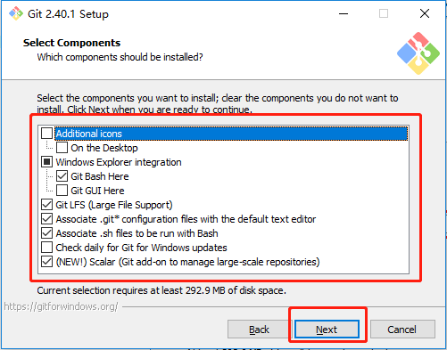
>
> 4、选择启动菜单文件，根据需要自行配置，建议不用创建，没啥用
>
> 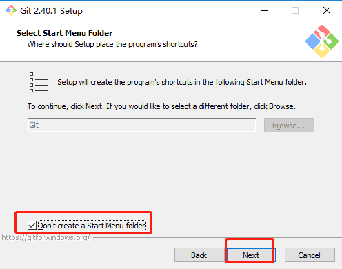
>
> 5、选择Git的编辑器，默认**vim**即可
>
> 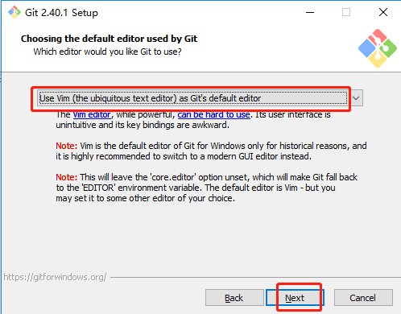
>
> 6、调整默认分支名称，默认**master**即可，也可根据需要调整
>
> 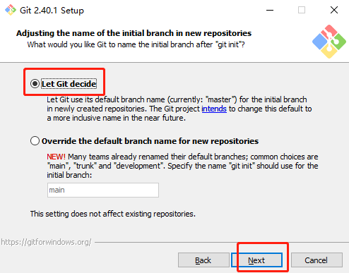
>
> 7、调整环境变量，建议第三方软件也能通过命令行使用Git
>
> 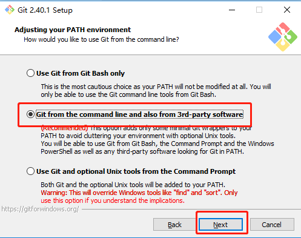
>
> 8、选择可执行的SSH，使用Git捆绑的OpenSSH即可
>
> 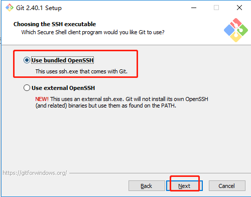
>
> 9、选择后端https传输协议，使用OpenSSL库即可
>
> 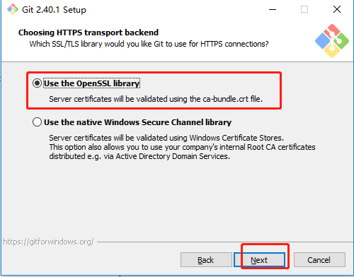
>
> 10、配置行结束标记(也就是回车换行)，默认即可
>
> 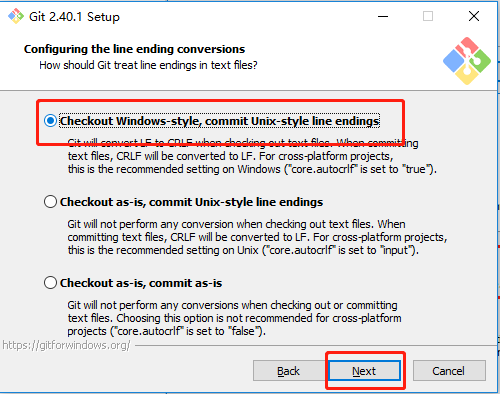
>
> 11、配置Git Bash终端，默认即可
>
> 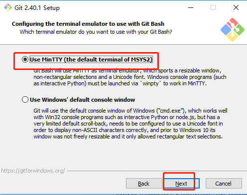
>
> 12、选择**git pull(拉取代码)**默认行为，选择默认快速合并即可
>
> 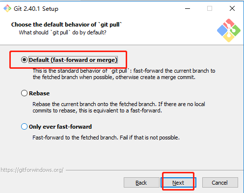
>
> 13、选择Git凭证帮助，默认Git的即可
>
> 
>
> 14、配置额外操作，选择默认允许系统缓存即可
>
> 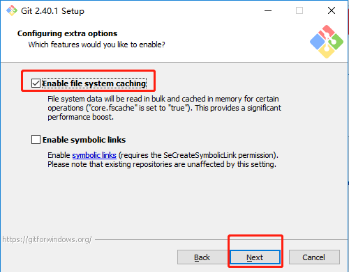
>
> 15、配置试用操作，无需勾选，点击【**Install**】等待安装即可
>
> 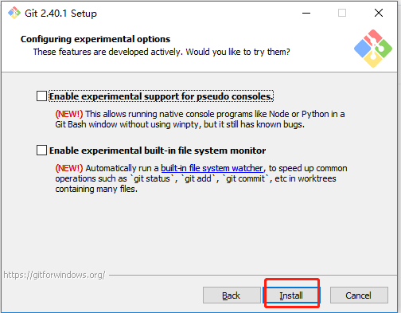
>
> 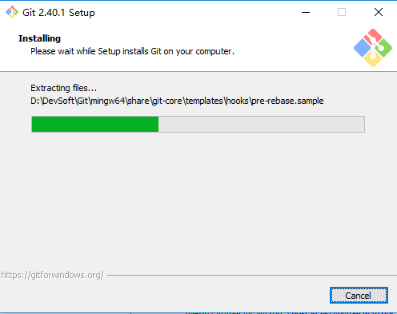
>
> 16、安装完成后，去掉勾选，点击完成【**Finish**】
>
> 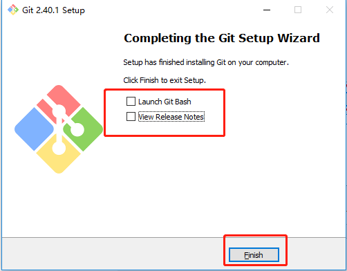
>
> 此时，鼠标右键会出现**Git Bash Here**
>
> 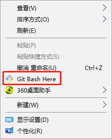
>
> 也可以通过命令行查看Git版本，Win+R输入`cmd`打开系统命令行，输入`git --version`，即可查看Git版本，输入`git`则可查看Git所有信息
>
> 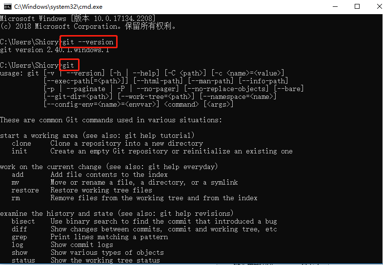
>


# 配置

> 因为Git是分布式版本控制系统，所以，每个机器都必须自报家门：用户名和Email地址。必须提供用户名，但可以使用虚构的电子邮件地址。
>
> 所以，安装完成后，还需要最后一步设置，打开Git Bash命令行后，在命令行输入：
>
> ```sh
> git config --global user.name "你的用户名"
> git config --global user.email "你的邮箱"
> 
> 
> git config --global user.name "汐小旅Shiory"
> git config --global user.email "Shiory@aliyun.com"
> ```
>
> 注意：`git config`命令的`--global`参数，用了这个参数，表示当前这台机器上所有的Git仓库都会使用这个配置，当然也可以对某个仓库指定不同的用户名和Email地址
>
> 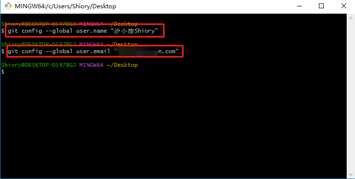
>
> 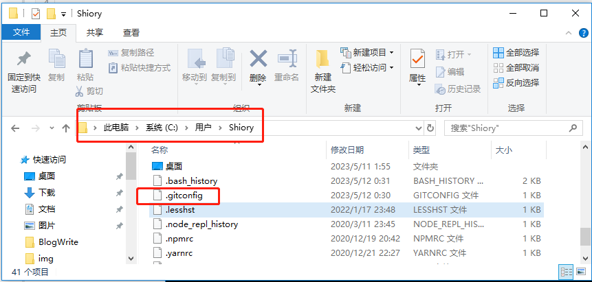

```ssh
ssh-keygen -t rsa -C 'Shiory@aliyun.com' -f ~/.ssh/gitee_id_rsa
ssh-keygen -t rsa -C 'Shiory@aliyun.com' -f ~/.ssh/github_id_rsa

# gitee
Host gitee.com
HostName gitee.com
PreferredAuthentications publickey
IdentityFile ~/.ssh/gitee_id_rsa

# github
Host github.com
HostName github.com
PreferredAuthentications publickey
IdentityFile ~/.ssh/github_id_rsa

ssh-add ~/.ssh/gitee_id_rsa
ssh-add ~/.ssh/github_id_rsa

ssh -T git@gitee.com
ssh -T git@github.com
```

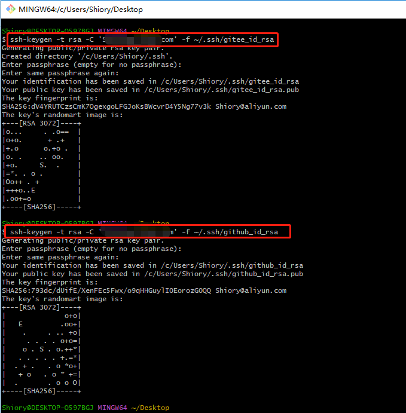

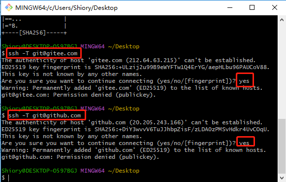


