<center><h1>Git的设置</h1></center>

<center><h5>作者：汐小旅Shiorys</h5></center>


# Git基本设置

> Git提供了`git config`工具进行账号信息的设置
>
> 例：设置全局用户名与邮箱，其中`--global`为全局设置
>
> ```bash
> git config --global user.name "用户名"
> git config --global user.email "邮箱"
> ```


## Git的设置级别简述

> Git共有三个级别的设置文件`config`：分别是`system`、`global` 和 `local`。以下是设置文件三个级别的说明
>
> | 级别   | 作用范围                   | 配置文件位置                                                 | 优先级 |
> | ------ | -------------------------- | ------------------------------------------------------------ | ------ |
> | local  | 当前仓库适用               | 当前仓库/.git/config                                         | 最高   |
> | global | 当前用户的所有仓库         | ~/.gitconfig(当前用户宿主目录下，例：windows下是C:/users/xxx/.gitconfig) | 中     |
> | system | 当前系统所有用户的所有仓库 | linux下是/etc/gitconfig；windows下是 Git安装目录/mingw64/etc/gitconfig | 最低   |
>
> ```tex
> 作用范围：system>global>local
> 优先级：local>global>system (设置有local优先使用local设置，否则看是否有global设置，再次之才会找system设置)
> ```
>
> 通过以下指令可以读写对应级别的配置文件`config`
>
> ```bash
> git config --local：仓库级别的设置，只对当前仓库适用
> git config --global：全局用户级别的设置，对当前用户的所有仓库适用
> git config --system：系统级别的设置，对所有用户的左右仓库适用
> ```
>
> **扩展**：所有的指令其实都是在读写配置文件。每个级别都会有一个对应的`config文件`，即直接修改对应的`config文件`也可以达到指令的设置效果。


## Git常用设置

### 设置用户名与邮箱

> 打开`Git Bash`界面，以下设置任选其一即可，通常是**设置全局用户名与邮箱**，特殊需求会**设置当前仓库用户名与邮箱**
>
> 1、设置全局用户名与邮箱
>
> ```bash
> git config --global user.name "你的用户名"
> git config --global user.email "你的邮箱"
> ```
>
> 2、设置当前仓库用户名与邮箱
>
> ```bash
> 需求：在不影响全局用户的情况下，单独给某个仓库设置一个不同的Git用户
> git config --local user.name "你的用户名"
> git config --local user.email "你的邮箱"
> ```


## Git查看设置的信息

> 查看指令
>
> ```bash
> git config --local -l 查看仓库配置
> git config --global -l 查看用户配置
> git config --system -l 查看系统配置
> git config -l 查看所有配置，依次是系统级别、用户级别和仓库级别
> ```


## Git其他设置指令

> ```bash
> git config -e 编辑
> git config --add 添加
> git config --get 获取
> git config --unset 取消设置
> ```


# SSH秘钥设置

## 设置SSH秘钥的原因

> 获取Git服务器代码到本地通常有三种方式：
>
> 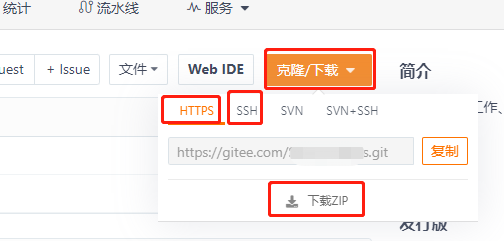
>
> **1、HTTPS方式**
>
> > **获取方式**：`git clone 仓库https地址`
> >
> > **使用说明**：不需要任何账号设置，只要拿到https仓库地址，可以任意克隆项目。但是当需要fetch和push的时候，需要验证用户名和密码。简单来说，https方式克隆时不校验，但是提交时需要校验。
>
> **2、SSH方式**
>
> > **获取方式**：`git clone 仓库https地址`
> >
> > **使用说明**：这种方式只能克隆自己账号下的项目，你必须是clone项目的所有者或者管理员，而且需要在clone前添加SSH Key，否则无法克隆clone。当需要fetch和push的时候，是不需要输入用户名的。如果配置SSH key的时候设置了密码，则需要输入密码，否则是不需要输入密码的。它的好处在于，只需要配置一次，后面fetch和push代码等操作都不再需要输入账号密码。
>
> **3、ZIP下载方式**
>
> > **获取方式**：直接下载ZIP包
> >
> > **使用说明**：不需要任何账号设置，直接下载
>
> 所以，如果只是下载别人的代码，直接https或打包下载都行；如果要用Git进行代码管理，ssh是最方便的方式。
>
> 同时，ssh方式目的是为了让clinet和git server能够安全通信，所以采用了数字签名RSA或者DSA来完成这个操作。


## 设置SSH秘钥步骤

### 查看是否已经生成过SSH key

> 打开`Git Bash`界面，输入以下命令查看系统用户目录下是否存在`.ssh`文件夹以及`.ssh`文件夹下是否存在`id_rsa.pub`或`id_dsa.pub`文件
>
> ```bash
> cd ~/.ssh
> 
> ls
> ```
>
> 或者直接打开文件夹查看
>
> 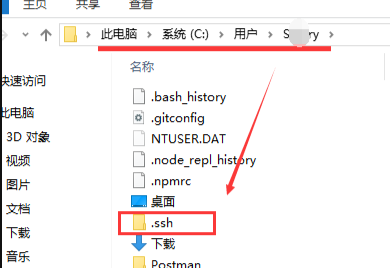
>
> 如果存在`id_rsa.pub`或`id_dsa.pub`文件，就备份一下`.ssh`文件夹，将这里的删除


### 单个Git账号设置SSH秘钥

> **1、创建SSH key**
>
> 打开`Git Bash`界面，输入以下命令创建
>
> ```bash
> ssh-keygen -t rsa -C "你的邮箱"
> ```
>
> 代码参数含义
>
> ```bash
> -t：执行密钥类型，默认是rsa，可以省略
> -C：设置注释文字，比如邮箱
> -f：指定密钥文件存储文件名
> 以上代码省略了-f 参数，因此运行上面那条命令之后会让你输入一个文件名，用户保存刚才生成的SSH key。
> 该命令执行后，会在C盘用户目录下生成.ssh文件夹(~/.ssh)，该文件夹下会有一对秘钥，分别是私钥和公钥，公钥需要注册到Git服务器（如GitLab、Gitee、GitHub）
> ```
>
> 根据提示按回车，共3次回车。建议不输入任何内容直接回车3次。
>
> ```bash
> 第一次回车：提示输入密钥文件名称，可设置，也可以直接使用默认，使用默认文件名就会生成id_rsa和id_rsa.pub两个密钥文件。
> 第二次回车：提示输入密码(该密码是push文件的时候输入的密码，而不是git server管理者的密码)。建议不输入密码直接回车，那么push的时候就不需要输入密码，直接提交
> 第三次回车：提示再次确认输入的密码。
> ```
>
> 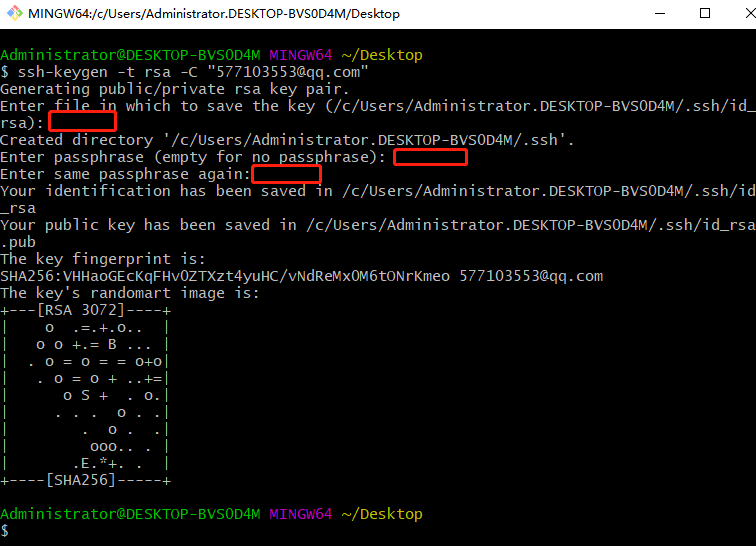
>
> 最后会在`.ssh`下得到两个文件\**id_rsa\**(私钥)和\**id_rsa.pub\**(公钥)。私钥自己保留，公钥需要配置带要访问的ssh服务器，也就是Git服务器（如GitLab、Gitee、GitHub）。
>
> 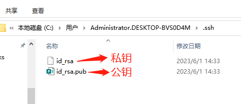
>
> ```bash
> 注意：id_rsa和id_rsa.pub是成对生成的，二者必须匹配才能工作。当你把id_rsa.pub公钥导入到远程服务器时，本地目录下的 ~/.ssh/id_rsa 私钥是不能删除的，也不能挪位置；当调用ssh -keygen命令重新生成密钥对时，本地目录下的 ~/.ssh/id_rsa 私钥会被覆盖，因此，需要把最新的公钥导入到远程服务器才能继续pull或push代码。
> ```
>
> 
>
> **2、将SSH公钥内容注册到Git服务器(如GitLab、Gitee、GitHub)**
>
> 将用户主目录下`~/.ssh/id_rsa.pub`文件的内容粘贴到Git服务器（可以直接用文本编辑器打开该文件，也可以通过命令`cat ~/.ssh/id_rsa.pub`查看复制公钥文件中的内容）。以下以**Gitee**与**GitHub**为例添加SSH公钥
>
> **Gitee添加SSH公钥**
>
> > 【**头像**】-- 【**设置**】-- 【**SSH公钥**】，输入公钥**标题**(任意)、将复制的公钥粘贴到**公钥**中，点击【**确定**】，输入**密码**【**验证**】即可
> >
> > 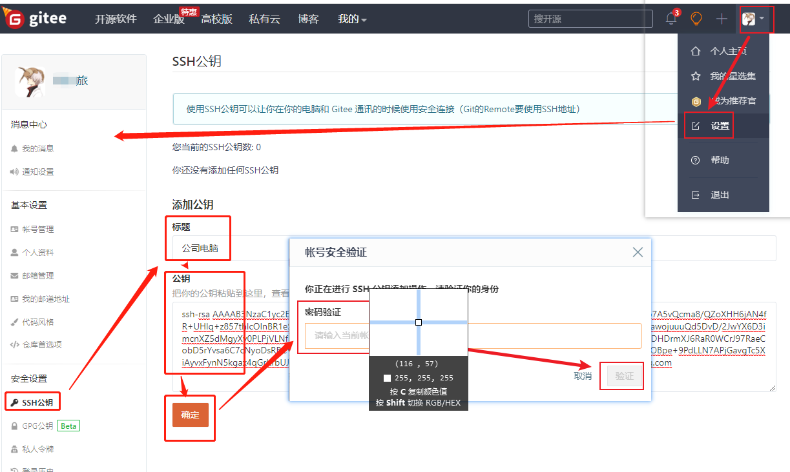
>
> **GitHub添加SSH公钥**
>
> > 【**头像**】-- 【**Settings**】-- 【**SSH and GPG keys**】--【**New SSH key**】，输入公钥**标题**(任意)、将复制的公钥粘贴到**Key**中，点击【**Add SSH key**】即可
> >
> > 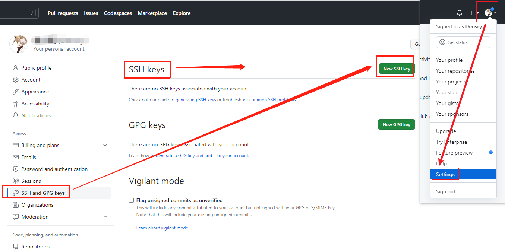
> >
> > 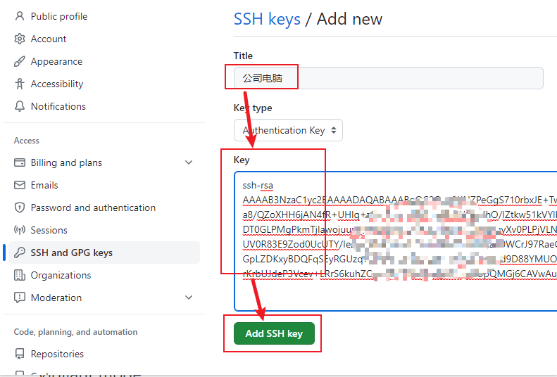
>
> 
>
> **3、测试SSH Key**
>
> 测试**Gitee**的**SSH Key**，输入下列命令
>
> ```bash
> ssh -T git@gitee.com
> ```
>
> 出现警告
>
> ```bash
> The authenticity of host 'gitee.com (212.64.63.215)' can't be established.
> ```
>
> 这是因为在生成秘钥的时候，只有**私钥**和**公钥**两个文件，还缺少一个**known_hosts**文件，只需要输入**yes**，就会生成缺少的**known_hosts**文件，出现**successfully**则表示成功！
>
> 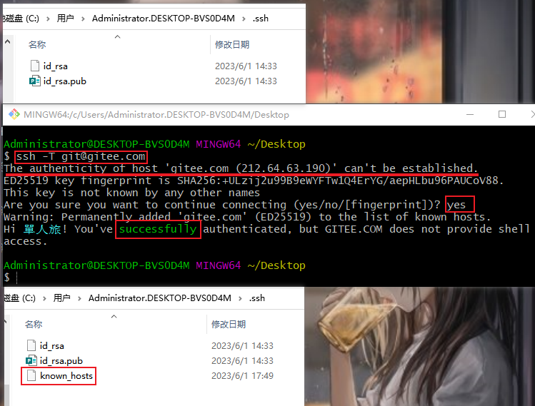
>
> 同理，测试**GitHub**的**SSH Key**，输入如下命令，操作同上，出现**successfully**则表示成功！
>
> ```bash
> ssh -T git@github.com
> ```
>
> 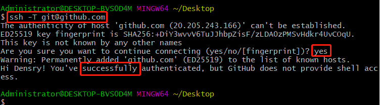
>
> 如果上述的操作到这里还没有成功，就使用--debug调试看：`-v` 是输出编译信息，然后根据编译信息去解决问题
>
> ```bash
> //debug调试
> ssh -vT git@gitee.com
> ssh -vT git@github.com
> ```
>
> 调试之后再使用下面的简单命令查看即可
>
> ```bash
> ssh git@gitee.com
> ssh git@github.com 
> ```


# 测试克隆与推送项目(单个Git账号)

## 克隆项目测试

> 在Gitee上新建一个项目，复制SSH链接，之后克隆到本地
>
> 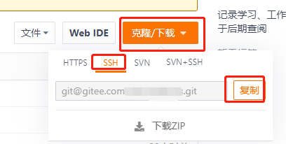
>
> 如果能克隆下来则表示没有问题
>
> ```bash
> git clone 项目SSH链接
> ```
>
> 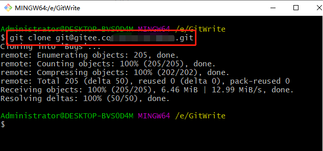


## 推送项目测试

> 随便修改一下里面的内容，之后进行推送测试
>
> ```bash
> git add .
> git commit -m 'SSH推送测试'
> git push
> ```
>
> 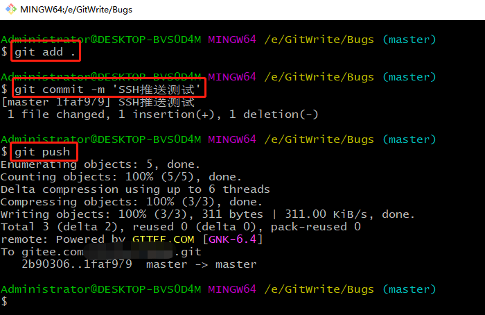


## 同时推送到Gitee与GitHub

> **前提：必须保证Gitee与GitHub的*推送邮箱*是Git设置的全局邮箱，即同一个邮箱**
>
> 上述推送测试中，只是测试推送到Gitee，如果需要同时推送到GitHub，则需要进行如下配置
>
> **1、在GitHub新建一个项目**
>
> 
>
> **2、找到项目的config文件**
>
> 打开项目的`.git`文件夹下的`config`文件（因为.git文件夹是隐藏的，所以需要将隐藏文件显示出来），此时就看到`.git`文件夹了，进入文件夹，找到`config`文件，用文本编辑器如Sublime Text3等编辑器打开，找到\**[remote "origin"]\**
>
> 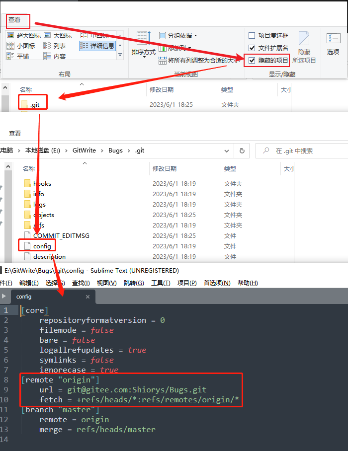
>
> 
>
> **2、配置`config`文件的\**remote\**内容**
>
> **方式一**：更改`config`文件的**[remote "origin"]**为下面的内容，有多少个远程仓库地址就加多少个url即可，添加完成后保存
>
> ```yaml
> [remote "origin"]
> 	url = 你的码云项目SSH地址
> 	url = 你的GitHub项目SSH地址
> 	fetch = +refs/heads/*:refs/remotes/origin/*
> ```
>
> **方式二**：执行下面的命令，效果与方式一一样
>
> ```bash
> git remote set-url --add origin 的GitHub项目SSH地址
> ```
>
> 最终`config`文件内容如下
>
> 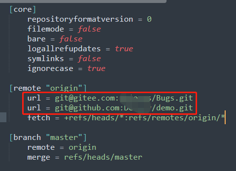
>
> **3、推送测试**
>
> 回到项目中，执行`git push`命令，推送成功。
>
> git push的时有时候会出现错误\**[rejected] master -> master (fetch first)\**
>
> 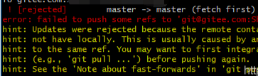
>
> 此时可以输入：\**git push -f\** 进行解决错误，然后再：git push
>
> 如果上述解决方式不管用也可以输入：\**git pull --rebase origin master\** 之后再进行git push 即可。
