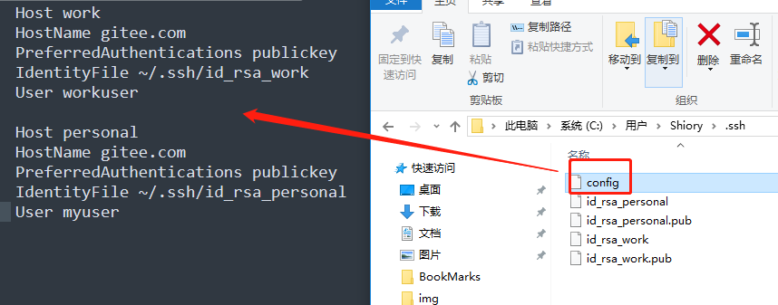

<center><h1>Git的设置</h1></center>

<center><h5>作者：汐小旅Shiorys</h5></center>


# Git基本设置

> Git提供了`git config`工具进行账号信息的设置
>
> 例：设置全局用户名与邮箱，其中`--global`为全局设置
>
> ```bash
> git config --global user.name "用户名"
> git config --global user.email "邮箱"
> ```


## Git的设置级别简述

> Git共有三个级别的设置文件`config`：分别是`system`、`global` 和 `local`。以下是设置文件三个级别的说明
>
> | 级别   | 作用范围                   | 配置文件位置                                                 | 优先级 |
> | ------ | -------------------------- | ------------------------------------------------------------ | ------ |
> | local  | 当前仓库适用               | 当前仓库/.git/config                                         | 最高   |
> | global | 当前用户的所有仓库         | ~/.gitconfig(当前用户宿主目录下，例：windows下是C:/users/xxx/.gitconfig) | 中     |
> | system | 当前系统所有用户的所有仓库 | linux下是/etc/gitconfig；windows下是 Git安装目录/mingw64/etc/gitconfig | 最低   |
>
> ```tex
> 作用范围：system>global>local
> 优先级：local>global>system (设置有local优先使用local设置，否则看是否有global设置，再次之才会找system设置)
> ```
>
> 通过以下指令可以读写对应级别的配置文件`config`
>
> ```bash
> git config --local：仓库级别的设置，只对当前仓库适用
> git config --global：全局用户级别的设置，对当前用户的所有仓库适用
> git config --system：系统级别的设置，对所有用户的左右仓库适用
> ```
>
> **扩展**：所有的指令其实都是在读写配置文件。每个级别都会有一个对应的`config文件`，即直接修改对应的`config文件`也可以达到指令的设置效果。


## Git常用设置

### 设置用户名与邮箱

> 打开`Git Bash`界面，根据需求选择以下设置之一即可，单账号通常是**设置全局用户名与邮箱**，多账号通常是**设置当前仓库用户名与邮箱**
>
> 1、设置全局用户名与邮箱，常用于单Git账号
>
> ```bash
> 需求：给所有仓库设置同一个Git账号
> git config --global user.name "你的用户名"
> git config --global user.email "你的邮箱"
> ```
>
> 2、设置当前仓库用户名与邮箱，常用于多Git账号
>
> ```bash
> 需求：单独给某个仓库设置一个不同的Git账号
> git config --local user.name "你的用户名"
> git config --local user.email "你的邮箱"
> ```


## Git查看设置的信息

> 查看指令
>
> ```bash
> git config --local -l 查看仓库配置
> git config --global -l 查看用户配置
> git config --system -l 查看系统配置
> git config -l 查看所有配置，依次是系统级别、用户级别和仓库级别
> ```


## Git其他设置指令

> ```bash
> git config -e 编辑
> git config --add 添加
> git config --get 获取
> git config --unset 取消设置
> ```


# SSH秘钥设置

## 设置SSH秘钥的原因

> 获取Git服务器代码到本地通常有三种方式：
>
> 
>
> **1、HTTPS方式**
>
> > **获取方式**：`git clone 仓库https地址`
> >
> > **使用说明**：不需要任何账号设置，只要拿到https仓库地址，可以任意克隆项目。但是当需要fetch和push的时候，需要验证用户名和密码。简单来说，https方式克隆时不校验，但是提交时需要校验。
>
> **2、SSH方式**
>
> > **获取方式**：`git clone 仓库https地址`
> >
> > **使用说明**：这种方式只能克隆自己账号下的项目，你必须是clone项目的所有者或者管理员，而且需要在clone前添加SSH Key，否则无法克隆clone。当需要fetch和push的时候，是不需要输入用户名的。如果配置SSH key的时候设置了密码，则需要输入密码，否则是不需要输入密码的。它的好处在于，只需要配置一次，后面fetch和push代码等操作都不再需要输入账号密码。
>
> **3、ZIP下载方式**
>
> > **获取方式**：直接下载ZIP包
> >
> > **使用说明**：不需要任何账号设置，直接下载
>
> 所以，如果只是下载别人的代码，直接https或打包下载都行；如果要用Git进行代码管理，ssh是最方便的方式。
>
> 同时，ssh方式目的是为了让clinet和git server能够安全通信，所以采用了数字签名RSA或者DSA来完成这个操作。


## 单账号设置SSH秘钥步骤

### 设置全局用户名与邮箱

> 打开`Git Bash`界面，输入以下命令
>
> ```bash
> git config --global user.name "你的用户名"
> git config --global user.email "你的邮箱"
> ```


### 查看是否已经生成过SSH key

> 打开`Git Bash`界面，输入以下命令查看系统用户目录下是否存在`.ssh`文件夹以及`.ssh`文件夹下是否存在`id_rsa.pub`或`id_dsa.pub`类似文件
>
> ```bash
> cd ~/.ssh
> 
> ls
> ```
>
> 或者直接打开文件夹查看
>
> 
>
> 如果存在`id_rsa.pub`或`id_dsa.pub`类似文件，就直接删除`.ssh`文件夹


### 创建SSH key

> 打开`Git Bash`界面，输入以下命令创建
>
> ```bash
> ssh-keygen -t rsa -C "你的邮箱"
> ```
>
> 代码参数含义
>
> ```bash
> -t：执行密钥类型，默认是rsa，可以省略
> -C：设置注释文字，比如邮箱
> -f：指定密钥文件存储位置与文件名
> 以上代码省略了-f 参数，因此运行上面那条命令之后会让你输入一个文件名，用户保存刚才生成的SSH key。
> 该命令执行后，会在C盘用户目录下生成.ssh文件夹(~/.ssh)，该文件夹下会有一对秘钥，分别是私钥和公钥，公钥需要注册到Git服务器（如Github、Gitee，Gitlab、Coding）
> ```
>
> 根据提示按回车，共3次回车。建议不输入任何内容直接回车3次。
>
> ```bash
> 第一次回车：提示输入密钥文件名称，可设置，也可以直接使用默认，使用默认文件名就会生成id_rsa和id_rsa.pub两个密钥文件。
> 第二次回车：提示输入密码(该密码是push文件的时候输入的密码，而不是git server管理者的密码)。建议不输入密码直接回车，那么push的时候就不需要输入密码，直接提交
> 第三次回车：提示再次确认输入的密码。
> ```
>
> 
>
> 最后会在`.ssh`下得到两个文件`id_rsa`(私钥)和`id_rsa.pub`(公钥)。私钥自己保留，公钥需要配置带要访问的ssh服务器，也就是Git服务器（如Github、Gitee，Gitlab、Coding）。
>
> 
>
> ```bash
> 注意：id_rsa和id_rsa.pub是成对生成的，二者必须匹配才能工作。当你把id_rsa.pub公钥导入到远程服务器时，本地目录下的 ~/.ssh/id_rsa 私钥是不能删除的，也不能挪位置；当调用ssh -keygen命令重新生成密钥对时，本地目录下的 ~/.ssh/id_rsa 私钥会被覆盖，因此，需要把最新的公钥导入到远程服务器才能继续pull或push代码。
> ```
>


### 将SSH公钥内容添加到Git服务器

> 将用户主目录下`~/.ssh/id_rsa.pub`的公钥文件中的内容粘贴到Git服务器（可以直接用文本编辑器打开文件，也可以通过命令`cat ~/.ssh/id_rsa.pub`查看复制公钥文件中的内容），添加到Git服务器。
>
> 添加方式参照文末【**Git服务器添加SSH-Key**】


### 测试SSH Key连接

> 测试**Gitee**的**SSH Key**，输入下列命令
>
> ```bash
> ssh -T git@gitee.com
> ```
>
> 出现警告
>
> ```bash
> The authenticity of host 'gitee.com (212.64.63.215)' can't be established.
> ```
>
> 这是因为在生成秘钥的时候，只有**私钥**和**公钥**两个文件，还缺少一个**known_hosts**文件，只需要输入**yes**，就会生成缺少的**known_hosts**文件，出现**successfully**则表示成功！
>
> 
>
> 同理，测试**GitHub**的**SSH Key**，输入如下命令，操作同上，出现**successfully**则表示成功！
>
> ```bash
> ssh -T git@github.com
> ```
>
> 
>
> 如果上述的操作到这里还没有成功，就使用--debug调试看：`-v` 是输出编译信息，然后根据编译信息去解决问题
>
> ```bash
> //debug调试
> ssh -vT git@gitee.com
> ssh -vT git@github.com
> ```
>
> 调试之后再使用下面的简单命令查看即可
>
> ```bash
> ssh git@gitee.com
> ssh git@github.com 
> ```


### 克隆项目测试

> 在Gitee上新建一个项目，复制SSH链接，之后克隆到本地
>
> 
>
> 如果能克隆下来则表示没有问题
>
> ```bash
> git clone 项目SSH链接
> ```
>
> 


### 推送项目测试

> 随便修改一下里面的内容，之后进行推送测试
>
> ```bash
> git add .
> git commit -m 'SSH推送测试'
> git push
> ```
>
> 


### 同时推送到Gitee与GitHub

> 上述推送测试中，只是测试推送到Gitee，如果需要同时将同一个项目推送到GitHub，则需要进行如下配置
>
> **前提：必须保证Gitee与GitHub的*推送邮箱*是Git设置的全局邮箱，即同一个邮箱。同时，GitHub上已经配置了上述步骤中生成的SSH Key的公钥**
>
> 
>
> **1、在GitHub新建一个项目**
>
> 
>
> **2、找到项目的config文件**
>
> 打开项目的`.git`文件夹下的`config`文件（因为.git文件夹是隐藏的，所以需要将隐藏文件显示出来），此时就看到`.git`文件夹了，进入文件夹，找到`config`文件，用文本编辑器如Sublime Text3等编辑器打开，找到**[remote "origin"]**
>
> 
>
> 
>
> **2、配置`config`文件的*remote*内容**
>
> **方式一**：更改`config`文件的**[remote "origin"]**为下面的内容，有多少个远程仓库地址就加多少个url即可，添加完成后保存
>
> ```yaml
> [remote "origin"]
> 	url = 你的码云项目SSH地址
> 	url = 你的GitHub项目SSH地址
> 	fetch = +refs/heads/*:refs/remotes/origin/*
> ```
>
> **方式二**：执行下面的命令，效果与**方式一**一样
>
> ```bash
> git remote set-url --add origin GitHub项目SSH地址
> ```
>
> 最终`config`文件内容如下
>
> 
>
> **3、推送测试**
>
> 回到项目中，执行`git push`命令，推送成功。
>
> `git push` 的时有时候会出现错误*[rejected] master -> master (fetch first)*
>
> 
>
> 此时可以输入：*git push -f* 进行解决错误，然后再：`git push`
>
> 如果上述解决方式不管用也可以输入：`git pull --rebase origin master` 之后再进行git push 即可。


## 多账号设置SSH秘钥步骤

> **举例两个账号：一个工作账号，一个个人账号**
>
> ```bash
> 工作账号
> 用户名：workuser
> 邮箱：workmail@qq.com
> 
> 个人账号
> 用户名：myuser
> 邮箱：mymail@qq.com
> ```
>
> **注意**：多个账号时，用户名与邮箱**都不能相同**，**邮箱**必须是**Gitee/GitHub/GitLab/Coding上设置的邮箱账号**
>
> 为了排除已经登录的Git账号影响，此处删除凭证信息
>
> `Win+R`输入`control`打开控制面板，在【**用户账户**】中找到【**凭据管理器**】，选择【**Windows凭据**】中删除Git账号登录的账号
>
> 


### 查看是否已经生成过SSH key

> 打开`Git Bash`界面，输入以下命令查看系统用户目录下是否存在`.ssh`文件夹以及`.ssh`文件夹下是否存在`id_rsa.pub`或`id_dsa.pub`类似文件
>
> ```bash
> cd ~/.ssh
> 
> ls
> ```
>
> 或者直接打开文件夹查看
>
> 
>
> 如果存在`id_rsa.pub`或`id_dsa.pub`类似文件，就备份`.ssh`文件夹后删除，如果不需要就直接删除`.ssh`文件夹


### 清空全局用户名与邮箱

> 查看已配置的git列表
>
> ```bash
> git config --list
> ```
>
> 看看其中是否配置了user.name与user.email，也就是全局用户名与邮箱
>
> 如果配置了全局用户名与邮箱，则可根据下列情况考虑是否要清空
>
> **情况一**：果大多项目都是使用这个用户名和邮箱，只是某个项目需要使用其他用户名和其他邮箱的话就无需删除，只要到需要使用其他用户名和其他邮箱的项目中配置局部用户名和邮箱即可。
>
> 如需求：单独给某个仓库设置一个不同于全局的Git账号，则只需配置局部用户名和邮箱即可。
>
> 设置步骤：
>
> ```bash
> 到需要使用其他用户名和其他邮箱的项目中，打开GitBash，依次执行下列语句：其中`--local`表示局部
> git config --local user.name "用户名"
> git config --local user.email "邮箱"
> 
> 设置完后，查看该仓库的git配置信息
> git config --local --list
> ```
>
> **情况二**：如果每个账号都会有很多项目，那么可以选择清空全局用户名和邮箱，执行下列语句即可
>
> ```bash
> git config --global --unset user.name
> git config --global --unset user.email
> ```
>
> 


### 创建不同Git账户的SSH Key

> 生成SSH Key命令格式如下
>
> ```bash
> ssh-keygen -t rsa -b 秘钥长度 -C '你的邮箱' -f 秘钥文件位置与文件名
> ```
>
> 参数说明：
>
> ```bash
> -t：t是type的缩写，即指定密钥的类型，密钥的类型有两种：RSA、DSA，默认是RSA算法，可以省略。
> -b：b是bit的缩写，指定密钥长度。对于RSA密钥，最小要求768位，默认是2048位；DSA密钥必须恰好是1024位(FIPS 186-2 标准的要求)
> -C：C是comment的缩写，表示提供一个注释，用于识别这个密钥，比如邮箱。很多网站和软件用这个注释作为密钥的名字
> -f：f是file的缩写，指定密钥文件存储位置与文件名
> 
> 例：ssh-keygen -t rsa -b 4096 -C '你的邮箱' -f ~/.ssh/id_rsa
> 表示：在用户目录的.ssh目录下，生成以RSA为算法长度为4096位且文件名为id_rsa的SSH秘钥
> ```
>
> 
>
> **1、创建工作账号SSH Key**
>
> ```bash
> ssh-keygen -t rsa -C 'workmail@qq.com' -f ~/.ssh/id_rsa_work
> ```
>
> 按**2个回车**（也就是不设置密码），密码为空。
>
> 紧接着会提示如下内容, 代表成功了
>
> 
>
> 
>
> 同理如下生成个人账号SSH Key
>
> **2、创建个人账号SSH Key**
>
> ```bash
> ssh-keygen -t rsa -C 'mymail@qq.com' -f ~/.ssh/id_rsa_personal
> ```
>
> 
>
> 最后会在`.ssh`目录下得到四个文件，其中`.pub`文件为公钥
>
> ```bash
> id_rsa_work(工作账号私钥)
> id_rsa_work.pub(工作账号公钥)
> id_rsa_personal(个人账号私钥)
> id_rsa_personal.pub(个人账号公钥)
> ```
>
> 


### 将SSH公钥内容添加到Git服务器

> 此处举例：工作账号添加到码云Gitee，个人账号也是添加到码云Gitee
>
> **1、将工作账号SSH公钥添加到Gitee**
>
> 使用**工作**账号**登录Gitee**，将工作账号公钥文件`id_rsa_work.pub`文件的内容粘贴到Gitee。
>
> 可以直接用文本编辑器打开该文件，也可以通过命令`cat ~/.ssh/id_rsa_work.pub`查看复制公钥文件中的内容
>
> 将SSH公钥添加到Gitee，添加方式参照文末【**Git服务器添加SSH-Key**】--【**Gitee添加SSH公钥**】
>
> 
>
> **2、将个人账号SSH公钥添加到GitHub**
>
> 同理，使用**个人**账号**登录Gitee**，将个人账号公钥文件`id_rsa_personal.pub`中的内容添加到Gitee


### Git账号与秘钥集中配置

> 为了更方便的管理多个Git账号，需要一个config的配置文件，用来集中配置。
>
> 在**~/.ssh**目录下新建或编辑(存在的话)一个**config**文件，添加如下内容，生成了几个账户的SSH Key就配置几组
>
> 这个配置是告诉Git，哪个远程仓库使用哪个私钥进行身份验证
>
> ```bash
> # 工作账号：Gitee账号1
> Host work
> HostName gitee.com
> PreferredAuthentications publickey
> IdentityFile ~/.ssh/id_rsa_work
> User workuser
> 
> # 个人账号：Gitee账号2
> Host personal
> HostName gitee.com
> PreferredAuthentications publickey
> IdentityFile ~/.ssh/id_rsa_personal
> User myuser
> ```
>
> 
>
> 配置说明
>
> ```bash
> Host：远端仓库服务器的别名，简写，必须唯一。例如：配置后 git@gitee.com 可以写为 git@work。clone时用于区分多个gitee账号的
> HostName：远端仓库服务地址或IP（不支持配置端口）,必须写正确。如果是gitee配置gitee.com；如果是github账号配置github.com
> Port：远端仓库服务器端口，一般不需要设置，特殊情况除外
> PreferredAuthentications：强制使用 Publickey 验证
> IdentityFile：指向私钥的绝对路径
> User：账号用户名(仓库上的用户名，如github账号名，gitee的仓库空间名)
> ```


### 测试SSH Key连接

> 命令格式
>
> > **ssh -T git@[此处填写config文件中配置的Host]** 
> >
> > 或
> >
> > **ssh -T git@[此处填写config文件中配置的HostName]** 
>
> 测试工作账号
>
> ```bash
> ssh -T git@work
> ```
>
> 会提示是否继续连接，此处输入：**yes**，出现`successfully`字样表示成功。
>
> 
>
> 
>
> 同理测试个人账号
>
> ```bash
> ssh -T git@personal
> ```


### 将SSH私钥添加到SSH-Agent上

> **配置完公钥后，还需要再设置一下私钥，不然使用会有问题。由于不是使用默认的`.ssh/id_rsa`，所以需要显示的告诉SSH-Agent新SSH私钥的位置。**
>
> 执行下列命令
>
> ```bash
> // ssh-agent是一个linux命令，主要是用来管理密钥的。
> ssh-agent -s  // -s 生成Bourne shell 风格的命令输出
> ```
>
> 成功的话，会得到类似这样的输出：`Agent pid 1895`
>
> 
>
> 
>
> 下一步，可能会出现的问题：`could not open a connection to your authentication agent`，【提示连接失败】，所以提前解决
>
> 
>
> 解决办法：命令如下：
>
> ```bash
> ssh-agent bash
> ```
>
> 接着继续执行命令，将SSH私钥添加到SSH-Agent
>
> ```bash
> ssh-add ~/.ssh/id_rsa_work  或  ssh-add work // 将工作账号私钥添加到本地
> ssh-add ~/.ssh/id_rsa_personal  或  ssh-add personal  // 将个人账号私钥添加到本地
> ```
>
> 操作成功会出现类似于下面的提示
>
> > Identity added: /c/Users/XXX/.ssh/work/id_rsa_work (邮箱地址)
> > 		Identity added:  /c/Users/.ssh/personal/id_rsa_personal (邮箱地址)
>
> 
>
> 这一步，可能会出现的问题1：`Permission denied (publickey)`，【提示没有权限】
>
> 解决办法：使用下列命令改下私钥文件权限，之后继续执行添加命令即可
>
> ```bash
> chmod 777 ~/.ssh/work/id_rsa_work
> chmod 777 ~/.ssh/personal/id_rsa_personal
> ```
>
> 可能会出现的问题2：`Authentications that can continue: publickey,gssapi-keyex,gssapi-with-mic,password`
>
> 解决办法如下：
>
> > 总结起来无非就是几种原因：
> > 1、检查远程服务器IP和端口是否错误，确保可以正确连接
> > 2、检查密钥密码锁是否设定有误，确保密码可以登陆远端仓库
> > 3、检查公钥是否正确添加到远端仓库
> >
> > 以上均检查没问题后，执行下面的命令
> >
> > ```bash
> > ssh-add -k ~/.ssh/<当前私钥文件> // 可以把密码添加到钥匙串以后只需要ssh-add就可以了
> > 
> > ssh-add ~/.ssh/id_rsa_work   // 将工作账号私钥添加到本地
> > ssh-add ~/.ssh/id_rsa_personal  // 将个人账号私钥添加到本地
> > ```
>
> 
>
> 添加完之后，可以使用以下命令检测私钥是否置成功
>
> ```bash
> ssh-add -l
> ```
>
> 输出如图，则证明添加成功了
>
> 


### 克隆项目测试

> 在工作账号的Gitee上新建一个项目：**demo-work**，复制SSH链接
>
> 
>
> 修改SSH链接，
>
> 	配置是多账户，不能用HTTPS方式的方式clone , 需要使用SSH方式区分不同的账号
> 	替换SSH链接中的内容
> 		如SSH链接为：git@gitee.com:workuser/demo-work.git
> 		替换为：git@[此处填写config文件中配置的HOST]:workuser/demo-work.git
> 	执行命令：git clone 替换后的SSH链接
> 如果能克隆下来则表示没有问题
>
> ```bash
> git clone git@work:workuser/demo-work.git
> ```
>
> 
>
> 
>
> 同理，在个人账号的Gitee上新建一个项目：**demo-personal**，测试**clone**项目，如果能克隆下来则表示没有问题


### 推送项目测试

> **1、创建本地git仓库：`demo-work`**
>
> ```bash
> mkdir demo-work
> cd demo-work
> git init 
> ```
>
> **2、设置工作账号的用户名与邮箱为本地仓库的用户名与邮箱**
>
> ```bash
> git config --local user.name "workuser"
> git config --local user.email "workmail@qq.com"
> ```
>
> **3、设置项目的远程地址，关联远程库库地址（clone里的地址）**
>
> ```bash
> # git remote add <别名> <远程库地址>
> git remote add origin git@work:workuser/demo-work.git
> ```
>
> **4、设置完后，查看该仓库的git配置信息**
>
> ```bash
> git config --local --list
> ```
>
> **5、`git pull`获取远程库与本地同步合并**
>
> 如果远程库不为空必须做这一步，否则后面的提交会失败
>
> 如果远程库为空，则跳过此步骤
>
> ```bash
> git pull --rebase origin master
> ```
>
> **6、随便添加一个文件，之后进行推送到工作账号的Gitee上测试**
>
> ```bash
> touch README.md
> git add README.md
> git commit -m '工作账号推送测试'
> git push -u origin master
> ```
>
> 
>
> 同理个人账号推送测试，本地项目：`demo-personal`


# Git服务器添加SSH Key

## Gitee添加SSH公钥

> 【**头像**】-- 【**设置**】-- 【**SSH公钥**】，输入公钥**标题**(任意)、将复制的公钥粘贴到**公钥**中，点击【**确定**】，输入**密码**【**验证**】即可
>
> 


## GitHub添加SSH公钥

> 【**头像**】-- 【**Settings**】-- 【**SSH and GPG keys**】--【**New SSH key**】，输入公钥**标题**(任意)、将复制的公钥粘贴到**Key**中，点击【**Add SSH key**】即可。
>
> 
>
> 
>