
<h1>JDK下载、安装、环境配置</h1>

<h5>作者：汐小旅Shiorys</h5>

> **JDK**：Java Development Kit，Java开发工具包，包括JRE
>
> **JRE**：Java Runtime Environment，Java运行环境

# 下载JDK

> 官网地址：https://www.oracle.com/
>
> 中国站点：https://www.oracle.com/cn/
>
> 以下操作以中国站点为例
>
> 
>
> 1、点击【**资源**】，找到【**Java下载**】并点击
>
> 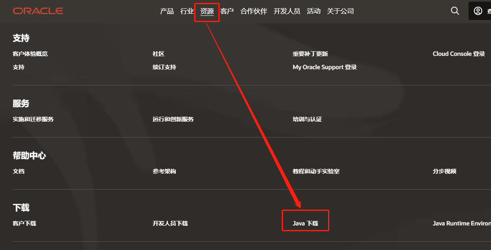
>
> 
>
> 2、点击【**Java archive**】，选择【**Java SE**】，在右侧即可看到所有版本，可根据需要下载相应的版本
>
> 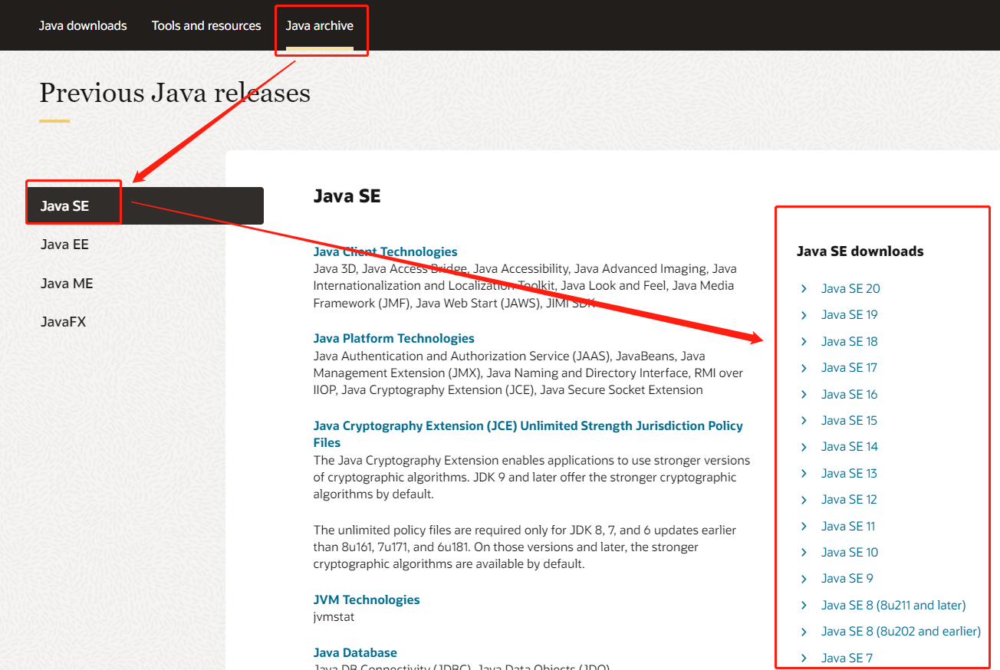
>
> 
>
> 3、点击所选中的版本，此处以 **Java SE8、Java SE17** 为例。根据自己的系统，下载相应的版本。此处选择的windows 64位系统版本exe安装版本，点击下载即可
>
> 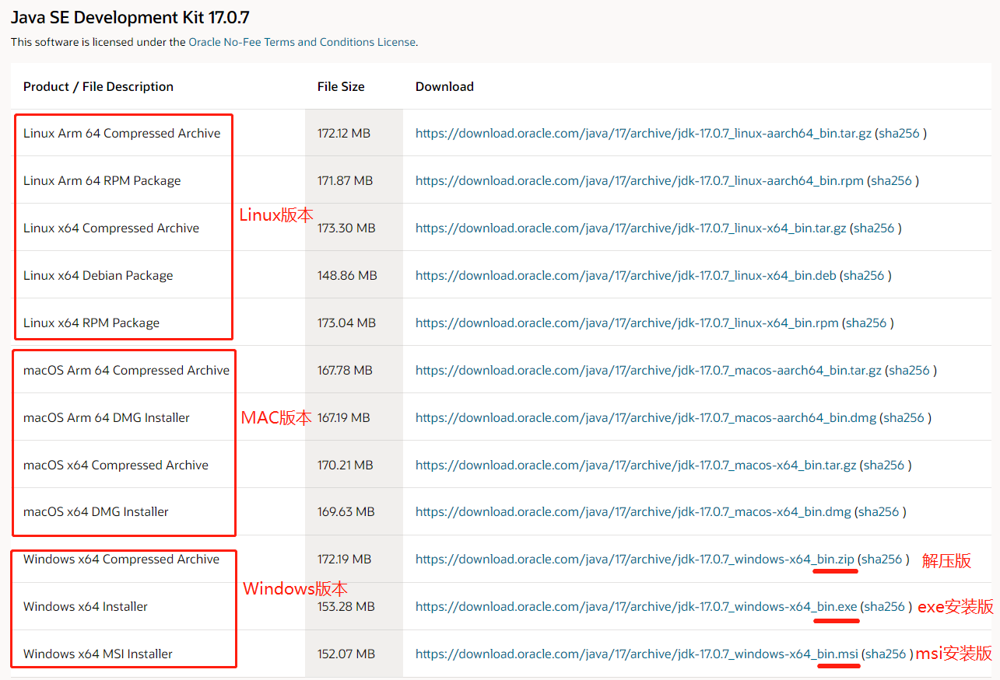
>
> 
>
> **注意**：一定要下载 ***JDK*** 版本，不要下载成 ***JRE*** 版本了。如果弹出如下弹框（如Java8下载时就会出现下面的弹框），勾选即可，需要登录的话，那就创建一个账号登录即可；如果不想登录还想下载，那就鼠标移到要下载的版本，右键复制地址，在浏览器新标签页打开下载即可。
>
> 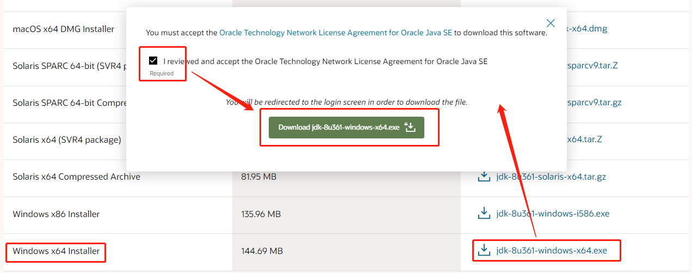

# 安装JDK

> **下一步**即可
>
> **建议**：安装路径最好不要有中文或者特殊符号空格等。建议不要装在C盘。
>
> **注意**：记得改安装路径
>
> 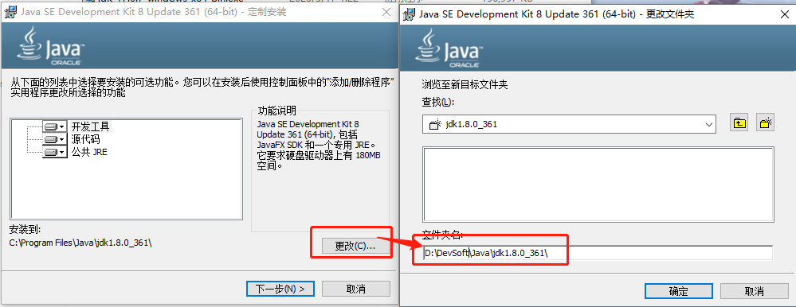
>
> 
>
> 当提示安装JRE时，可以选择不安装，因为JDK中已经有JRE了
>
> 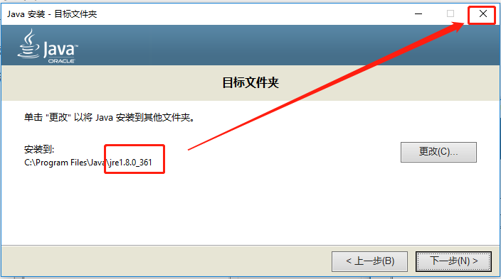
>
> 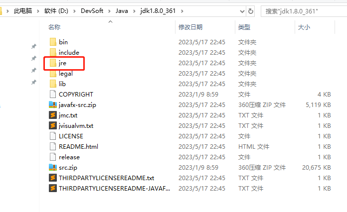

# 配置环境变量

> 右击此电脑，选择【**属性**】
>
> 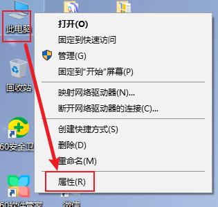

## 1、配置【JAVA_HOME】

> **好处**：当进行版本更换时，更加灵活，只需改**JAVA_HOME的变量值**即可。
>
> 【**高级系统设置**】----【**环境变量**】----【**新建**】，**变量名：JAVA_HOME，变量值：JDK的安装目录**
>
> 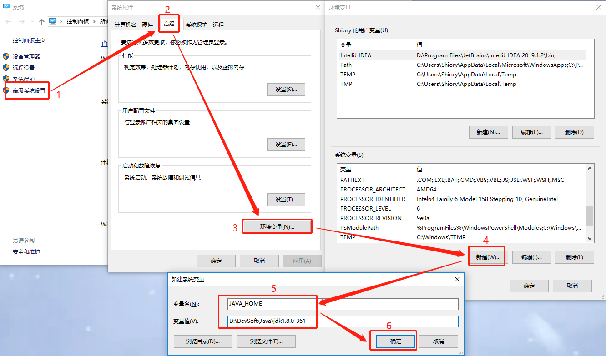

## 2、配置【Path】

> **好处**：这样就可以在任意位置执行Java程序
>
> 在环境变量中找到【**Path**】，点击【**编辑**】，点击【**新建**】，输入：`%JAVA_HOME%\bin` ，之后就一路【**确定**】即可
>
> 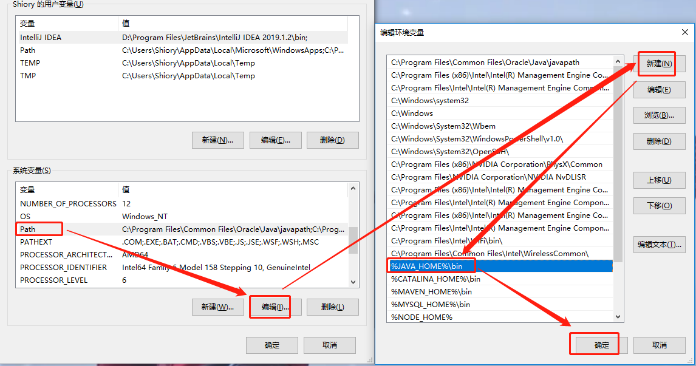

## 3、配置【classpath】

> 在JDK1.5版本之后就可以不用配置了，因为默认就把当前路径(Java源文件路径)当做classpath(在哪生成.class文件，就默认到哪找)
>
> 
>
> **path和classpath的区别**
>
> path环境变量里面记录的是可执行的文件，如exe文件，对可执行文件现在当前路径去找，如果没有就到path环境变量中配置的路径去找
>
> classpath环境变量里记录的时Java类的运行文件所在的目录。

## 4、测试否成功

> **Windows徽标键+R**打开dos命令窗口，输入**cmd回车**
>
> 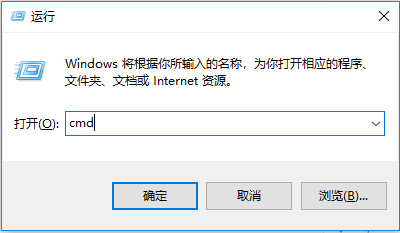
>
> **测试JDK是否安装成功**：输入`java -version`，如果出现`版本号`则表示安装成功
>
> 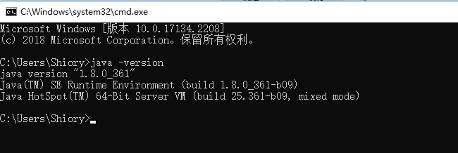
>
> **测试环境变量是否生效**：依次输入：`java`，`javac`，如果出现以下情况则表示环境变量配置成功
>
> 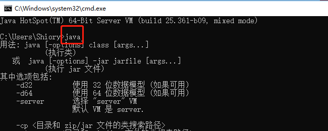
>
> 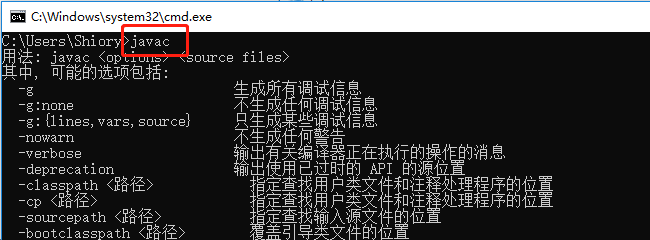

# 安装多个不同版本的JDK

> 此处以两个版本为例，上面已经安装的`JDK1.8`版本，下面安装`JDK17`版本，安装步骤同上，尽量安装到同一个目录，这样方便管理。

## 1、配置环境变量

> 创建三个**JAVA_HOME**。
>
> **JAVA8_HOME**：变量值存放JDK1.8的安装路径；
>
> **JAVA17_HOME**：变量值存放的JDK17的安装路径；
>
> **JAVA_HOME**：如果需要`JDK1.8`版本变量值就存放 `%JAVA8_HOME%`，如果需要JDK17版本变量值就存放 `%JAVA17_HOME%`，多个版本JDK以此类推，便于切换。
>
> 
>
> 
>
> **注意**：**Path**路径不用更改，但 `%JAVA_HOME%` 一定要放在最前面
>
> 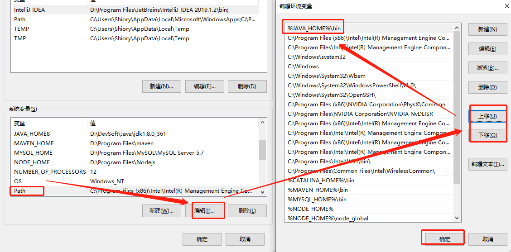

## 2、测试是否能切换

> 将**JAVA_HOME**的变量值改为`%JAVA8_HOME%`，在dos命令窗口依次输入：`java -version`、`javac -version`，如果版本号一致，表明 JDK1.8版本可用，再测试JDK17版本。
>
> 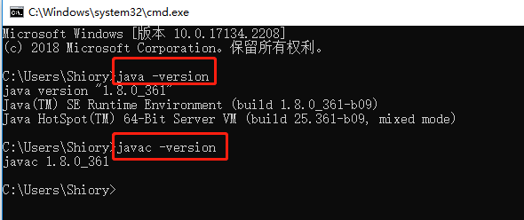
>
> 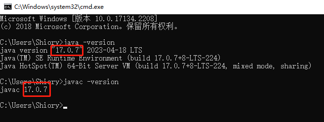
>
> **说明**：如果切换不成功，就到**C:\Windows\System32**目录下找到**java.exe、javaw.exe、javaws.exe**这三个执行文件删除即可。(删除原因：在安装JDK时又选择了安装了JRE，会将这三个执行文件复制到**C:\Windows\System32**目录下，这个目录在Windows环境变量中的优先级高于 JAVA_HOME 设置的环境变量的优先级，所以需要删除)