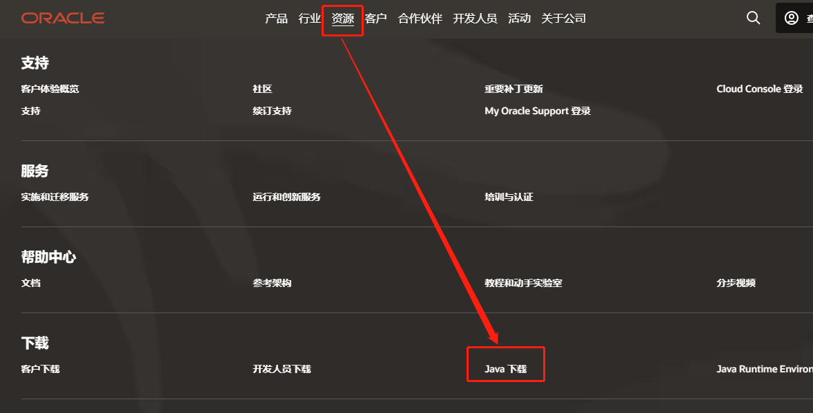
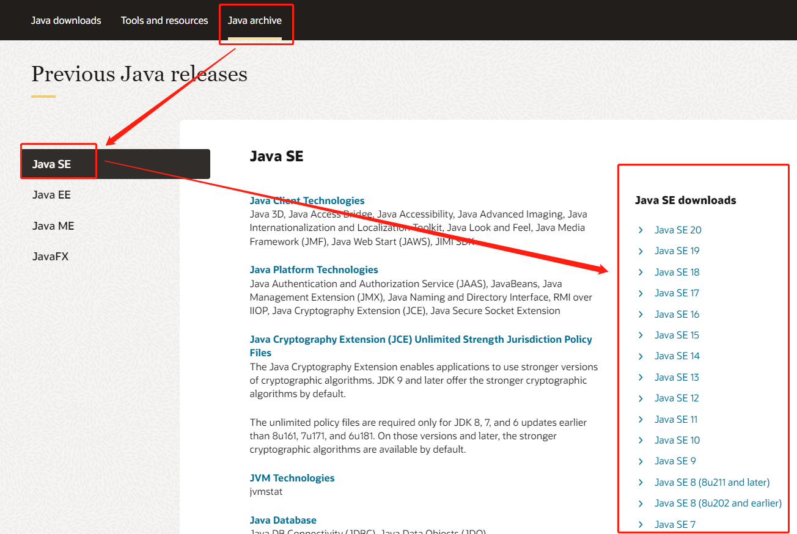
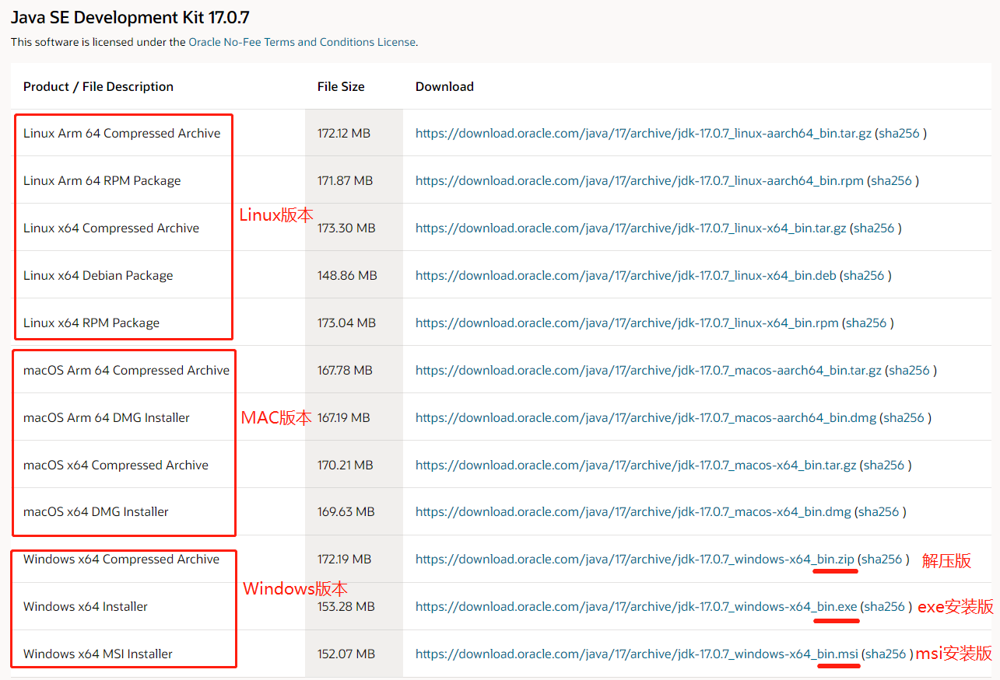
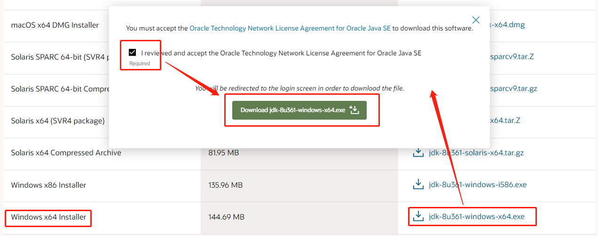

<h1>JDK下载、安装、环境配置</h1>

<h5>作者：汐小旅Shiory</h5>

> **JDK**：Java Development Kit，Java开发工具包，包括JRE
>
> **JRE**：Java Runtime Environment，Java运行环境

# 1、下载

> 官网地址：https://www.oracle.com/
>
> 中国站点：https://www.oracle.com/cn/
>
> 以下操作以中国站点为例
>
> 
>
> 1、点击【**资源**】，找到【**Java下载**】并点击
>
> 
>
> 
>
> 2、点击【**Java archive**】，选择【**Java SE**】，在右侧即可看到所有版本，可根据需要下载相应的版本
>
> 
>
> 
>
> 3、点击所选中的版本，此处以 **Java SE17** 为例。根据自己的系统，下载相应的版本。此处选择的windows 64位系统版本exe安装版本，点击下载即可
>
> 
>
> 
>
> **注意**：一定要下载 ***JDK*** 版本，不要下载成 ***JRE*** 版本了。如果弹出如下弹框（如Java8下载时就会出现下面的弹框），勾选即可，需要登录的话，那就创建一个账号登录即可；如果不想登录还想下载，那就鼠标移到要下载的版本，右键复制地址，在浏览器新标签页打开下载即可。
>
> 

# 2、安装

