<center><h1>Electron打包Vue项目为桌面应用</h1></center>

<center><h5>作者：汐小旅Shiory</h5></center>


## 简述

> **electron官网**：https://www.electronjs.org/ ，（中文模式：https://www.electronjs.org/zh）
>
> **electron源码地址**：https://github.com/electron/electron
>
> **electron中文站点**：http://electron.org.cn/
>
> 常见的打包方式有两种：`electron-packager` 和`electron-builder`，更多方式查看**electron官网**，下文以**electron-builder**为打包方式
>
> electron-builder就是有比electron-packager有更丰富的的功能，支持更多的平台，同时也支持了自动更新。除了这几点之外，由electron-builder打出的包更为轻量，并且可以打包出不暴露源码的setup安装程序。
>
> ```tex
> electron-packager源码地址：https://github.com/electron/electron-packager
> electron-builder源码地址：https://github.com/electron-userland/electron-builder
> ```
>
> **electron-builder**使用配置文档
>
> ```tex
> 官网：https://www.electron.build/
> 中文：http://electron.org.cn/builder/index.html
> ```


## 前提

> 已安装Node.js


## 准备Vue项目

> 1、全局安装Vue脚手架Vue CLI（已安装可以跳过）
>
> ```bash
> npm install -g @vue/cli
> ```
>
> 
>
> 2、使用脚手架创建Vue项目。其中**vue-demo**为项目名
>
> ```bash
> vue create vue-demo
> ```
>
> 
>
> 3、选择预置项。通过上下键选择【**Manually select features**】自定义添加，选中后回车
>
> 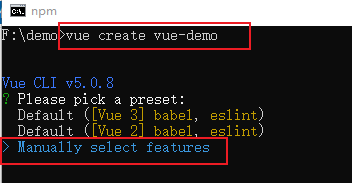
>
> ```tex
> Default([Vue 3] babel, eslint):vue3的项目，只包含js编译器babel，代码检测工具eslint。
> Default([Vue 2] babel, eslint):vue2的项目，只包含js编译器babel，代码检测工具eslint。
> Manually select features:自定义添加选择功能。
> ```
>
> 
>
> 4、选择配置。通过上下键移动，空格键选择，一般选择以下几项即可
>
> 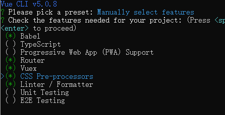
>
> ```tex
> Babel：js编译器
> Typescript：js的超集
> Progressive Web App Support:渐进式的网页应用程序
> Router:vue的路由
> Vuex:vue的状态管理
> CSS Pre-processors:css的预处理器
> Linter/Formatter:代码风格检测与格式化(如果自己代码不是很规范的话可以用这个约束下自己,也可不选择，按照自己的风格)
> Unit Testing:单元测试
> E2E Testing:端对端测试
> ```
>
> 
>
> 5、选择Vue版本。根据自己的需要选择。此处选择Vue3-【**3.x**】
>
> 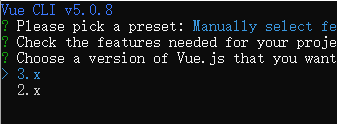
>
> 
>
> 6、路由采用**history**模式，输入**Y**
>
> 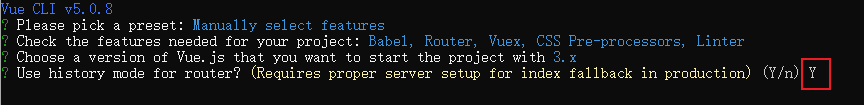
>
> 
>
> 7、选择第一项【**Sass/SCSS (with dart-sass)**】CSS预处理器
>
> 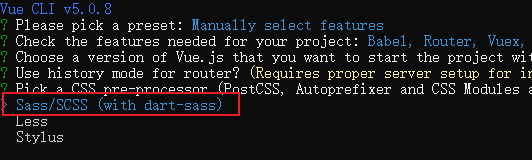
>
> 
>
> 8、选择第三项【**ESLint+Standard config**】标准配置
>
> 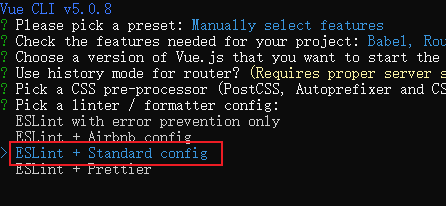
>
> 
>
> 9、选择第一项【**Lint on save**】，编写代码时提示错误
>
> 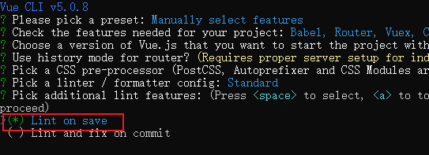
>
> 
>
> 10、Babel、ESLint 等的配置存放选择都存放在package.json中，选择第二项【**In package.json**】
>
> 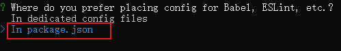
>
> 
>
> 11、保存设置为**mydemo**,下次再次创建项目时便会多出一个**mydemo**选项，不需再次配置即可直接使用
>
> 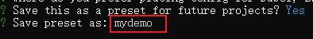
>
> 如果以后想删除这个配置，直接到【**C盘/用户/用户名/.vuerc**】文件中删除即可
>
> 
>
> 12、回车等待后创建完成，用编辑器打开创建的Vue项目，执行命令`npm run serve`启动项目，打开链接就可以访问
>
> 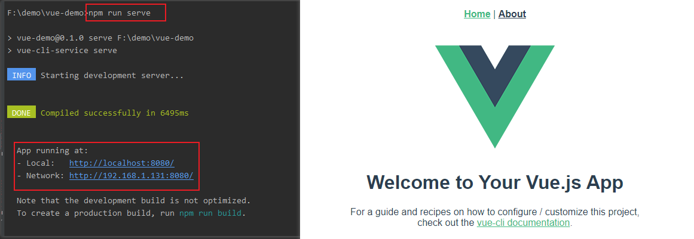


## 打包Vue项目

> 1、设置国内镜像
>
> ```bash
> npm config set electron_mirror http://npm.taobao.org/mirrors/electron/
> npm config set electron-builder-binaries_mirror https://npm.taobao.org/mirrors/electron-builder-binaries/
> ```
>
> 
>
> 2、全局安装electron插件与打包工具electron-builder
>
> ```bash
> npm install electron -g
> npm install electron-builder -g
> ```
>
> electron是否安装成功，通过`electron -v` 命令如果出现版本号，则表示安装成功
>
> 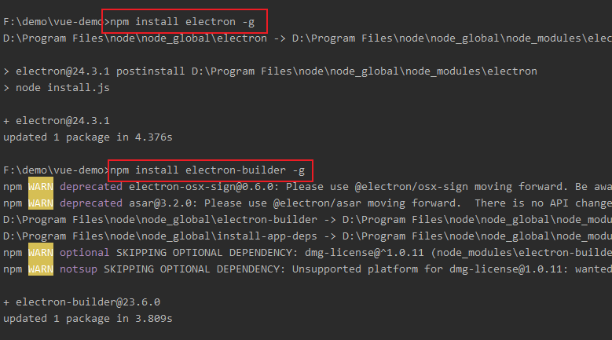
>
> 
>
> 3、在项目目录下运行命令：`vue add electron-builder`，electron-builder添加完成后会选择electron版本，直接选择最新版。等待下载完成。
>
> ```bash
> vue add electron-builder
> ```
>
> 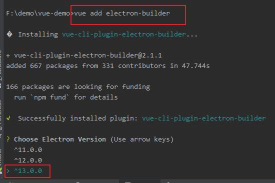
>
> 
>
> 4、下载完成后通过命令：`npm run electron:serve`尝试运行项目，确认项目是正常的，运行成功后，就会弹出electron窗体
>
> ```bash
> npm run electron:serve
> ```
>
> 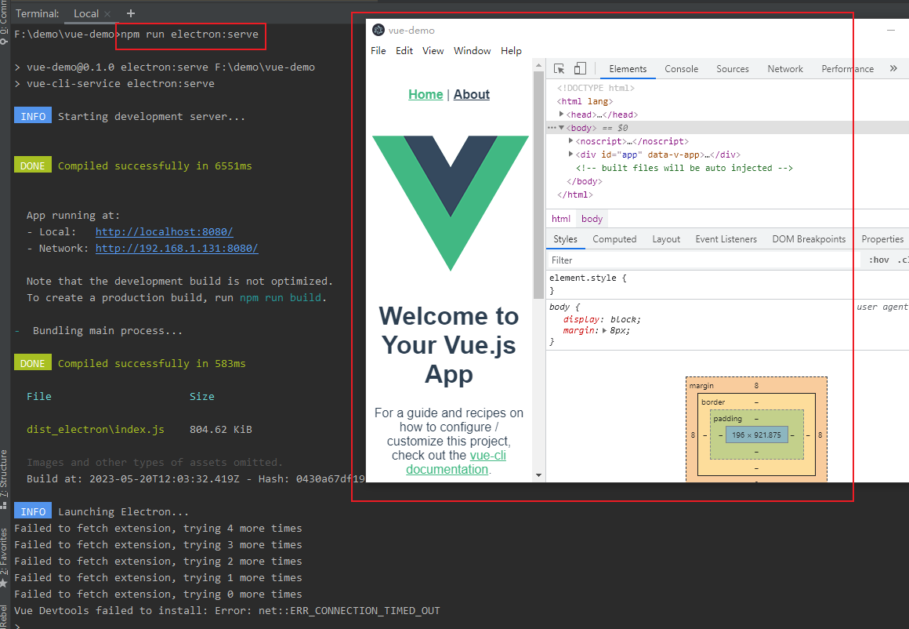
>
> 该命令是在项目下`package.json`文件中**scripts**找到的
>
> 
>
> ```bash
> npm run serve    网页运行
> npm run build    打包Vue项目为静态文件。会在根目录生成dist文件夹（静态文件）
> npm run electron:serve   网页运行并打开客户端运行
> npm run electron:build   构建打包客户端。会在根目录生成dist_electron文件夹
> 						 其中的XXX Setup XXX.exe就是安装包，需要打包别的平台，macOS,Linux等，去electron官网查看
> ```
>
> 
>
> 5、打包exe
>
> 由于vue与electron路由模式的原因，vue一般默认history模式。如果直接打包，打包后的exe会白屏，所以打包前需要修改项目的路由。
>
> 需要在**router**的**index.js**中做如下修改：
>
> ```js
> 1、从 vue-router 中引入 createWebHashHistory
> 2、将 createWebHistory(process.env.BASE_URL) // history模式
>    改为 createWebHashHistory(process.env.BASE_URL) // hash 模式
> ```
>
> 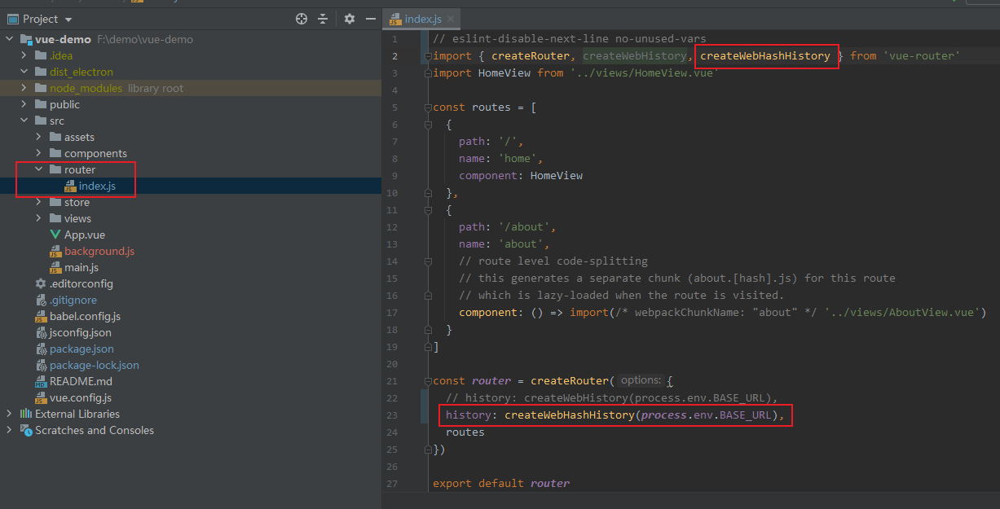
>
> 若为vue2的项目则直接将mode的值从**history**改为**hash**
>
> 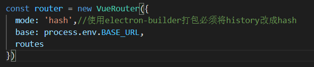
>
> 开始打包，执行如下命令
>
> ```bash
> npm run electron:build
> ```
>
> 打包时会下载相关插件，如下
>
> 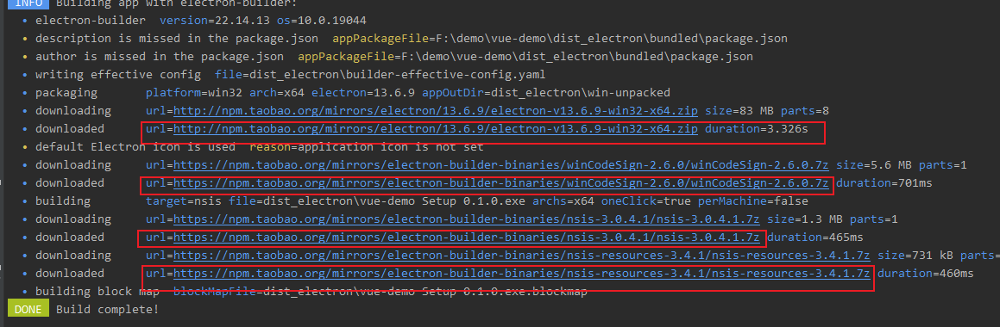
>
> 没有**步骤1**设置国内镜像的话，默认会在github下载包，就会很慢甚至失败，而不是像上图的国内镜像下载很快，下载文件存放的位置如下，也可以直接到github上先下载，放到下列目录下
>
> ```tex
> C:\Users(用户)\用户名\AppData\Local\electron\Cache （electron-v13.6.9-win32-x64.zip）
> C:\Users(用户)\用户名\AppData\Local\electron-builder\Cache（nsis与winCodeSign）
> ```
>
> 
>
> 打包完成后，项目目录下会多出一个**dist_eletron**，打包出的**exe**即在其中，此exe需安装后使用；但在**dist_eletron**的**win-unpacked**下也会有与项目同名的**exe**，此**exe**无需安装即可运行，但依赖同级目录下的文件，不能直接单独使用。
>
> 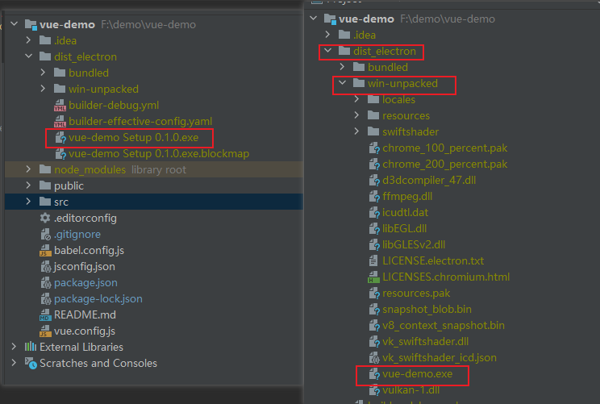
>
> 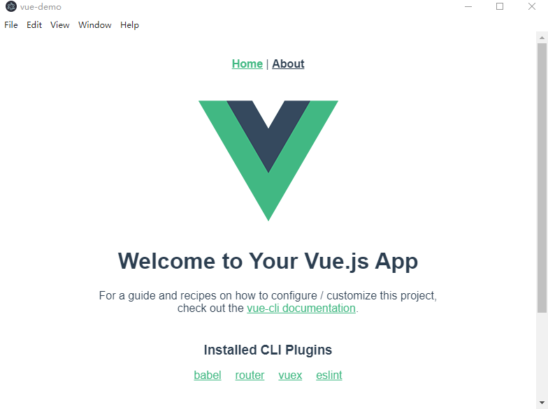


## 完善配置

> 打包配置-vue.config.js
>
> ```js
> // vue.config.js
> 
> const { defineConfig } = require('@vue/cli-service')
> module.exports = defineConfig({
>   transpileDependencies: true,
>   pluginOptions: {
>     // vue-cli-plugin-electron-builder 配置
>     electronBuilder: {
>       // 打包配置
>       builderOptions: {
>         electronDownload: {
>           mirror: "https://npm.taobao.org/mirrors/electron/" //镜像设置
>         },
>         productName: 'vue-demo', // 项目名，也是打包后安装包前缀名
>         appId: 'com.shiory.app', // 包名
>         copyright: 'Shiory版权所有', // 可在此处添加版权信息
>         /* directories: { // 输出文件夹
>           output: 'build' // 打包文件输出位置
>         }, */
>         files: ['**/*'],
>         extraResources: {
>           // 拷贝dll等静态文件到指定位置,否则打包之后回出现找不到dll的问题
>           from: 'resources/',
>           to: './'
>         },
>         dmg: {
>           contents: [
>             {
>               x: 410,
>               y: 150,
>               type: 'link',
>               path: '/Applications'
>             },
>             {
>               x: 130,
>               y: 150,
>               type: 'file'
>             }
>           ]
>         },
>         mac: {
>           // 设置mac的图标
>           icon: 'public/aoz.ico'
>         },
>         linux: {
>           // 设置linux的图标
>           icon: 'public/aoz.ico'
>         },
>         win: {
>           icon: 'public/aoz.ico', // 图标路径 windows系统中icon需要256*256的ico格式图片，更换应用图标亦在此处
>           // eslint-disable-next-line no-template-curly-in-string
>           artifactName: '${productName}_setup_${version}.${ext}',
>           target: [
>             {
>               target: 'nsis', // 使用nsis打成安装包
>               arch: [
>                 'x64' // 打包文件适用系统
>               ]
>             }
>           ]
>         },
>         asar: false,
>         nsis: {
>           oneClick: false, // oneClick: 是否可以一键安装，若需自定义安装路径，此处为false
>           allowElevation: true, // 允许请求提升。 如果为false，则用户必须使用提升的权限重新启动安装程序。
>           allowToChangeInstallationDirectory: true, // 允许修改安装路径
>           installerIcon: 'public/aoz.ico', // 安装图标
>           uninstallerIcon: 'public/favicon.ico', // 卸载图标
>           installerHeaderIcon: 'public/aoz.ico', // 安装时的头部图标
>           createDesktopShortcut: true, // 创建桌面快捷键
>           createStartMenuShortcut: false, // 创建开始菜单图标
>           // eslint-disable-next-line no-template-curly-in-string
>           shortcutName: '${productName}-desktop' // 快捷键名称
>           // include: "build/script/installer.nsh", // 若有自定义nsis脚本，可添加，没有则省略此句
>         },
>         publish: [
>           {
>             provider: 'generic', // 服务器提供商
>             url: 'https://www.baidu.com/' // 服务器地址，根据实际情况添加
>           }
>         ]
>       }
>     }
>   }
> })
> ```
>
> 打包配置-background.js
>
> ```js
> 'use strict'
> 
> import { app, protocol, BrowserWindow } from 'electron'
> import { createProtocol } from 'vue-cli-plugin-electron-builder/lib'
> import installExtension, { VUEJS3_DEVTOOLS } from 'electron-devtools-installer'
> const isDevelopment = process.env.NODE_ENV !== 'production'
> 
> // Scheme must be registered before the app is ready
> protocol.registerSchemesAsPrivileged([
>   { scheme: 'app', privileges: { secure: true, standard: true } }
> ])
> 
> async function createWindow () {
>   // Create the browser window.
>   const win = new BrowserWindow({
>     width: 800,
>     height: 600,
>     title: '标题',
>     webPreferences: {
> 
>       // Use pluginOptions.nodeIntegration, leave this alone
>       // See nklayman.github.io/vue-cli-plugin-electron-builder/guide/security.html#node-integration for more info
>       nodeIntegration: process.env.ELECTRON_NODE_INTEGRATION,
>       contextIsolation: !process.env.ELECTRON_NODE_INTEGRATION
>     }
>   })
> 
>   if (process.env.WEBPACK_DEV_SERVER_URL) {
>     // Load the url of the dev server if in development mode
>     await win.loadURL(process.env.WEBPACK_DEV_SERVER_URL)
>     if (!process.env.IS_TEST) win.webContents.openDevTools()
>   } else {
>     createProtocol('app')
>     // Load the index.html when not in development
>     win.loadURL('app://./index.html')
>   }
> }
> 
> // Quit when all windows are closed.
> app.on('window-all-closed', () => {
>   // On macOS it is common for applications and their menu bar
>   // to stay active until the user quits explicitly with Cmd + Q
>   if (process.platform !== 'darwin') {
>     app.quit()
>   }
> })
> 
> app.on('activate', () => {
>   // On macOS it's common to re-create a window in the app when the
>   // dock icon is clicked and there are no other windows open.
>   if (BrowserWindow.getAllWindows().length === 0) createWindow()
> })
> 
> // This method will be called when Electron has finished
> // initialization and is ready to create browser windows.
> // Some APIs can only be used after this event occurs.
> app.on('ready', async () => {
>   if (isDevelopment && !process.env.IS_TEST) {
>     // Install Vue Devtools
>     try {
>       await installExtension(VUEJS3_DEVTOOLS)
>     } catch (e) {
>       console.error('Vue Devtools failed to install:', e.toString())
>     }
>   }
>   createWindow()
>   // 隐藏菜单栏
>   const {
>     Menu
>   } = require('electron')
>   Menu.setApplicationMenu(null)
>   if (process.platform !== 'darwin') {
>     app.dock.hide()
>   }
> })
> 
> // Exit cleanly on request from parent process in development mode.
> if (isDevelopment) {
>   if (process.platform === 'win32') {
>     process.on('message', (data) => {
>       if (data === 'graceful-exit') {
>         app.quit()
>       }
>     })
>   } else {
>     process.on('SIGTERM', () => {
>       app.quit()
>     })
>   }
> }
> 
> ```


## 参考链接

> ```
> https://github.com/nklayman/vue-cli-plugin-electron-builder/issues/171
> https://nklayman.github.io/vue-cli-plugin-electron-builder/guide/configuration.html#table-of-contents
> https://www.electron.build/configuration/configuration
> https://blog.csdn.net/xi1213/article/details/123953851
> https://blog.csdn.net/mm_0123456789/article/details/122825576
> https://blog.csdn.net/weixin_39666797/article/details/117221192
> https://icofx.ro/
> https://github.com/electron-userland/electron-builder
> https://www.cnblogs.com/benpaodejiandan/p/7081011.html
> https://github.com/electron/electron-packager
> https://www.51cto.com/article/627670.html
> https://jiuaidu.com/jianzhan/1133016/
> https://zhuanlan.zhihu.com/p/449443615
> https://github.com/electron/electron/releases
> 同时下载对应的下所报文件与SHASUMS256.txt文件
> C:\Users\Administrator.DESKTOP-BVS0D4M\AppData\Local\electron\Cache
> C:\Users\Administrator.DESKTOP-BVS0D4M\AppData\Local\electron-builder\Cache
> 从github上找到对应的版本并下载，放在如下位置：
> https://github.com/electron-userland/electron-builder-binaries/releases
> 继续从github仓库下载对应版本的压缩包，放在如下位置：
> https://github.com/electron-userland/electron-builder-binaries/releases
> https://blog.51cto.com/u_15920212/5962937
> https://blog.csdn.net/KYuruyan/article/details/119948460
> https://blog.csdn.net/qq_34170840/article/details/124753565
> https://blog.csdn.net/duansamve/article/details/126494450
> Electron：和webpack融合
> https://blog.csdn.net/GY_U_YG/article/details/122364841
> ```