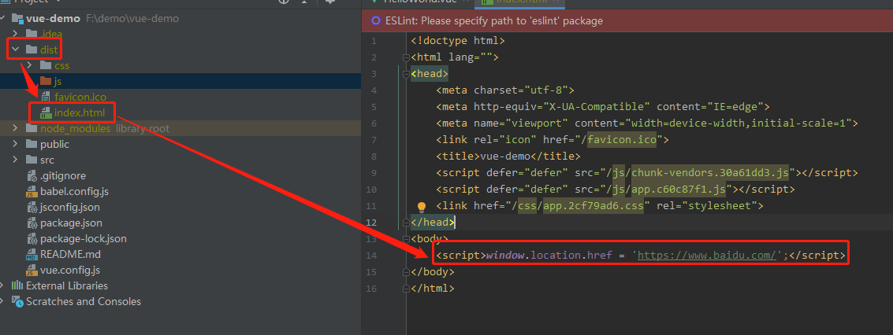
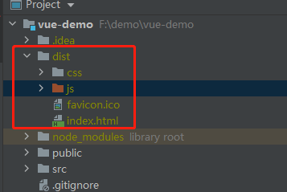
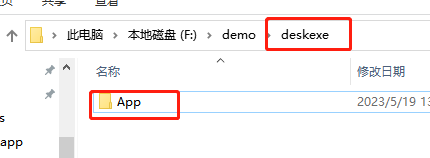
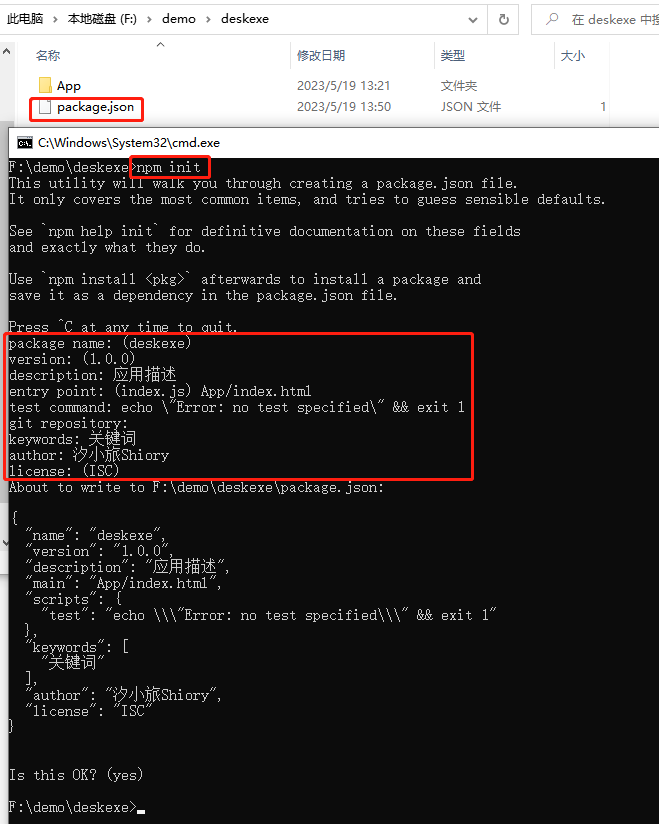
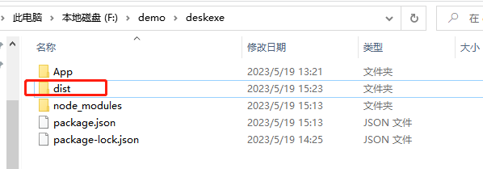
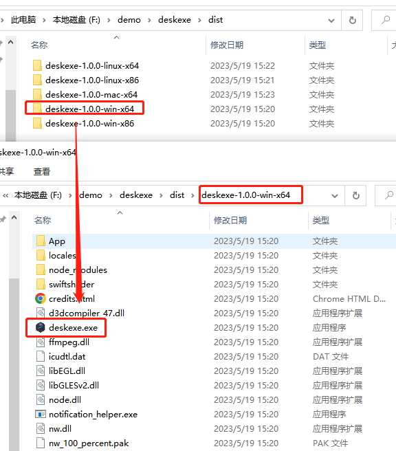

<center><h1>NWjs打包Vue项目为桌面应用</h1></center>

<center><h5>作者：汐小旅Shiory</h5></center>


## 前提

> 已安装Node.js


## 准备Vue项目

> 1、安装Vue CLI（已安装可以跳过）
>
> ```bash
> npm install -g @vue/cli
> ```
>
> 
>
> 2、创建Vue项目
>
> ```bash
> vue create vue-demo
> ```
>
> 
>
> 3、通过下面的命令将**vue-demo**项目打包为**dist**
>
> ```bash
> npm run build
> ```
>
> 
>
> 4、打开**dist**文件夹，将**index.html**的**body标签**中加入如下语句(表示打开百度网页)
>
> ```js
> <script>window.location.href = 'https://www.baidu.com/';</script>
> ```
>
> 


## 使用NW.js打包

> NW.js打包有两种方式
>
> ```tex
> 1、nw-builder(官方方式，比较复杂)
> 2、nwjs-builder-phoenix (推荐，比官方简单)
> ```
>
> **NW.js官网**：https://nwjs.io/
>
> **中文站点**：http://nwjs.org.cn/
>
> **NW.js源码地址**：https://github.com/nwjs/nw.js
>
> **nwjs-builder-phoenix源码地址**：https://github.com/evshiron/nwjs-builder-phoenix
>
> 注：使用命令：`npm run biuld ` 将VUE项目打包后的**dist文件**（打包后其实就是html+css+js的文件，因此纯静态网页文件也可以使用下面的方法打包成电脑端的桌面应用）。dist文件夹目录中就是打包后的静态文件：html+css+js+static
>
> 


## 使用举例

> 1、在任意目录新建一个**deskexe文件夹**，该文件夹名称根据自己的需要自行命名，此处命名为**deskexe**，将上述打包好的**dist文件夹**拷贝到该目录下，并重命名为任意名称，此处命名为**App**。
>
> 
>
> 
>
> 2、通过命令`npm init`在**deskexe目录**下初始化一个`package.json`文件，也**可以在后面的步骤6中完整内容直接复制**
>
> ```bash
> npm init
> 
> 之后需要手动确定或输入初始化信息
> package name：打包后应用的名称，回车即可
> version：版本，回车即可
> description：描述，手动输入
> entry point：入口文件位置，手动输入，因为本文中项目入口文件在App目录中的index.html(也就是vue-demo项目打包后dist目录中的文件)
> test command：测试命令，可以不填写，也可以直接复制此语句：echo "Error: no test specified" && exit 1
> git repository：git 仓库，可以不填写
> keywords：关键词
> author：作者
> license：默认ISC即可
> ```
>
> 
>
> 初始化后`package.json`文件内容如下：
>
> ```json
> {
>   "name": "deskexe",
>   "version": "1.0.0",
>   "description": "应用描述",
>   "main": "App/index.html",
>   "scripts": {
>     "test": "echo \"Error: no test specified\" && exit 1"
>   },
>   "keywords": [
>     "关键词"
>   ],
>   "author": "汐小旅Shiory",
>   "license": "ISC"
> }
> ```
>
> 
>
> 5、安装**nwjs-builder-phoenix**打包工具，在**deskexe目录**下执行如下命令
>
> ```bash
> npm install nwjs-builder-phoenix --save
> ```
>
> 
>
> 6、在`package.json`中新增修改打包相关配置
>
> ```json
> 配置1：NW.js打包版本配置，最新版本可以去NW.js官网(https://nwjs.io/)查看
> "build": {
>     "nwVersion": "0.76.1"
> }
> 
> 配置2：在scripts中新增启动脚本与打包脚本
> 其中通过"--tasks win-x86,win-x64,linux-x86,linux-x64,mac-x64"来实现不同平台的打包，按需配置
> "scripts": {
>     "test": "echo \"Error: no test specified\" && exit 1",
>     // 启动脚本
>     "start": "run -x86 --mirror https://npm.taobao.org/mirrors/nwjs/ .", 
>     // 打包脚本
>     "build": "build --tasks win-x86,win-x64,linux-x86,linux-x64,mac-x64 --mirror https://npm.taobao.org/mirrors/nwjs/ ."
> }
> 
> 配置3：窗口属性配置，具体属性，请参考nwjs官方文档（https://nwjs.readthedocs.io/en/latest/References/Manifest%20Format/#window-subfields）
> "window": {
>     // 字符串，设置默认title
>     "title": "VUE桌面应用",
>     // 窗口的icon
>     "icon": "App/favicon.ico",
>     // bool值。是否显示导航栏
>     "toolbar": false,
>     // bool值。是否允许调整窗口大小
>     "resizable": true,
>     // 是否全屏
>     "fullscreen": false,
>     // 是否在win任务栏显示图标
>     "show_in_taskbar": false,
>     // bool值。如果设置为false，程序将无边框显示
>     "frame": true,
>     // 字符串。窗口打开时的位置，可以设置为“null”、“center”或者“mouse”
>     "position": "center",
>     // 窗口是否透明
>     "transparent":false,
>     // 主窗口的的宽度
>     "width": 1920,
>     // 主窗口的的高度
>     "height": 1080,
>     // 窗口的最小宽度
>     "min_width": 400,
>     // 窗口的最小高度。
>     "min_height": 335,
>     // 窗口显示的最大宽度，可不设
>     "max_width": 800,
>     // 窗口显示的最大高度，可不设
>     "max_height": 670,
>     // bool值，如果设置为false，启动时窗口不可见
>     "show": true,
>     // 是否在任务栏显示图标
>     "show_in_taskbar":true,
>     // bool值。是否使用kiosk模式。如果使用kiosk模式，应用程序将全屏显示，并且阻止用户离开应用
>     "kiosk": false
> }
> 
> 配置4：webkit设置
> // bool值，如果设置为false，将禁用webkit的node支持
> "nodejs": true,
> // 指定一个node.js文件，当程序启动时，该文件会被运行，启动时间要早于node-webkit加载html的时间
> // 它在node上下文中运行，可以用它来实现类似后台线程的功能。（不需要可注释不用）
> "node-main": "js/node.js",
> // bool值。默认情况下，如果将node-webkit程序打包发布，那么只能启动一个该应用的实例。如果你希望允许同时启动多个实例，将该值设置为false
> "single-instance": true,
> "webkit": {
>     // bool值，是否加载插件，如flash，默认值为false
>     "plugin": true,
>     // *bool值，是否加载Java applets，默认为false
>     "java": false,
>     // bool值，是否启用页面缓存，默认为false
>     "page-cache": false
> }
> ```
>
> 完整`package.json`内容
>
> ```json
> {
>       "name": "deskexe",
>       "version": "1.0.0",
>       "description": "应用描述",
>       "main": "App/index.html",
>       "build": {
>         "nwVersion": "0.76.1"
>       },
>       "scripts": {
>         "test": "echo \"Error: no test specified\" && exit 1",
>         "start": "run -x86 --mirror https://npm.taobao.org/mirrors/nwjs/ .", 
>         "build": "build --tasks win-x86,win-x64,linux-x86,linux-x64,mac-x64 --mirror https://npm.taobao.org/mirrors/nwjs/ ."
>       },
>       "keywords": [
>         "关键词"
>       ],
>       "author": "汐小旅Shiory",
>       "license": "ISC",
>       "window": {
>         "title": "VUE桌面应用",
>         "icon": "App/favicon.ico",
>         "toolbar": false,
>         "resizable": true,
>         "fullscreen": false,
>         "show_in_taskbar": true,
>         "frame": true,
>         "position": "center",
>         "transparent":false,
>         "width": 1920,
>         "height": 1080,
>         "min_width": 400,
>         "min_height": 400,
>         "show": true,
>         "show_in_taskbar":true,
>         "kiosk": false
>       },
>       "dependencies": {
>         "nwjs-builder-phoenix": "^1.15.0"
>       },
>       "nodejs": true,
>       "node-main": "js/node.js",
>       "single-instance": true,
>       "webkit": {
>         "plugin": true,
>         "java": false,
>         "page-cache": false
>       }
> }
> ```
>
> 
>
> 7、在**deskexe文件夹**下打开cmd (也就是输入cmd回车即可)，输入命令：`npm i`回车，等待安装依赖包
>
> 
>
> 8、测试是否能运行，执行命令：`npm run start`，如果不报错且能打开一个窗口，证明成功。
>
> 
>
> 9、打包。执行命令：`npm run build`，待命令执行完毕且无报错，会在**deskexe文件夹**下生成**dist文件夹**。如果只想打包win64的桌面应用，则在package.json文件中修改即可。
>
> 
>
> 进入dist文件夹中就是打包好的不同平台的桌面应用，其中**deskexe-1.0.0-win-x64**为windows64位系统的应用，进入该文件夹中会看到**exe文件**，双击即可打开桌面应用
>
> 


## 简化步骤

> 1、通过命令`npm run build`将Vue项目打包为**dist**
>
> 2、创建一个文件夹(**deskexe**)，命名任意，将1中打包好的dist文件夹**拷贝到**新建的文件夹中(**deskexe**)，并**将dist文件夹重命名**(任意，此处为App)
>
> 3、在创建的文件夹(**deskexe**)中新建一个`package.json`文件，内容如下
>
> ```json
> {
>     "name": "deskexe",
>     "version": "1.0.0",
>     "description": "应用描述",
>     "main": "App/index.html",
>     "build": {
>      "nwVersion": "0.76.1"
>     },
>     "scripts": {
>      "test": "echo \"Error: no test specified\" && exit 1",
>      "start": "run -x86 --mirror https://npm.taobao.org/mirrors/nwjs/ .", 
>      "build": "build --tasks win-x64 --mirror https://npm.taobao.org/mirrors/nwjs/ ."
>     },
>     "keywords": [
>      "关键词"
>     ],
>     "author": "汐小旅Shiory",
>     "license": "ISC",
>     "window": {
>      "title": "VUE桌面应用",
>      "icon": "App/favicon.ico",
>      "toolbar": false,
>      "resizable": true,
>      "fullscreen": false,
>      "show_in_taskbar": true,
>      "frame": true,
>      "position": "center",
>      "transparent":false,
>      "width": 1920,
>      "height": 1080,
>      "min_width": 400,
>      "min_height": 400,
>      "show": true,
>      "show_in_taskbar":true,
>      "kiosk": false
>     },
>     "dependencies": {
>      "nwjs-builder-phoenix": "^1.15.0"
>     },
>     "nodejs": true,
>     "node-main": "js/node.js",
>     "single-instance": true,
>     "webkit": {
>      "plugin": true,
>      "java": false,
>      "page-cache": false
>     }
> }
> ```
>
> 4、在创建的文件夹(**deskexe**)中打开**cmd**，依次执行下面的命令。会在**deskexe文件夹**下生成**dist文件夹**，dist文件夹中就是打包好的桌面应用文件夹，双击文件夹中的exe文件，即可启动
>
> ```bash
> npm i
> npm run build
> ```


## 避坑指南

> 1、不要使用 cnpm 安装nwjs-builder-phoenix
>
> 2、下面的配置根据需要更改，否则会打包多个几个平台，打包很慢。windows64位系统用win-x64就差不多了
>
> ```json
> "dist": "build --tasks win-x86,win-x64,linux-x86,linux-x64,mac-x64 --mirror https://dl.nwjs.io/ .",
> ```
>
> 3、不推荐将整个应用打包为一个exe文件，vue-demo的dist包640k，打包成exe后1.76G
