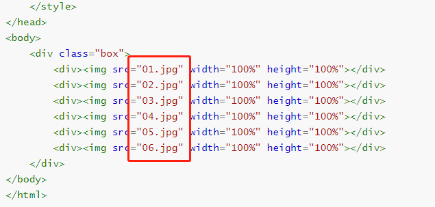

<center><h1>旋转立方体</h1></center>

<center><h5>作者：汐小旅Shiory</h5></center>


> 1、新建一个HTML文件：RotatingCube.html，html代码如下
>
> ```html
> <!DOCTYPE html>
> <html lang="en">
> <head>
>     <meta charset="UTF-8">
>     <title>旋转立方体</title>
>     <style type="text/css">
> 
>         /*6个面的div样式*/
>         .box div{
>             position: absolute;
>             top:0;
>             opacity: 1;
>             width: 400px;
>             height: 400px;
>             text-align: center;
>             color: white;
>             line-height: 400px;
>             font-size: 100px;
>         }
> 
>         /*前面*/
>         .box div:nth-child(1){
>             transform: translateZ(200px);
>             background: red;
>             z-index: 1;
>         }
> 
>         /*后面*/
>         .box div:nth-child(2){
>             transform: rotateY(-180deg) translateZ(200px);
>             background: green;
>         }
> 
>         /*左面*/
>         .box div:nth-child(3){
>             transform: rotateY(-90deg) translateZ(200px);
>             background: yellow;
>         }
> 
>         /*右面*/
>         .box div:nth-child(4){
>             transform: rotateY(90deg) translateZ(200px);
>             background: orange;
>         }
> 
>         /*上面*/
>         .box div:nth-child(5){
>             transform: rotateX(90deg) translateZ(200px);
>             background: cyan;
>         }
> 
>         /*下面*/
>         .box div:nth-child(6){
>             transform: rotateX(-90deg) translateZ(200px);
>             background: blue;
>         }
> 
>         /*box div旋转样式*/
>         .box {
>             position: relative;
>             width: 400px;
>             height: 400px;
>             margin: 200px auto;
>             /*修改为3d维度*/
>             transform-style: preserve-3d;
> 
>             transform: rotateX(-30deg) rotateY(-30deg);
>             animation: move 10s infinite linear;
>         }
>         @keyframes move{
>             from{transform: rotateX(0deg) rotateY(0deg) rotateZ(0deg);}
>             to{transform: rotateX(360deg) rotateY(360deg) rotateZ(360deg);}
>         }
>     </style>
> </head>
> <body>
>     <div class="box">
>         <div></div>
>         <div></div>
>         <div></div>
>         <div></div>
>         <div></div>
>         <div></div>
>     </div>
> </body>
> </html>
> ```
>
> 
>
> 2、准备六张图片，将上面代码中的`img`标签中的`src`属性值换成准备的六张照片。
>
> 
>
> 
>
> 3、保存html文件，用浏览器打开html文件，效果如下。
>
> 

