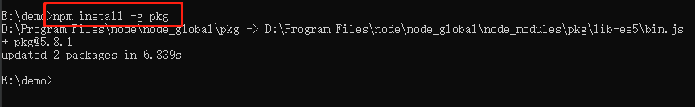
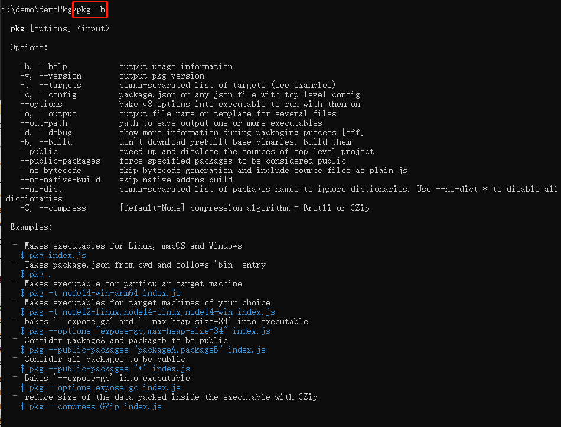
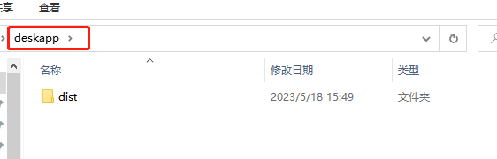
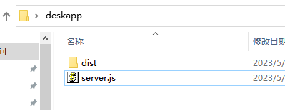
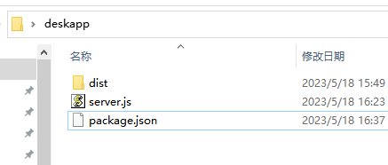
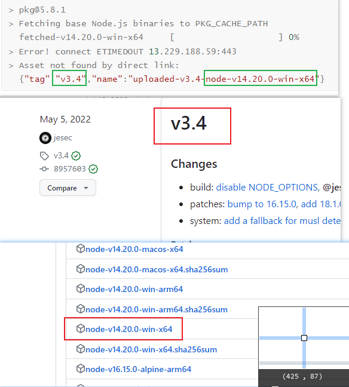
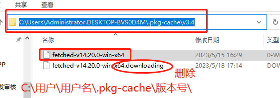
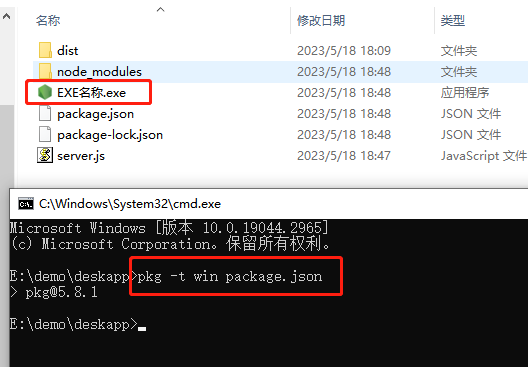
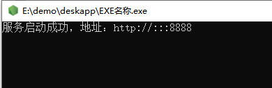

<center><h1>pkg打包Node.js应用</h1></center>

<center><h5>作者：汐小旅Shiory</h5></center>


> **pkg简介**：将 Node.js 项目打包成可执行文件，即使在未安装 Node.js 的设备上也可以运行
>
> **源码地址**：https://github.com/vercel/pkg  ，中文翻译：https://www.oschina.net/p/npmjs-pkg
>
> **前提**：已安装Node.js


## 1、安装pkg

> 全局安装pkg
>
> ```sh
> npm install -g pkg
> ```
>
> 
>


## 2、用法

> pkg安装完成后，通过`pkg -h`查看相关命令
>
> 
>
> 基本语法是
>
> ```sh
> pkg [options] <input>
> ```
>
> > `<input>`可以通过三种方式指定：
> >
> > 1.一个脚本文件，例如`pkg index.js`;
> >
> > 2.`package.json`，例如`pkg package.json`，这时会使用`package.json`中的`bin`字段作为入口文件；
> >
> > 3.一个目录，例如`pkg .`，这时会寻找指定目录下的`package.json`文件，然后在找`bin`字段作为入口文件。
> >
> > `[options]`中可以指定打包的参数：
> >
> > 1.`-t`指定打包的目标平台和Node版本，如`-t node6-win-x64,node6-linux-x64,node6-macos-x64`可以同时打包3个平台的可执行程序；
> >
> > 2.`-o`指定输出可执行文件的名称，但如果用`-t`指定了多个目标，那么就要用`--out-path`指定输出的目录；
> >
> > 3.`-c`指定一个JSON配置文件，用来指定需要额外打包脚本和资源文件，通常使用`package.json`配置。


## 3、使用举例

> **1、全局安装pkg**
>
> ```sh
> npm install -g pkg
> ```
>
> **2、打包项目为 `dist`**
>
> ```sh
> npm run build
> ```
>
> **3、新建一个文件夹，如deskapp，将打包好的dist文件夹放到该目录下**
>
> 
>
> **4、在deskapp目录下新建打包入口文件：server.js**
>
> 入口文件内容如下
>
> ```js
> //server.js
> //用express做的简单服务
> const express = require('express');
> const app = express();
> const path = require('path');
> 
> //注意这里使用path.join(__dirname, 'dist')而不是'dist'，虽然在命令行中执行起来效果是一样的，不过pkg打包会无法识别到dist目录
> app.use(express.static(path.join(__dirname, 'dist')));
> 
> var server = app.listen(8888, function () {// 指定端口
>   var host = server.address().address;
>   var port = server.address().port;
>   console.log(`服务启动成功，地址：http://${host}:${port}`)
> });
> ```
>
> 
>
> **5、在deskapp目录下新建打包配置文件：package.json**
>
> 配置文件内容如下
>
> ```json
> {
>     "name": "EXE名称",
>     "bin": "server.js",
>     "pkg": {
>         "scripts": [
>             "build/**/*.js"
>         ],
>         "assets": [
>             "dist/**/*"
>         ]
>     }
> }
> ```
>
> 说明：
>
> ```
> name：打包后exe的名称
> bin：打包入口文件
> pkg：pkg配置
> 	scripts：需要打包进来的其他js文件，可添加多个
> 	assets：静态文件的目录，可添加多个
> ```
>
> 
>
> **6、在deskapp目录下依次执行下面的命令**
>
> ```sh
> npm install express
> ```
>
> ```sh
> pkg -t win package.json      # 通过-t指定打包类型，这里的 -t win 是打包成windows系统的exe文件，其他系统可去pkg源码地址查看使用
> ```
>
> 执行命令`pkg -t win package.json `时会很慢甚至失败报错
>
> ```sh
> > pkg@5.8.1
> > Fetching base Node.js binaries to PKG_CACHE_PATH
>   fetched-v14.20.0-win-x64     [                    ] 0%
> > Error! connect ETIMEDOUT 13.229.188.59:443
> > Asset not found by direct link:
>   {"tag":"v3.4","name":"uploaded-v3.4-node-v14.20.0-win-x64"}
> ```
>
> 原因是打包需要相应的二进制文件`fetched-vX.X.X-win-x64`，当执行命令时，会去**github**下载相应版本的二进制文件，但由于访问**github**比较慢，就会导致打包比较慢甚至失败。所以需要到**github**先下载相应的二进制文件。打包二进制文件地址：https://github.com/vercel/pkg-fetch/releases
>
> 根据报错的内容，找到相应的版本下载
>
> 
>
> 下载之后，将这个文件`node-v14.20.0-win-x64`放到**pkg缓存目录**下，并**更名**为`fetched-v14.20.0-win-x64`，同时将这个目录下的 `.downloading` 结尾的文件删除。
>
> **注意：**pkg缓存目录的位置--C盘的用户目录下的`.pkg-cache`目录，将下载的文件放到对应版本目录下即可（**C:/用户/用户名/.pkg-cache/版本号/**）
>
> 
>
> 之后再继续回到**deskapp**目录下执行命令
>
> ```sh
> pkg -t win package.json
> ```
>
> 打包成功后，会生成一个EXE文件
>
> 
>
> 双击**exe文件**，运行成功后，在浏览器输入：localhost:8888，就能访问打包好的项目了
>
> 

