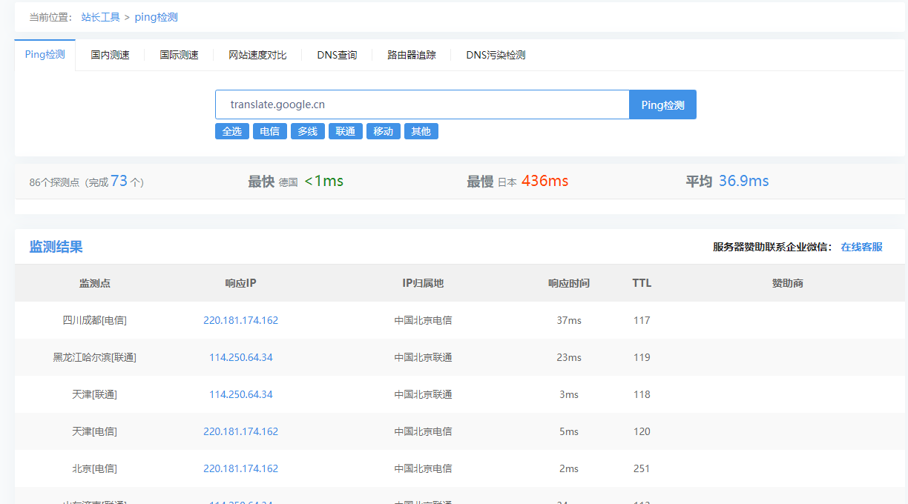
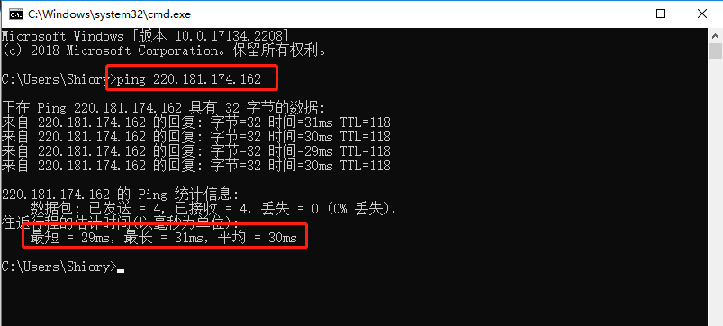
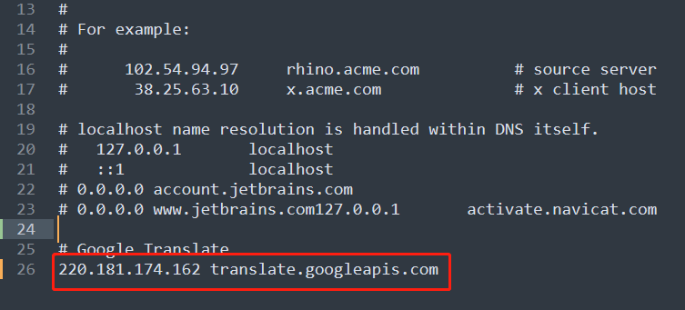
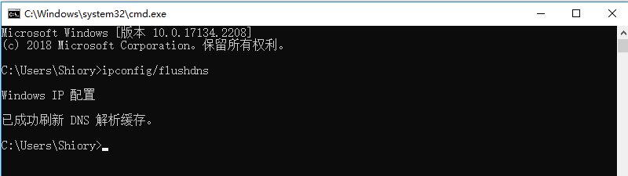
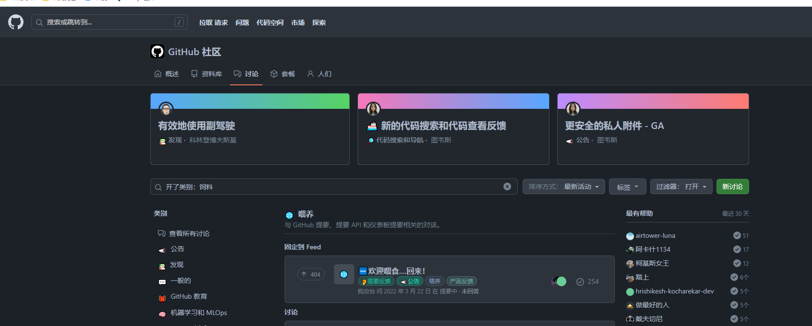

<center><h1>谷歌翻译恢复</h1></center>

<center><h5>作者：汐小旅Shiorys</h5></center>


# 失效原因

> 谷歌不再提供 translate.google.cn 网页版的服务
>
> 虽然谷歌不再提供 **translate.google.cn** 网页版的服务了，但谷歌翻译的 API 服务 **translate.googleapis.com** 还在，只需要通过 **hosts** 重定向至国内服务器，即可恢复使用


# 恢复谷歌翻译

## 方法一

> 恢复工具：https://github.com/Ponderfly/GoogleTranslateIpCheck
>
> 1、下载解压后**以管理员的身份运行exe文件**
>
> 2、等待IP全部加载完毕，输入**Y**，将会把最优IP配置到**hosts文件**中，同时会刷新DNS
>
> 3、重启谷歌浏览器，即可使用谷歌翻译了


## 方法二

> 1、首先是使用拨测网站： https://ping.chinaz.com  ， ping一下 `translate.google.cn` 的 IP。注意在 Ping 的时候，要选择国内服务器
>
> 
>
> 
>
> 2、选择IP：注意不要看**响应时间最小**的 IP，而应该选择**物理距离最近**的 IP。然后用命令行ping一下**物理距离最近**的 IP，比如在北京，那就北京距离最近，使用命令行ping一下监测点为**北京**的**响应IP**，多ping几个，选择最快的
>
> 
>
> 
>
> 3、修改hosts文件
>
> hosts文件位置
>
> ```
> Windows系统：C:\Windows\System32\drivers\etc\hosts
> Mac系统：/etc/hosts
> Linux系统：/etc/hosts
> Android系统：/system/etc/hosts
> IOS系统：/etc/hosts
> ```
>
> 在**hosts文件**中加入**第2步中得到的IP**，以如下形式加入到hosts文件中，其中：**220.181.174.162**为得到的IP，**translate.googleapis.com**为谷歌翻译的API
>
> ```
> 220.181.174.162 translate.googleapis.com
> ```
>
> 
>
> 
>
> 4、刷新DNS：打开命令行，输入：**ipconfig/flushdns** ，点击确定即可
>
> 


# 测试谷歌翻译是否可用

> 此处以github为例翻译，由图可看出，已经可以使用谷歌翻译了
>
> 
